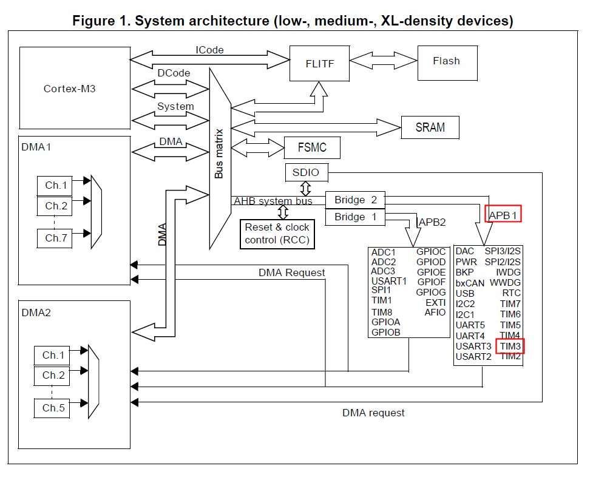

### HC=SR04 초음파센서를 이용한 거리 측정

---

#### 1. TIM3를 이용한 1㎲ 단위 시간 측정


 **1.1 RCC 설정**

RCC 설정을 위해 다음 그림과 같이 Device Configuration 창에서 Pinout & Configuration 탭의 System Core 항목 중 RCC를 선택 후 우측의 RCC Mode and Configuration 의 Mode의 High Speed Clock(HSE) 및 Low Speed Clock(LSE) 모두를 Disable로 변경한다.


 **1.2 TIM3 설정**

  Pinout & Configuration탭의 Timers의 하위항목 중 Tim3를 선택한다.  Tim4 Mode and Configuration의 Mode에서 Internal Clock을 선택하면, 아래에 Parameter Setting 항목이 나타난다.

  

**1.3 타이머 클럭 확인**

 Tim4의 Congiguration의 arameter Settings 탭의 Prescaler,  Counter Period 설정에 앞서 Clock을 확인해야 한다. 

  STM32-F1xx 시리즈 MCU는 CPU와  다수의 peripheral 장치들로 이루어져 있으며, 이들은 ARMBA( Advanced Microcontroller Bus Architecture ) 버스로 연결되어 있다. 

  ARMBA( Advanced Microcontroller Bus Architecture ) 버스는 AHB(Advanced High Performance Bus), APB1(Advanced Peripheral Bus1 ), APB2( Advanced Peripheral Bus2 ) 의 3가지 BUS로 이루어지며, 다음은 각 Peripheral Device들이 어떤 버스에 연결되어 있는가를 보여주는  구성도이다. 

  

  

1㎲ 주기의  TIM3 타이머 인터럽트 설정을 위해 우선 TIM3가 연결된 APB1 버스에 공급되는 클럭 주파수를 확인해보자.  Clock Configuration 탭을 선택한다.

  APB1 Timer Clock이 64(MHz)라는 것을 확인할 수 있다. 

  

TIM3에는 1초에 64,000,000 개의 클럭이 공급된다. 클럭 1개의 주기는 1/64,000,000 초 이므로 1㎲를 만드려면 64개의 클럭이 필요하다. ( 64 x 1/64,000,000 = 64/64,000,000 = 1/1,000,000 = 1㎲ )

이를 위해 Tim3 Mode and Configuration의 Parameter Settings 탭에서 Prescaler와 Counter Period에 적절한 값을 설정하여 이를 맞춰줘야 한다. Prescaler = 1, Counter Period = 64 또는 Prescaler = 4, Counter Period = 16 과 같이 설정해야 하지만,  실제로 동작 시켰을 때 오류가 확인되어 일단 Prescaler = 4, Counter Period = 64로 설정 후, 거리 측정 코드에서 보정하여 주기로 하자. 다음 그림과 같이 Prescaler = 4-1, Counter Period = 64-1을 입력한다.


이제 TIM3 타이머 인터럽트 사용을 설정하기위해 Tim3 Mode and Configuration의 NVIC Settings 탭에 TIM3 global interrupt를 Eanabled 시켜준다. 

 

  TIM3 타이머 인터럽트를 전체 인터럽트 테이블에 등록하기위해  NVIC Mode and Configuration의 NVIC 탭에 

  


  **HC-SR04 결선 및 GPIO 설정**

HC-SR04 초음파 센서는 VCC, Trig, Echo, GND 4개의 핀을 가지고 있다. 다음 그림과 같이 결선 한다. 

  센서의 Trig핀으로 10㎲ 펄스폭을 갖는 펄스를 공급하면 센서는 8개의 초음파를 발사한다. 이 때 센서의 Echo핀의 출력은 Low를 유지 하지만 발사한 초음파의 반사파가 수신되기 시작하면 Echo핀으로 High 신호를 출력한다. 이 High신호는 모든 반사파가 수신될 때까지 유지되다가 Low로 떨어진다. 즉 Echo 핀의 출력이 High를 유지한 시간이 초음파가 거리를 측정하고자 하는 대상까지 왕복하는데에 소요된 시간이라는 것이다. 음파의 속도는 340m/s이므로 속도 = 거리 / 시간 에서 속도와 시간을 알아낼 수 있으므로 거리를 구할 수 있다. 

이제 센서의 Trig 핀이 연결된 PB4와 Echo핀이 연결된 PB5에 대한 GPIO 설정을 해 주어야 한다.

- PB4는 Trig핀에 Trig 펄스를 공급해 주어야 하므로 출력으로 설정하고,

  

-  PB5은 Echo핀의 출력이 언제 Low에서 High로 변하는 지, 또는 High에서 Low로 변하는 지 읽어내야 하므로 입력으로 설정해야 한다.

  

  이제 GPIO Configuration을 확인하면 다음과 같다.


**Code Generate**

`Project` 메뉴의 `Generate Code`를 클릭


다음은 [**HC-SR04 데이터시트**](https://cdn.sparkfun.com/datasheets/Sensors/Proximity/HCSR04.pdf) 의 거리측정 타이밍 다이어 그램이다. 


HC-SR04에 PW(Pulse Width)가 10(㎲)인 Trigger Pulse를 공급하려면 마이크로 초 단위의 딜레이 함수가 필요하므로 마이크로 초 단위의 딜레이 함수 `delay_us()`를 제공하는 사용자 라이브러리 작성을 위해 `delay_us.h`파일을 다음과 같이 작성한다. 

```c
/* delay_us.h */
#ifndef DELAY_US_H
#define DELAY_US_H

void delay_us(int us);

#endif

```

작성한`delay_us.h`는 STM32 Cube IDE**워크 스페이스의 HC-SR04 프로젝트 폴더의 `Core/Inc`폴더에 저장하고, `delay_us.c`파일을 아래와 같이 작성하여 . **STM32 Cube IDE**워크 스페이스의 HC-SR04 프로젝트 폴더의 `Core/Src`폴더에 저장한다.

``` c
#include "delay_us.h"

int delay = 0;
int value = 0;
void delay_us(int us){
value = 3;
delay = us * value;
for(int i=0;i < delay;i++);
}

```

아래는 오실로스코프로 측정하면서, 위 `delay_us()`함수의 `value`값을 조정한 결과 화면이다. `delay_us()`를 이용하여 10㎲ 동안 GPIO 핀으로 HIGH와 LOW를 반복 출력한 결과인데, 오실로 스코프 시간축 한칸이 10㎲로 조정되어있으므로  실제 10㎲보다는 조금 길지만 무시할 수 있을 만하다.(HC-SR04에 공급할 Trigger 펄스 발생용으로는 충분하다.) 

측정 결과를 `printf()`로 출력하기 위에 앞서 진행한 과정에서 작성한 `uart2_printf.h`와 `uart_printf.c파일들도 ` `Core/Inc` 폴더와 `Core/Src`폴더에 적절히 복사한다. 

STM32CubeIDE의 프로젝트 탐색기에서 HC-SR04 프로젝트에 우클릭하여 나타난 컨텍스트 메뉴에서 `Refresh`

를 클릭한다. 


`main.c`의 다음코드를 `main.c`의 다음코드를

```c
/* USER CODE BEGIN Includes */

/* USER CODE END Includes */
```

`printf()`와 `delay_us()를 사용하기 위해 다음과 같이 수정, 편집한다. 

```c
/* USER CODE BEGIN Includes */
#include "uart2_printf.h"
#include "delay_us.h"
/* USER CODE END Includes */
```


`main.c`의 다음코드를 `main.c`의 다음코드를 

```c
/* USER CODE BEGIN PD */

/* USER CODE END PD */
```

아래와 같이 수정한다. 

```c
/* USER CODE BEGIN PD */
#define HIGH 1
#define LOW 0
/* USER CODE END PD */
```


```c
/* USER CODE BEGIN PV */

/* USER CODE END PV */
```


```c
/* USER CODE BEGIN PV */
volatile unsigned long count = 0;
unsigned long echo_time = 0;
/* USER CODE END PV */
```


`main.c`의 다음코드를

```c
/* USER CODE BEGIN PFP */

/* USER CODE END PFP */
```

아래와 같이 수정한다. 

```c
/* USER CODE BEGIN PFP */
void trig(void);
unsigned long echo(void);
/* USER CODE END PFP */
```


`printf()` 사용을 위해 `main.c`의 다음코드를 `main.c`의 다음코드를 

```c
/* USER CODE BEGIN 4 */
}
/* USER CODE END 4 */
```

아래와 같이 수정한다. 

```c
/* USER CODE BEGIN 4 */
void
HAL_TIM_PeriodElapsedCallback (TIM_HandleTypeDef *htim)
{
  count++;
}

void trig()
{
	HAL_GPIO_WritePin(GPIOB, GPIO_PIN_4, HIGH);
	delay_us(10);
	HAL_GPIO_WritePin(GPIOB, GPIO_PIN_4, LOW);
}

unsigned long echo()
{
	unsigned long echo = 0;
	while(HAL_GPIO_ReadPin(GPIOB, GPIO_PIN_5)== LOW);
	unsigned long time1 = count * 4;
	while(HAL_GPIO_ReadPin(GPIOB, GPIO_PIN_5)== HIGH);
	unsigned long time2 = count * 4;
	echo = time2 - time1;
	if( echo >= 240 && echo <= 23000 )
		return echo;
	else
		return 0;
}
/* USER CODE END 4 */
```


`main.c`의 다음코드를

```c
/* USER CODE BEGIN 2 */

  /* USER CODE END 2 */
```

아래와 같이 수정한다.  

```c
/* USER CODE BEGIN 2 */
  if(HAL_TIM_Base_Start_IT(&htim3) != HAL_OK) {
	  Error_Handler();
  }
  printf("Start HC-SR04\n");
  /* USER CODE END 2 */
```

이제 타이머 인터럽트가 활성화 되어 `/* USER CODE BEGIN 4 */`에 작성한 `HAL_TIM_PeriodElapsedCallback ()`함수가 설정한 타이머 인터럽트 주기마다 자동으로 호출되게 된다. 


`main.c`의 다음코드를 `main.c`의 다음코드를 

```c
 /* USER CODE BEGIN WHILE */
  while (1)
  {
    /* USER CODE END WHILE */
```

아래와 같이 수정한다. 

```c
/* USER CODE BEGIN WHILE */
  while (1)
  {
	trig();
	echo_time = echo();
	if( echo_time != 0 )
	  {
	   // speed ( 340 m/s ) = distance / time,

	   // distance = speed x time
	   // but echo_time is twice time

	   // ​( go to object & back to start position )
	   // 2 x distance = 340 m/s x echo_time usec
	   // distance = 170 m/sec x echo_time usec

	   // = 170,000 mm/sec x echo_time sec / 1000000
	   // distance = 17 x echo_time / 100 mm

	    //dist = 17 * (echo_time / 100);
	    printf("Distance = %lu (mm)\n", 17 * (echo_time / 100));
	  }
	  else printf("Out of Range~\n");
	  HAL_Delay(1000);
    /* USER CODE END WHILE */
```


다음은 편집이 완료된 `main.c`의 전체 코드이다.

```c
/* USER CODE BEGIN Header */
/**
  ******************************************************************************
  * @file           : main.c
  * @brief          : Main program body
  ******************************************************************************
  * @attention
  *
  * Copyright (c) 2025 STMicroelectronics.
  * All rights reserved.
  *
  * This software is licensed under terms that can be found in the LICENSE file
  * in the root directory of this software component.
  * If no LICENSE file comes with this software, it is provided AS-IS.
  *
  ******************************************************************************
  */
/* USER CODE END Header */
/* Includes ------------------------------------------------------------------*/
#include "main.h"

/* Private includes ----------------------------------------------------------*/
/* USER CODE BEGIN Includes */
#include "uart2_printf.h"
#include "delay_us.h"
/* USER CODE END Includes */

/* Private typedef -----------------------------------------------------------*/
/* USER CODE BEGIN PTD */

/* USER CODE END PTD */

/* Private define ------------------------------------------------------------*/
/* USER CODE BEGIN PD */
#define HIGH 1
#define LOW 0
/* USER CODE END PD */

/* Private macro -------------------------------------------------------------*/
/* USER CODE BEGIN PM */

/* USER CODE END PM */

/* Private variables ---------------------------------------------------------*/
TIM_HandleTypeDef htim3;

UART_HandleTypeDef huart2;

/* USER CODE BEGIN PV */
volatile unsigned long count = 0;
unsigned long echo_time = 0;
//unsigned long dist = 0;
/* USER CODE END PV */

/* Private function prototypes -----------------------------------------------*/
void SystemClock_Config(void);
static void MX_GPIO_Init(void);
static void MX_USART2_UART_Init(void);
static void MX_TIM3_Init(void);
/* USER CODE BEGIN PFP */
void trig(void);
unsigned long echo(void);
/* USER CODE END PFP */

/* Private user code ---------------------------------------------------------*/
/* USER CODE BEGIN 0 */

/* USER CODE END 0 */

/**
  * @brief  The application entry point.
  * @retval int
  */
int main(void)
{

  /* USER CODE BEGIN 1 */

  /* USER CODE END 1 */

  /* MCU Configuration--------------------------------------------------------*/

  /* Reset of all peripherals, Initializes the Flash interface and the Systick. */
  HAL_Init();

  /* USER CODE BEGIN Init */

  /* USER CODE END Init */

  /* Configure the system clock */
  SystemClock_Config();

  /* USER CODE BEGIN SysInit */

  /* USER CODE END SysInit */

  /* Initialize all configured peripherals */
  MX_GPIO_Init();
  MX_USART2_UART_Init();
  MX_TIM3_Init();
  /* USER CODE BEGIN 2 */
  if(HAL_TIM_Base_Start_IT(&htim3) != HAL_OK) {
	  Error_Handler();
  }
  printf("Start HC-SR04\n");
  /* USER CODE END 2 */

  /* Infinite loop */
  /* USER CODE BEGIN WHILE */
  while (1)
  {
	trig();
	echo_time = echo();
	if( echo_time != 0 )
	  {
	   // speed ( 340 m/s ) = distance / time,

	   // distance = speed x time
	   // but echo_time is twice time

	   // ​( go to object & back to start position )
	   // 2 x distance = 340 m/s x echo_time usec
	   // distance = 170 m/sec x echo_time usec

	   // = 170,000 mm/sec x echo_time sec / 1000000
	   // distance = 17 x echo_time / 100 mm

	    //dist = 17 * (echo_time / 100);
	    printf("Distance = %lu (mm)\n", 17 * (echo_time / 100));
	  }
	  else printf("Out of Range~\n");
	  HAL_Delay(1000);
    /* USER CODE END WHILE */

    /* USER CODE BEGIN 3 */
  }
  /* USER CODE END 3 */
}

/**
  * @brief System Clock Configuration
  * @retval None
  */
void SystemClock_Config(void)
{
  RCC_OscInitTypeDef RCC_OscInitStruct = {0};
  RCC_ClkInitTypeDef RCC_ClkInitStruct = {0};

  /** Initializes the RCC Oscillators according to the specified parameters
  * in the RCC_OscInitTypeDef structure.
  */
  RCC_OscInitStruct.OscillatorType = RCC_OSCILLATORTYPE_HSI;
  RCC_OscInitStruct.HSIState = RCC_HSI_ON;
  RCC_OscInitStruct.HSICalibrationValue = RCC_HSICALIBRATION_DEFAULT;
  RCC_OscInitStruct.PLL.PLLState = RCC_PLL_ON;
  RCC_OscInitStruct.PLL.PLLSource = RCC_PLLSOURCE_HSI_DIV2;
  RCC_OscInitStruct.PLL.PLLMUL = RCC_PLL_MUL16;
  if (HAL_RCC_OscConfig(&RCC_OscInitStruct) != HAL_OK)
  {
    Error_Handler();
  }

  /** Initializes the CPU, AHB and APB buses clocks
  */
  RCC_ClkInitStruct.ClockType = RCC_CLOCKTYPE_HCLK|RCC_CLOCKTYPE_SYSCLK
                              |RCC_CLOCKTYPE_PCLK1|RCC_CLOCKTYPE_PCLK2;
  RCC_ClkInitStruct.SYSCLKSource = RCC_SYSCLKSOURCE_PLLCLK;
  RCC_ClkInitStruct.AHBCLKDivider = RCC_SYSCLK_DIV1;
  RCC_ClkInitStruct.APB1CLKDivider = RCC_HCLK_DIV2;
  RCC_ClkInitStruct.APB2CLKDivider = RCC_HCLK_DIV1;

  if (HAL_RCC_ClockConfig(&RCC_ClkInitStruct, FLASH_LATENCY_2) != HAL_OK)
  {
    Error_Handler();
  }
}

/**
  * @brief TIM3 Initialization Function
  * @param None
  * @retval None
  */
static void MX_TIM3_Init(void)
{

  /* USER CODE BEGIN TIM3_Init 0 */

  /* USER CODE END TIM3_Init 0 */

  TIM_ClockConfigTypeDef sClockSourceConfig = {0};
  TIM_MasterConfigTypeDef sMasterConfig = {0};

  /* USER CODE BEGIN TIM3_Init 1 */

  /* USER CODE END TIM3_Init 1 */
  htim3.Instance = TIM3;
  htim3.Init.Prescaler = 4-1;
  htim3.Init.CounterMode = TIM_COUNTERMODE_UP;
  htim3.Init.Period = 64-1;
  htim3.Init.ClockDivision = TIM_CLOCKDIVISION_DIV1;
  htim3.Init.AutoReloadPreload = TIM_AUTORELOAD_PRELOAD_DISABLE;
  if (HAL_TIM_Base_Init(&htim3) != HAL_OK)
  {
    Error_Handler();
  }
  sClockSourceConfig.ClockSource = TIM_CLOCKSOURCE_INTERNAL;
  if (HAL_TIM_ConfigClockSource(&htim3, &sClockSourceConfig) != HAL_OK)
  {
    Error_Handler();
  }
  sMasterConfig.MasterOutputTrigger = TIM_TRGO_RESET;
  sMasterConfig.MasterSlaveMode = TIM_MASTERSLAVEMODE_DISABLE;
  if (HAL_TIMEx_MasterConfigSynchronization(&htim3, &sMasterConfig) != HAL_OK)
  {
    Error_Handler();
  }
  /* USER CODE BEGIN TIM3_Init 2 */

  /* USER CODE END TIM3_Init 2 */

}

/**
  * @brief USART2 Initialization Function
  * @param None
  * @retval None
  */
static void MX_USART2_UART_Init(void)
{

  /* USER CODE BEGIN USART2_Init 0 */

  /* USER CODE END USART2_Init 0 */

  /* USER CODE BEGIN USART2_Init 1 */

  /* USER CODE END USART2_Init 1 */
  huart2.Instance = USART2;
  huart2.Init.BaudRate = 115200;
  huart2.Init.WordLength = UART_WORDLENGTH_8B;
  huart2.Init.StopBits = UART_STOPBITS_1;
  huart2.Init.Parity = UART_PARITY_NONE;
  huart2.Init.Mode = UART_MODE_TX_RX;
  huart2.Init.HwFlowCtl = UART_HWCONTROL_NONE;
  huart2.Init.OverSampling = UART_OVERSAMPLING_16;
  if (HAL_UART_Init(&huart2) != HAL_OK)
  {
    Error_Handler();
  }
  /* USER CODE BEGIN USART2_Init 2 */

  /* USER CODE END USART2_Init 2 */

}

/**
  * @brief GPIO Initialization Function
  * @param None
  * @retval None
  */
static void MX_GPIO_Init(void)
{
  GPIO_InitTypeDef GPIO_InitStruct = {0};
  /* USER CODE BEGIN MX_GPIO_Init_1 */

  /* USER CODE END MX_GPIO_Init_1 */

  /* GPIO Ports Clock Enable */
  __HAL_RCC_GPIOC_CLK_ENABLE();
  __HAL_RCC_GPIOD_CLK_ENABLE();
  __HAL_RCC_GPIOA_CLK_ENABLE();
  __HAL_RCC_GPIOB_CLK_ENABLE();

  /*Configure GPIO pin Output Level */
  HAL_GPIO_WritePin(LD2_GPIO_Port, LD2_Pin, GPIO_PIN_RESET);

  /*Configure GPIO pin Output Level */
  HAL_GPIO_WritePin(GPIOB, GPIO_PIN_4, GPIO_PIN_RESET);

  /*Configure GPIO pin : B1_Pin */
  GPIO_InitStruct.Pin = B1_Pin;
  GPIO_InitStruct.Mode = GPIO_MODE_IT_RISING;
  GPIO_InitStruct.Pull = GPIO_NOPULL;
  HAL_GPIO_Init(B1_GPIO_Port, &GPIO_InitStruct);

  /*Configure GPIO pin : LD2_Pin */
  GPIO_InitStruct.Pin = LD2_Pin;
  GPIO_InitStruct.Mode = GPIO_MODE_OUTPUT_PP;
  GPIO_InitStruct.Pull = GPIO_NOPULL;
  GPIO_InitStruct.Speed = GPIO_SPEED_FREQ_LOW;
  HAL_GPIO_Init(LD2_GPIO_Port, &GPIO_InitStruct);

  /*Configure GPIO pin : PB4 */
  GPIO_InitStruct.Pin = GPIO_PIN_4;
  GPIO_InitStruct.Mode = GPIO_MODE_OUTPUT_PP;
  GPIO_InitStruct.Pull = GPIO_NOPULL;
  GPIO_InitStruct.Speed = GPIO_SPEED_FREQ_LOW;
  HAL_GPIO_Init(GPIOB, &GPIO_InitStruct);

  /*Configure GPIO pin : PB5 */
  GPIO_InitStruct.Pin = GPIO_PIN_5;
  GPIO_InitStruct.Mode = GPIO_MODE_INPUT;
  GPIO_InitStruct.Pull = GPIO_NOPULL;
  HAL_GPIO_Init(GPIOB, &GPIO_InitStruct);

  /* EXTI interrupt init*/
  HAL_NVIC_SetPriority(EXTI15_10_IRQn, 0, 0);
  HAL_NVIC_EnableIRQ(EXTI15_10_IRQn);

  /* USER CODE BEGIN MX_GPIO_Init_2 */

  /* USER CODE END MX_GPIO_Init_2 */
}

/* USER CODE BEGIN 4 */
void
HAL_TIM_PeriodElapsedCallback (TIM_HandleTypeDef *htim)
{
  count++;
}

void trig()
{
	HAL_GPIO_WritePin(GPIOB, GPIO_PIN_4, HIGH);
	delay_us(10);
	HAL_GPIO_WritePin(GPIOB, GPIO_PIN_4, LOW);
}

unsigned long echo()
{
	unsigned long echo = 0;
	while(HAL_GPIO_ReadPin(GPIOB, GPIO_PIN_5)== LOW);
	unsigned long time1 = count * 4;
	while(HAL_GPIO_ReadPin(GPIOB, GPIO_PIN_5)== HIGH);
	unsigned long time2 = count * 4;
	echo = time2 - time1;
	if( echo >= 240 && echo <= 23000 )
		return echo;
	else
		return 0;
}
/* USER CODE END 4 */

/**
  * @brief  This function is executed in case of error occurrence.
  * @retval None
  */
void Error_Handler(void)
{
  /* USER CODE BEGIN Error_Handler_Debug */
  /* User can add his own implementation to report the HAL error return state */
  __disable_irq();
  while (1)
  {
  }
  /* USER CODE END Error_Handler_Debug */
}

#ifdef  USE_FULL_ASSERT
/**
  * @brief  Reports the name of the source file and the source line number
  *         where the assert_param error has occurred.
  * @param  file: pointer to the source file name
  * @param  line: assert_param error line source number
  * @retval None
  */
void assert_failed(uint8_t *file, uint32_t line)
{
  /* USER CODE BEGIN 6 */
  /* User can add his own implementation to report the file name and line number,
     ex: printf("Wrong parameters value: file %s on line %d\r\n", file, line) */
  /* USER CODE END 6 */
}
#endif /* USE_FULL_ASSERT */

```

**Project** 메뉴의 **Build Project**를 선택하여 빌드한다.


에러없이 빌드되었으면, HC-SR04의 VCC- +5V에, GND는 GND에, Trig는 PB4에, Echo는 PB5에결선한다.

| HC-SR04 | NUCLEO-F103RB |
| ------- | ------------- |
| VCC     | +5V           |
| GND     | GND           |
| Trig    | PB4           |
| Echo    | PB5           |


 **RUN** 메뉴에서 **RUN** 항목을 선택하여 실행한다. 

아래는 HC-SR04 초음파 거리측정 센서를 책상에서 천장을 향하게 세팅하고 `Putty`에서 결과를 확인한 화면이다.


현재 책상에서 천장까지의 거리가 약 1.6(m)로 측정되고 있음을 알 수 있다.


[**목차**](../README.md) 