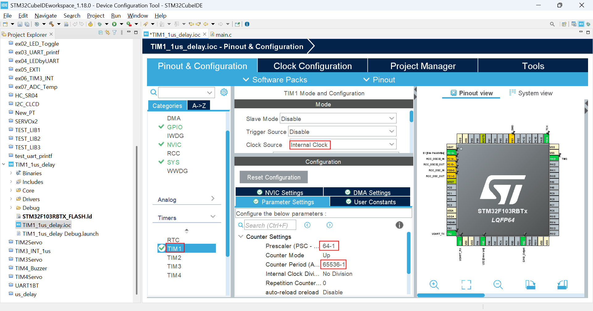
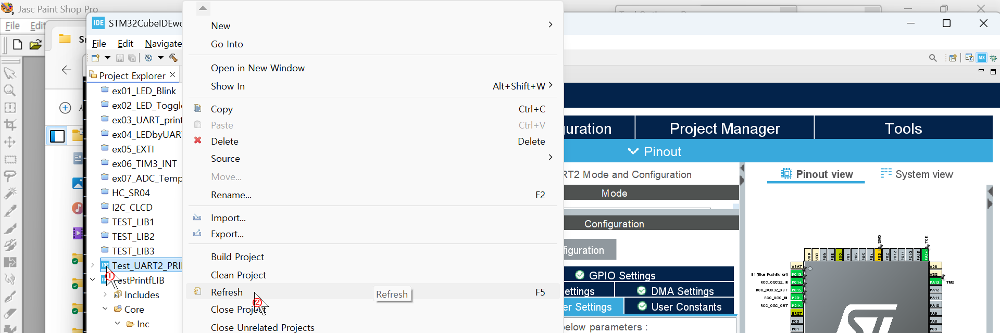
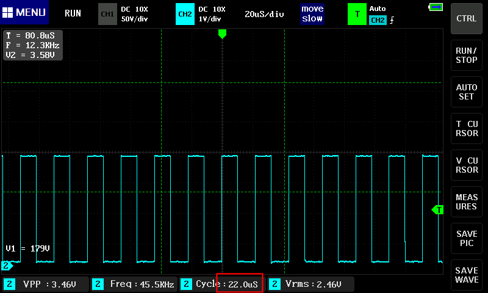

### TIM1을 이용한 `delay_us()`구현 라이브러리 작성 및 사용 

#### 개발환경

**OS** MS-Windows 10(64bit)

**Target** STM32 NUCLEO F103RB

**IDE** STM32 Cube IDE

**참고문헌** STM32CubeIDE를 이용한 STM32 따라하기(주)북랩 김남수 ∙ 이진형 지음 


TIM1을 이용한 1(㎲)딜레이 함수`delay_us()`를 구현 한 라이브러리를 작성해 보자.

**`tim1delay_us.h`**작성

```c
/*
 * tim1delay_us.h
 *
 * Created on: 2025. 04. 10 by Lee Yongjin
 *
 * STM32 HAL library for delay_us() with TIM1
 */
 
#ifndef TIM1DELAY_US_H
#define TIM1DELAY_US_H

#include "stm32f1xx_hal.h"

extern TIM_HandleTypeDef htim1;

void timer_start(void);
void delay_us(uint16_t us);

#endif /* TIM1DELAY_US_H */

```


**`tim1_delay_us.c`**작성

```c
/*
 * tim1_delay_us.c
 *
 * Created on: 2025. 04. 10 by Lee Yongjin
 *
 * STM32 HAL library for delay_us() with TIM1
 */

#include "tim1delay_us.h"

void timer_start(void)
{
	HAL_TIM_Base_Start(&htim1);
}

void delay_us(uint16_t us)
{
	__HAL_TIM_SET_COUNTER(&htim1, 0);              // initislize counter to start from 0
	while((__HAL_TIM_GET_COUNTER(&htim1))<us);   // wait count until us
}

```


`tim1delay_us`라이브러리 사용방법


일단 이 라이브러리를 사용할 프로젝트의 STM32 Cube IDE의 Pinout & Configuration에서 TIM1 설정이 필요하다.

우선 TIM1에 공급되는 타이머 클럭을 1MHz로 만들어 줄 Prescaler 값을 설정한다. 시스템 클럭이 64MHz일 경우 `64-1`, 시스템 클럭이 72MHz일 경우 `72-1`로 설정 한다. 이렇게 해야 타이머 클럭 1개를 카운트 할때 1(㎲)가 소요되어 마이크로 초 단위의 딜레이 함수 `delay_us()`를 구현하기 용이하다. 



Prescaler값을 설정했으면  Counter Period 값을 설정하는데, 16비트 카운터가 카운트할 수 있는 최대값인 `65536-1`로 설정한다. 이 것으로 TIM1설정을 마치고, 앞서 작성한 `tim1delay_us.h`파일을 

`STM32CubeIDEWorkspace` -`CurrentProject -` `Core`- `Inc`폴더에,  `tim1delay_us.c`파일은 

`STM32CubeIDEWorkspace` -`CurrentProject -` `Core`- `Src`폴더에 복사한다. (`current project`는 현재 작업 중인 프로젝트 폴더를 말한다. )

STM32 Cube IDE의 프로젝트 탐색기에서 작업중인 프로젝트 이름에 마우스 오른쪽 버튼을 클릭하여 나타난 컨텍스트 메뉴에서 `Refresh`메뉴를 클릭하여 복사한 라이브러리를 현재 프로젝트에 반영한다. 

 

`main.c`의 다음 코드를 찾아, 

```c
/* Private includes ----------------------------------------------------------*/
/* USER CODE BEGIN Includes */

/* USER CODE END Includes */
```


다음과 같이 편집한다. 

```c
/* Private includes ----------------------------------------------------------*/
/* USER CODE BEGIN Includes */
#include "tim1_delay_us.h"
/* USER CODE END Includes */
```


`main.c`의 다음 코드를 찾아, 

```c
/* USER CODE BEGIN 2 */

  /* USER CODE END 2 */
```


다음과 같이 편집한다. 

```c
/* USER CODE BEGIN 2 */
timer_start();
  /* USER CODE END 2 */
```


이제 `delay_us()`함수를 사용 할 수 있다. 매개변수는 (㎲)단위의 시간을 최대 65535까지의 정수로 입력하면 된다. 예 : `delay_us(10)`

아래 그림은 해당 라이브러리를 사용하여 GPIO PB2핀의 출력을 오실로스코프에서 측정한 결과이다. 



10(㎲)동안 HIGH, 10(㎲)동안 LOW를 교대로 출력하므로 주기는 20(㎲)가 되어야 하지만 측정 결과는 22(㎲)이다. 10(㎲)마다 1(㎲)의 오차가 발생했다.


[**목차**](../README.md) 
