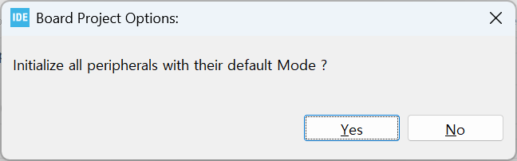

### USART2를 이용한 `printf()`구현 라이브러리 작성 및 사용

#### 개발환경

**OS** MS-Windows 10(64bit)

**Target** STM32 NUCLEO F103RB

**IDE** STM32 Cube IDE

**참고문헌** STM32CubeIDE를 이용한 STM32 따라하기(주)북랩 김남수 ∙ 이진형 지음 


**`printf()`**는 표준출력장치를 통해 데이터를 출력하는 함수이다. PC의 경우 화면출력이 표준 출력장치인데, NUCLEO 보드의  USART로 한 문자를 출력하는 함수를 만들어 이를 표준 출력 장치로 등록해 주면 USART로 출력하는 **`printf()`**를 구현할 수 있다.

**NUCLEO F103RB**의 경우 USART1,USART 2, USART3 개의 USART가 지원된다.  이 중 USART2가 USB에 연결되어 있으므로 USART2를 사용하기로 한다.

**`uart2_printf.h`**작성

```c
/*
 * uart2_printf.h
 *
 * Created on: 2025. 03. 16 by Lee Yongjin
 *
 * STM32 HAL library for using printf with USART2
 */
  
#ifndef UART2_PRINTF_H
#define UART2_PRINTF_H

#include<stdio.h>
#include "stm32f1xx_hal.h"
#endif /* UART2_PRINTF_H */
```


**`uart2_printf.c`**작성

```c
/*
 * uart2_printf.c
 *
 * Created on: 2025. 03. 16 by Lee Yongjin
 *
 * STM32 HAL library for using printf with USART2
 */

#include "uart2_printf.h"

extern UART_HandleTypeDef huart2;

#ifdef __GNUC__
/* With GCC, small printf (option LD Linker->Libraries->Small printf
   set to 'Yes') calls __io_putchar() */
#define PUTCHAR_PROTOTYPE int __io_putchar(int ch)
#else
#define PUTCHAR_PROTOTYPE int fputc(int ch, FILE *f)
#endif /* __GNUC__ */

/**
  * @brief  Retargets the C library printf function to the USART.
  * @param  None
  * @retval None
  */
PUTCHAR_PROTOTYPE
{
  /* Place your implementation of fputc here */
  /* e.g. write a character to the USART1 and Loop until the end of transmission */
  if (ch == '\n')
    HAL_UART_Transmit (&huart2, (uint8_t*) "\r", 1, 0xFFFF);
  HAL_UART_Transmit (&huart2, (uint8_t*) &ch, 1, 0xFFFF);

  return ch;
}
```


`uart2_printf`라이브러리 사용방법


프로젝트 생성 시 아래 화면에서[  <u>Y</u>es ]를 선택 했다면 따로 STM32 Cube IDE의 Pinout & Configuration에서 USART2에 대해 따로 설정할 것은 없다. 



앞서 작성한 `uart2_printf.h`파일을 

`STM32CubeIDEWorkspace` -`CurrentProject -` `Core`- `Inc`폴더에,  `uart2_printf.c`파일은 

`STM32CubeIDEWorkspace` -`CurrentProject -` `Core`- `Src`폴더에 복사한다. (`current project`는 현재 작업 중인 프로젝트 폴더를 말한다. )

STM32 Cube IDE의 프로젝트 탐색기에서 작업중인 프로젝트 이름에 마우스 오른쪽 버튼을 클릭하여 나타난 컨텍스트 메뉴에서 `Refresh`메뉴를 클릭하여 복사한 라이브러리를 현재 프로젝트에 반영한다. 

 

`main.c`의 다음 코드를 찾아, 

```c
/* Private includes ----------------------------------------------------------*/
/* USER CODE BEGIN Includes */

/* USER CODE END Includes */
```


다음과 같이 편집한다. 

```c
/* Private includes ----------------------------------------------------------*/
/* USER CODE BEGIN Includes */
#include "uart2_printf.h"
/* USER CODE END Includes */
```

이제 `main()`안에서 `MX_USART2_UART_Init();`이 후 부터 `printf()`를 사용할 수 있다. 

[**목차**](../README.md) 
