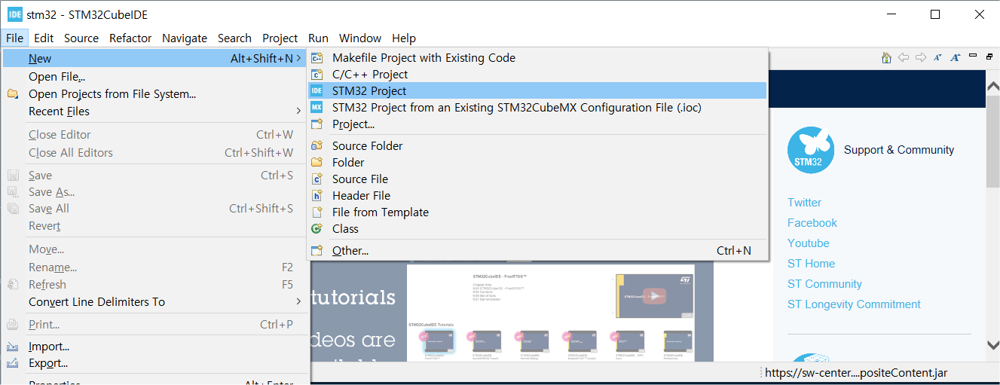
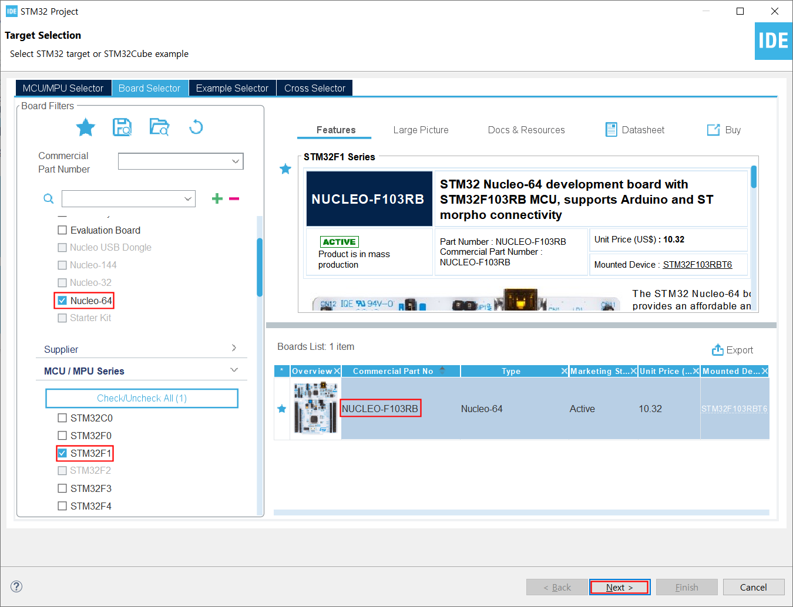
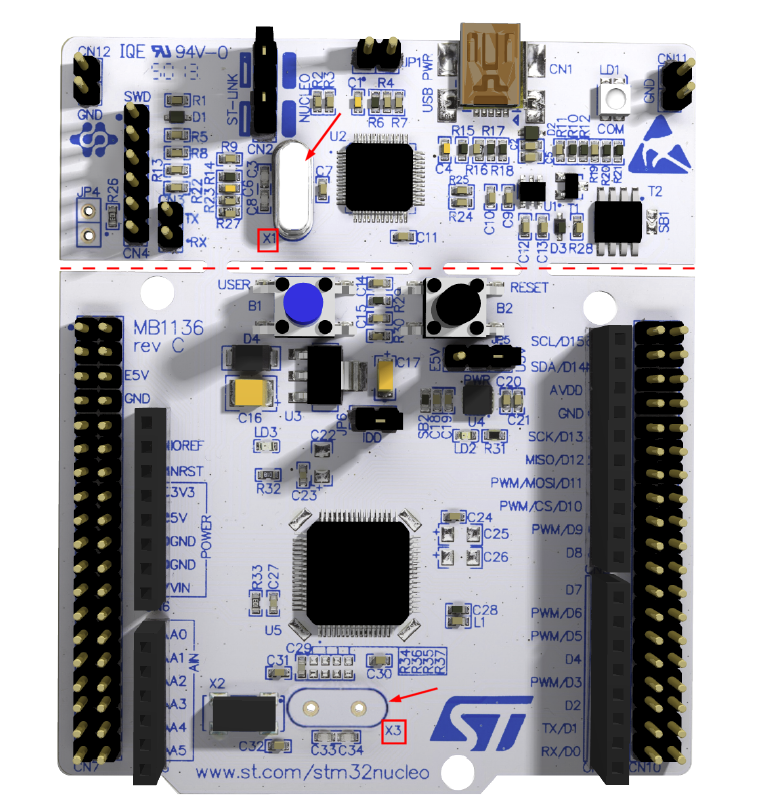
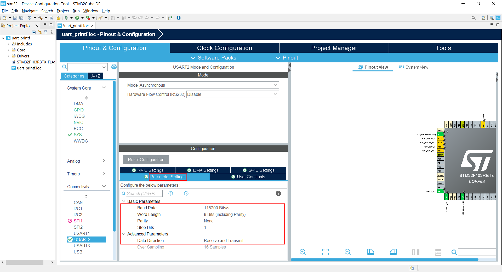
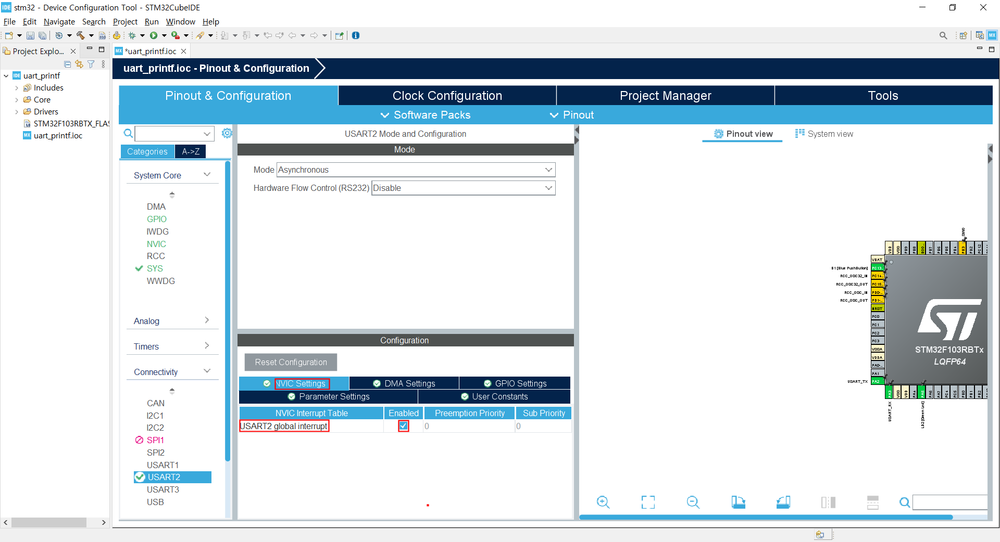

### 주제목

실습하려는 기능 요약

#### 개발환경

**OS** MS-Windows 10(64bit)

**Target** STM32 NUCLEO F103RB

**IDE** STM32 Cube IDE

**참고문헌** STM32CubeIDE를 이용한 STM32 따라하기(주)북랩 김남수 ∙ 이진형 지음 

#### 프로젝트 생성

**STM32CubeIDE** 실행 후, 아래와 같이 File - New - STM32 Project 선택 




#### Target 선택

Tafget Selection 윈도우가 나타나면 **Board Selector** 탭을 클릭한다.


Board selector 탭의 Type에서 NUCLEO64를 체크, MCU/MPU Series에서 STM32F1을 체크 하면 Board List에 **NUCLEO-F103RB**가 표시된다. 이를 선택 후, 하단의 Next > 버튼을 클릭한다.



STM32 Project 창이 나타나면 Project Name: 에 적당한 프로젝트 이름을 입력 후(예: LED_Blink) Finish 버튼을 클릭한다. 


Board Project Options 대화창에서 Yes 버튼을 클릭한다.


Open Associated Perspective 대화창에서 Yes 버튼을 클릭하면 Device Configration Tool 창이 열린다.


#### Device Configuration Tool 설정

가장 먼저 설정할 **`peripheral`**은 **RCC**(Reset & Clock Control)이다.

**NUCLEO-F103RB** 에서 사용가능한 클럭소스는 크게 내부클럭, 외부클럭이 있고, 외부클럭은 ST-Link의 8MHz 크리스탈 출력을 bypass시켜 사용하는 방법과 아래 그림에 표시된 X3 위치에 8MHz 크리스털을 납땜하여 그 출력을 클럭으로 사용하는 방법이 있다. 

NUCLEO F103RB 보드는 위 그림의 적색 점선으로 표시한 Cutting Edge를 경계로 잘라서 2개의 보드로 사용할 수 있는데, 위쪽 보드는 ST-Link ISP( In-Circuit Programmer)로 독립적으로사용할 수 있다.

##### RCC 설정

앞으로 모든 실습은 내부내부 클럭(STM32F103RB MCU 내부의 RC클럭 발진회로)사용을 기준으로 진행한다.

클럭 소스로 내부RC 클럭 발진회로를 선택하기위한 RCC 설정을 위해 다음 그림과 같이 Device Configuration 창에서 Pinout & Configuration 탭의 System Core 항목 중 RCC를 선택 후 우측의 RCC Mode and Configuration 의 Mode의 High Speed Clock(HSE), Low Speed Clock(LSE) 모두 Disable로 변경한다.


Clock Configuration 탭에서 SYSCLK이 64(MHz)로 설정되었는 지 확인한다.


##### USART2 설정

RCC 다음에 설정할  **`peripheral`**은 **USART2**(Universal Synchronous ASynchronous RecieverReceiver/Transmitter)이다. **`USART2`**를 이용한 **`printf()`**함수를 사용할 수 있도록 하기위해 USART2 장치를 설정해보자. 

- NUCLEO-F103RB 타겟보드는 3개의 USART(USART1, USART2, USART3)가 지원된다. 그 중 USB 포트에 바로 연결된 장치가 USART2이므로 USART2 장치를 표준 출력장치로 설정하여 printf() 함수로 출력한 내용이 시리얼로 출력되도록 USART2를 설정한다. 먼저 Device Configuration 창에서 Pinout & Configuration 탭의 Conectivity 항목 중 USART2를 선택 후 우측의 USART Mode snd Configuration 의 Mode를 Asynchronous로, Hardware Flow Control(RS232)을 Disable로 변경한다. 

  


USART2  Parameter Settings

앞서 설정한 USART2 Mode 항목 아래에 Configuration 항목의 Parameter Settings 탭을 선택하고 

**Baud Rate** - 115200, **World Length** : 8bit, **Parity** : None, **Stop Bits** : 1, **Data Direction** : Recieve and Transmit 등의 설정값을 확인

한다.




USART2 NVIC Settings

NVIC Settings 탭을 선택하고, USART2 Global Interrupt항목의 Enabled를 체크한다.




##### NVIC 설정

USART 다음에 설정할  **`peripheral`**은 **NVIC**(Nested Vector Interrupt Controller)이다.  peripheral 설정 중 해당 peripheral의 NVIC Settings 탭을 설정했다면 반드시 System Core의 NVIC에 반영 여부를 확인하자. 

System Core 항목에서 NVIC을 선택하고, USART2 Global Interrupt 항목의 체크를 해제한다.


##### 추가 Peripheral설정

다른 Peripheral(ADC, TIM, I2C 외) 기능이 필요하면 추가로 설정한다. 

#####  Generate Code

지금까지의 설정을 반영한 코드 생성을 위해 Project 메뉴의 Generate Code 항목을 선택한다. 

Open Associated Perspective 대화창에서 Yes 버튼을 클릭한다. 


자동으로 `main.c`가 생성된다. 다음은 이렇게 생성된 `main.c`의 내용이다.

```c
/* USER CODE BEGIN Header */
/**
  ******************************************************************************
  * @file           : main.c
  * @brief          : Main program body
  ******************************************************************************
  * @attention
  *
  * Copyright (c) 2025 STMicroelectronics.
  * All rights reserved.
  *
  * This software is licensed under terms that can be found in the LICENSE file
  * in the root directory of this software component.
  * If no LICENSE file comes with this software, it is provided AS-IS.
  *
  ******************************************************************************
  */
/* USER CODE END Header */
/* Includes ------------------------------------------------------------------*/
#include "main.h"

/* Private includes ----------------------------------------------------------*/
/* USER CODE BEGIN Includes */

/* USER CODE END Includes */

/* Private typedef -----------------------------------------------------------*/
/* USER CODE BEGIN PTD */

/* USER CODE END PTD */

/* Private define ------------------------------------------------------------*/
/* USER CODE BEGIN PD */

/* USER CODE END PD */

/* Private macro -------------------------------------------------------------*/
/* USER CODE BEGIN PM */

/* USER CODE END PM */

/* Private variables ---------------------------------------------------------*/
UART_HandleTypeDef huart2;

/* USER CODE BEGIN PV */

/* USER CODE END PV */

/* Private function prototypes -----------------------------------------------*/
void SystemClock_Config(void);
static void MX_GPIO_Init(void);
static void MX_USART2_UART_Init(void);
/* USER CODE BEGIN PFP */

/* USER CODE END PFP */

/* Private user code ---------------------------------------------------------*/
/* USER CODE BEGIN 0 */

/* USER CODE END 0 */

/**
  * @brief  The application entry point.
  * @retval int
  */
int main(void)
{

  /* USER CODE BEGIN 1 */

  /* USER CODE END 1 */

  /* MCU Configuration--------------------------------------------------------*/

  /* Reset of all peripherals, Initializes the Flash interface and the Systick. */
  HAL_Init();

  /* USER CODE BEGIN Init */

  /* USER CODE END Init */

  /* Configure the system clock */
  SystemClock_Config();

  /* USER CODE BEGIN SysInit */

  /* USER CODE END SysInit */

  /* Initialize all configured peripherals */
  MX_GPIO_Init();
  MX_USART2_UART_Init();
  /* USER CODE BEGIN 2 */

  /* USER CODE END 2 */

  /* Infinite loop */
  /* USER CODE BEGIN WHILE */
  while (1)
  {
    /* USER CODE END WHILE */

    /* USER CODE BEGIN 3 */
  }
  /* USER CODE END 3 */
}

/**
  * @brief System Clock Configuration
  * @retval None
  */
void SystemClock_Config(void)
{
  RCC_OscInitTypeDef RCC_OscInitStruct = {0};
  RCC_ClkInitTypeDef RCC_ClkInitStruct = {0};

  /** Initializes the RCC Oscillators according to the specified parameters
  * in the RCC_OscInitTypeDef structure.
  */
  RCC_OscInitStruct.OscillatorType = RCC_OSCILLATORTYPE_HSI;
  RCC_OscInitStruct.HSIState = RCC_HSI_ON;
  RCC_OscInitStruct.HSICalibrationValue = RCC_HSICALIBRATION_DEFAULT;
  RCC_OscInitStruct.PLL.PLLState = RCC_PLL_ON;
  RCC_OscInitStruct.PLL.PLLSource = RCC_PLLSOURCE_HSI_DIV2;
  RCC_OscInitStruct.PLL.PLLMUL = RCC_PLL_MUL16;
  if (HAL_RCC_OscConfig(&RCC_OscInitStruct) != HAL_OK)
  {
    Error_Handler();
  }

  /** Initializes the CPU, AHB and APB buses clocks
  */
  RCC_ClkInitStruct.ClockType = RCC_CLOCKTYPE_HCLK|RCC_CLOCKTYPE_SYSCLK
                              |RCC_CLOCKTYPE_PCLK1|RCC_CLOCKTYPE_PCLK2;
  RCC_ClkInitStruct.SYSCLKSource = RCC_SYSCLKSOURCE_PLLCLK;
  RCC_ClkInitStruct.AHBCLKDivider = RCC_SYSCLK_DIV1;
  RCC_ClkInitStruct.APB1CLKDivider = RCC_HCLK_DIV2;
  RCC_ClkInitStruct.APB2CLKDivider = RCC_HCLK_DIV1;

  if (HAL_RCC_ClockConfig(&RCC_ClkInitStruct, FLASH_LATENCY_2) != HAL_OK)
  {
    Error_Handler();
  }
}

/**
  * @brief USART2 Initialization Function
  * @param None
  * @retval None
  */
static void MX_USART2_UART_Init(void)
{

  /* USER CODE BEGIN USART2_Init 0 */

  /* USER CODE END USART2_Init 0 */

  /* USER CODE BEGIN USART2_Init 1 */

  /* USER CODE END USART2_Init 1 */
  huart2.Instance = USART2;
  huart2.Init.BaudRate = 115200;
  huart2.Init.WordLength = UART_WORDLENGTH_8B;
  huart2.Init.StopBits = UART_STOPBITS_1;
  huart2.Init.Parity = UART_PARITY_NONE;
  huart2.Init.Mode = UART_MODE_TX_RX;
  huart2.Init.HwFlowCtl = UART_HWCONTROL_NONE;
  huart2.Init.OverSampling = UART_OVERSAMPLING_16;
  if (HAL_UART_Init(&huart2) != HAL_OK)
  {
    Error_Handler();
  }
  /* USER CODE BEGIN USART2_Init 2 */

  /* USER CODE END USART2_Init 2 */

}

/**
  * @brief GPIO Initialization Function
  * @param None
  * @retval None
  */
static void MX_GPIO_Init(void)
{
  GPIO_InitTypeDef GPIO_InitStruct = {0};
  /* USER CODE BEGIN MX_GPIO_Init_1 */

  /* USER CODE END MX_GPIO_Init_1 */

  /* GPIO Ports Clock Enable */
  __HAL_RCC_GPIOC_CLK_ENABLE();
  __HAL_RCC_GPIOD_CLK_ENABLE();
  __HAL_RCC_GPIOA_CLK_ENABLE();
  __HAL_RCC_GPIOB_CLK_ENABLE();

  /*Configure GPIO pin Output Level */
  HAL_GPIO_WritePin(LD2_GPIO_Port, LD2_Pin, GPIO_PIN_RESET);

  /*Configure GPIO pin : B1_Pin */
  GPIO_InitStruct.Pin = B1_Pin;
  GPIO_InitStruct.Mode = GPIO_MODE_IT_RISING;
  GPIO_InitStruct.Pull = GPIO_NOPULL;
  HAL_GPIO_Init(B1_GPIO_Port, &GPIO_InitStruct);

  /*Configure GPIO pin : LD2_Pin */
  GPIO_InitStruct.Pin = LD2_Pin;
  GPIO_InitStruct.Mode = GPIO_MODE_OUTPUT_PP;
  GPIO_InitStruct.Pull = GPIO_NOPULL;
  GPIO_InitStruct.Speed = GPIO_SPEED_FREQ_LOW;
  HAL_GPIO_Init(LD2_GPIO_Port, &GPIO_InitStruct);

  /* EXTI interrupt init*/
  HAL_NVIC_SetPriority(EXTI15_10_IRQn, 0, 0);
  HAL_NVIC_EnableIRQ(EXTI15_10_IRQn);

  /* USER CODE BEGIN MX_GPIO_Init_2 */

  /* USER CODE END MX_GPIO_Init_2 */
}

/* USER CODE BEGIN 4 */

/* USER CODE END 4 */

/**
  * @brief  This function is executed in case of error occurrence.
  * @retval None
  */
void Error_Handler(void)
{
  /* USER CODE BEGIN Error_Handler_Debug */
  /* User can add his own implementation to report the HAL error return state */
  __disable_irq();
  while (1)
  {
  }
  /* USER CODE END Error_Handler_Debug */
}

#ifdef  USE_FULL_ASSERT
/**
  * @brief  Reports the name of the source file and the source line number
  *         where the assert_param error has occurred.
  * @param  file: pointer to the source file name
  * @param  line: assert_param error line source number
  * @retval None
  */
void assert_failed(uint8_t *file, uint32_t line)
{
  /* USER CODE BEGIN 6 */
  /* User can add his own implementation to report the file name and line number,
     ex: printf("Wrong parameters value: file %s on line %d\r\n", file, line) */
  /* USER CODE END 6 */
}
#endif /* USE_FULL_ASSERT */

```


##### `printf()`라이브러리 작성 및 프로젝트에 반영

USART2를 이용한 `printf()` 사용을 위한 사용자 라이브러리 `uart2_printf.h`파일과 `uart2_printf.c`파일을 각각 STM32 Cube IDE의 워크스페이스의 작성 중인 프로젝트 폴더의 `Core/Inc` 및 `Core/Src`폴더에 다음과같이 작성하여 저장한다. 

**`uart2_printf.h`**

```c
/*
 * uart2_printf.h
 *
 * STM32 HAL library for using printf with USART2
 */
  
#ifndef UART2_PRINTF_H
#define UART2_PRINTF_H

#include "stm32f1xx_hal.h"
#include<stdio.h>

#endif /* UART2_PRINTF_H */
```


**`uart2_printf.c`**

```c
/*
 * uart2_printf.c
 *
 * STM32 HAL library for using printf with USART2
 */

#include "uart2_printf.h"

extern UART_HandleTypeDef huart2;

#ifdef __GNUC__
/* With GCC, small printf (option LD Linker->Libraries->Small printf
   set to 'Yes') calls __io_putchar() */
#define PUTCHAR_PROTOTYPE int __io_putchar(int ch)
#else
#define PUTCHAR_PROTOTYPE int fputc(int ch, FILE *f)
#endif /* __GNUC__ */

/**
  * @brief  Retargets the C library printf function to the USART.
  * @param  None
  * @retval None
  */
PUTCHAR_PROTOTYPE
{
  /* Place your implementation of fputc here */
  /* e.g. write a character to the USART1 and Loop until the end of transmission */
  if (ch == '\n')
    HAL_UART_Transmit (&huart2, (uint8_t*) "\r", 1, 0xFFFF);
  HAL_UART_Transmit (&huart2, (uint8_t*) &ch, 1, 0xFFFF);

  return ch;
}
```


##### Refresh Project

추가된 라이브러리를 작성 중인 프로젝트에 반영하기 위해다음 그림과 같이 프로젝트 탐색기에서 프로젝트 명에 우클릭하여 나타난 컨텍스트 메뉴에서`Refresh`를 클릭한다.


 `printf()`의 사용을 위해 `[Project Name]/Core/Src/main.c`의 다음 코드를 찾아

```c
/* Private includes ----------------------------------------------------------*/
/* USER CODE BEGIN Includes */

/* USER CODE END Includes */
```

아래와 같이 변경한다.

```c
/* Private includes ----------------------------------------------------------*/
/* USER CODE BEGIN Includes */
#include "uart2_printf.h"
/* USER CODE END Includes */
```

이제 `main()`안에서 `printf()`를 호출할 수 있다.


다음은 여기까지 편집된 `main.c`의 내용이다.

```c
/* USER CODE BEGIN Header */
/**
  ******************************************************************************
  * @file           : main.c
  * @brief          : Main program body
  ******************************************************************************
  * @attention
  *
  * Copyright (c) 2025 STMicroelectronics.
  * All rights reserved.
  *
  * This software is licensed under terms that can be found in the LICENSE file
  * in the root directory of this software component.
  * If no LICENSE file comes with this software, it is provided AS-IS.
  *
  ******************************************************************************
  */
/* USER CODE END Header */
/* Includes ------------------------------------------------------------------*/
#include "main.h"

/* Private includes ----------------------------------------------------------*/
/* USER CODE BEGIN Includes */

/* USER CODE END Includes */

/* Private typedef -----------------------------------------------------------*/
/* USER CODE BEGIN PTD */

/* USER CODE END PTD */

/* Private define ------------------------------------------------------------*/
/* USER CODE BEGIN PD */

/* USER CODE END PD */

/* Private macro -------------------------------------------------------------*/
/* USER CODE BEGIN PM */

/* USER CODE END PM */

/* Private variables ---------------------------------------------------------*/
UART_HandleTypeDef huart2;

/* USER CODE BEGIN PV */

/* USER CODE END PV */

/* Private function prototypes -----------------------------------------------*/
void SystemClock_Config(void);
static void MX_GPIO_Init(void);
static void MX_USART2_UART_Init(void);
/* USER CODE BEGIN PFP */

/* USER CODE END PFP */

/* Private user code ---------------------------------------------------------*/
/* USER CODE BEGIN 0 */

/* USER CODE END 0 */

/**
  * @brief  The application entry point.
  * @retval int
  */
int main(void)
{

  /* USER CODE BEGIN 1 */

  /* USER CODE END 1 */

  /* MCU Configuration--------------------------------------------------------*/

  /* Reset of all peripherals, Initializes the Flash interface and the Systick. */
  HAL_Init();

  /* USER CODE BEGIN Init */

  /* USER CODE END Init */

  /* Configure the system clock */
  SystemClock_Config();

  /* USER CODE BEGIN SysInit */

  /* USER CODE END SysInit */

  /* Initialize all configured peripherals */
  MX_GPIO_Init();
  MX_USART2_UART_Init();
  /* USER CODE BEGIN 2 */

  /* USER CODE END 2 */

  /* Infinite loop */
  /* USER CODE BEGIN WHILE */
  while (1)
  {
    /* USER CODE END WHILE */

    /* USER CODE BEGIN 3 */
  }
  /* USER CODE END 3 */
}

/**
  * @brief System Clock Configuration
  * @retval None
  */
void SystemClock_Config(void)
{
  RCC_OscInitTypeDef RCC_OscInitStruct = {0};
  RCC_ClkInitTypeDef RCC_ClkInitStruct = {0};

  /** Initializes the RCC Oscillators according to the specified parameters
  * in the RCC_OscInitTypeDef structure.
  */
  RCC_OscInitStruct.OscillatorType = RCC_OSCILLATORTYPE_HSI;
  RCC_OscInitStruct.HSIState = RCC_HSI_ON;
  RCC_OscInitStruct.HSICalibrationValue = RCC_HSICALIBRATION_DEFAULT;
  RCC_OscInitStruct.PLL.PLLState = RCC_PLL_ON;
  RCC_OscInitStruct.PLL.PLLSource = RCC_PLLSOURCE_HSI_DIV2;
  RCC_OscInitStruct.PLL.PLLMUL = RCC_PLL_MUL16;
  if (HAL_RCC_OscConfig(&RCC_OscInitStruct) != HAL_OK)
  {
    Error_Handler();
  }

  /** Initializes the CPU, AHB and APB buses clocks
  */
  RCC_ClkInitStruct.ClockType = RCC_CLOCKTYPE_HCLK|RCC_CLOCKTYPE_SYSCLK
                              |RCC_CLOCKTYPE_PCLK1|RCC_CLOCKTYPE_PCLK2;
  RCC_ClkInitStruct.SYSCLKSource = RCC_SYSCLKSOURCE_PLLCLK;
  RCC_ClkInitStruct.AHBCLKDivider = RCC_SYSCLK_DIV1;
  RCC_ClkInitStruct.APB1CLKDivider = RCC_HCLK_DIV2;
  RCC_ClkInitStruct.APB2CLKDivider = RCC_HCLK_DIV1;

  if (HAL_RCC_ClockConfig(&RCC_ClkInitStruct, FLASH_LATENCY_2) != HAL_OK)
  {
    Error_Handler();
  }
}

/**
  * @brief USART2 Initialization Function
  * @param None
  * @retval None
  */
static void MX_USART2_UART_Init(void)
{

  /* USER CODE BEGIN USART2_Init 0 */

  /* USER CODE END USART2_Init 0 */

  /* USER CODE BEGIN USART2_Init 1 */

  /* USER CODE END USART2_Init 1 */
  huart2.Instance = USART2;
  huart2.Init.BaudRate = 115200;
  huart2.Init.WordLength = UART_WORDLENGTH_8B;
  huart2.Init.StopBits = UART_STOPBITS_1;
  huart2.Init.Parity = UART_PARITY_NONE;
  huart2.Init.Mode = UART_MODE_TX_RX;
  huart2.Init.HwFlowCtl = UART_HWCONTROL_NONE;
  huart2.Init.OverSampling = UART_OVERSAMPLING_16;
  if (HAL_UART_Init(&huart2) != HAL_OK)
  {
    Error_Handler();
  }
  /* USER CODE BEGIN USART2_Init 2 */

  /* USER CODE END USART2_Init 2 */

}

/**
  * @brief GPIO Initialization Function
  * @param None
  * @retval None
  */
static void MX_GPIO_Init(void)
{
  GPIO_InitTypeDef GPIO_InitStruct = {0};
  /* USER CODE BEGIN MX_GPIO_Init_1 */

  /* USER CODE END MX_GPIO_Init_1 */

  /* GPIO Ports Clock Enable */
  __HAL_RCC_GPIOC_CLK_ENABLE();
  __HAL_RCC_GPIOD_CLK_ENABLE();
  __HAL_RCC_GPIOA_CLK_ENABLE();
  __HAL_RCC_GPIOB_CLK_ENABLE();

  /*Configure GPIO pin Output Level */
  HAL_GPIO_WritePin(LD2_GPIO_Port, LD2_Pin, GPIO_PIN_RESET);

  /*Configure GPIO pin : B1_Pin */
  GPIO_InitStruct.Pin = B1_Pin;
  GPIO_InitStruct.Mode = GPIO_MODE_IT_RISING;
  GPIO_InitStruct.Pull = GPIO_NOPULL;
  HAL_GPIO_Init(B1_GPIO_Port, &GPIO_InitStruct);

  /*Configure GPIO pin : LD2_Pin */
  GPIO_InitStruct.Pin = LD2_Pin;
  GPIO_InitStruct.Mode = GPIO_MODE_OUTPUT_PP;
  GPIO_InitStruct.Pull = GPIO_NOPULL;
  GPIO_InitStruct.Speed = GPIO_SPEED_FREQ_LOW;
  HAL_GPIO_Init(LD2_GPIO_Port, &GPIO_InitStruct);

  /* EXTI interrupt init*/
  HAL_NVIC_SetPriority(EXTI15_10_IRQn, 0, 0);
  HAL_NVIC_EnableIRQ(EXTI15_10_IRQn);

  /* USER CODE BEGIN MX_GPIO_Init_2 */

  /* USER CODE END MX_GPIO_Init_2 */
}

/* USER CODE BEGIN 4 */

/* USER CODE END 4 */

/**
  * @brief  This function is executed in case of error occurrence.
  * @retval None
  */
void Error_Handler(void)
{
  /* USER CODE BEGIN Error_Handler_Debug */
  /* User can add his own implementation to report the HAL error return state */
  __disable_irq();
  while (1)
  {
  }
  /* USER CODE END Error_Handler_Debug */
}

#ifdef  USE_FULL_ASSERT
/**
  * @brief  Reports the name of the source file and the source line number
  *         where the assert_param error has occurred.
  * @param  file: pointer to the source file name
  * @param  line: assert_param error line source number
  * @retval None
  */
void assert_failed(uint8_t *file, uint32_t line)
{
  /* USER CODE BEGIN 6 */
  /* User can add his own implementation to report the file name and line number,
     ex: printf("Wrong parameters value: file %s on line %d\r\n", file, line) */
  /* USER CODE END 6 */
}
#endif /* USE_FULL_ASSERT */

```


##### `main.c` 편집

자동 생성된 `main.c`의 내용을 구현하려는 기능에 부합하도록 수정 편집 한다.

`/* USER CODE BEGIN Includes */` 와 `/* USER CODE END Includes */`사이에는 `main.h`외 추가로 include할 헤더파일을 적는다. 

```c
/* Private includes ----------------------------------------------------------*/
/* USER CODE BEGIN Includes */

/* USER CODE END Includes */
```


`/* USER CODE BEGIN PTD */` 와 `/* USER CODE END IPTD */`사이에는user define type 구조체 등 사용자 정의 변수 Type을 적는다. 

```c
/* Private typedef -----------------------------------------------------------*/
/* USER CODE BEGIN PTD */

/* USER CODE END PTD */
```


`/* USER CODE BEGIN PD */` 와 `/* USER CODE BEGIN PD */`사이에는 필요한 `#define`을 작성한다. 

```c
/* Private define ------------------------------------------------------------*/
/* USER CODE BEGIN PD */

/* USER CODE END PD */
```


`/* USER CODE BEGIN PM */` 와 `/* USER CODE END PM */` 사이에는 사용자 정의 매크로를 작성한다. 

```c
/* Private macro -------------------------------------------------------------*/
/* USER CODE BEGIN PM */

/* USER CODE END PM */
```


`/* USER CODE BEGIN PV */` 와 `/* USER CODE BEGIN PV */` 사이에는 필요한 변수를 정의한다.

```c
/* Private variables ---------------------------------------------------------*/
/* USER CODE BEGIN PV */

/* USER CODE END PV */
```


`/* /* USER CODE BEGIN 0 */` 와 ` /* USER CODE END 0 */` 사이에는 `main()`에 포함되지 앟는 코드를 작성한다.

```c
/* Private user code ---------------------------------------------------------*/
/* USER CODE BEGIN 0 */

/* USER CODE END 0 */
```


`/* USER CODE BEGIN 1 */` 과 ` /* USER CODE END 1 */` 사이에는 `main()`에 포함되지만`while(1)`에서 반복되지 않고 1회만 구동될 코드를 작성한다.

```c
/* USER CODE BEGIN 1 */

 /* USER CODE END 1 */
```


`/* USER CODE BEGIN 2 */` 과 ` /* USER CODE END 2 */` 사이에는 

`/* /* USER CODE BEGIN 1 */` 과 ` /* USER CODE END 1 */`사이에 적지않은 `main()`에 포함되지만`while(1)`에서 반복되지 않고 1회만 구동될 코드를 작성한다.

```c
/* USER CODE BEGIN 2 */

 /* USER CODE END 2*/
```


```c
  /* USER CODE BEGIN WHILE */
  while (1)
  {
```

과 `/* USER CODE END WHILE */` 사이에는 `main()`에 작성할 내용 중 `while(1)`에 의해 무한 반복될 내용을 작성한다. 


```c
/* Infinite loop */
  /* USER CODE BEGIN WHILE */
  while (1)
  { 
      
    /* USER CODE END WHILE */
```


`/* USER CODE BEGIN 4 */` 와 `/* USER CODE END 4 */` 사이의 위치는 `main()`외부이다. ISR(Interrupt Service Routine)이나 사용자 정의 함수를 정의하는 위치로 사용하기에 적합하다. 

```c
 /* USER CODE BEGIN 4 */
 
  /* USER CODE END 4 */
```


든 코드의 작성이 완료되면 Project 메뉴의 Build Project 항목을 클릭하여 빌드한다.


##### 구동 및 테스트

에러없이 빌드되었으면, RUN 메뉴에서 RUN 항목을 선택하여 빌드 결과를 타겟보드(NUCLEO-F103RB)에 업로드 후, 구현한 기능이 정상 작동하는 지 확인한다. 

[**목차**](../README.md) 
