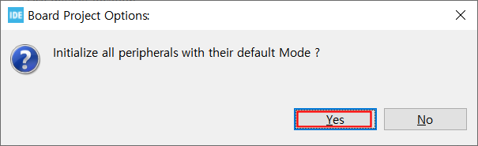
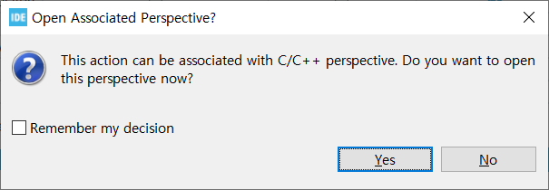
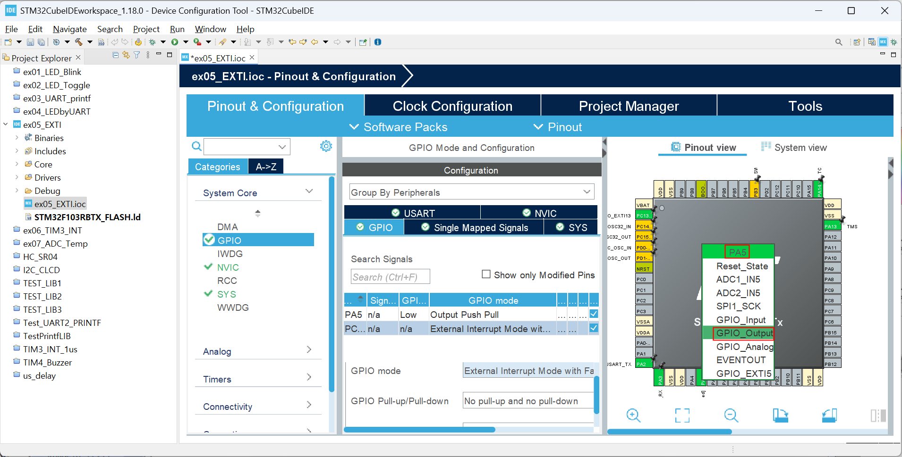
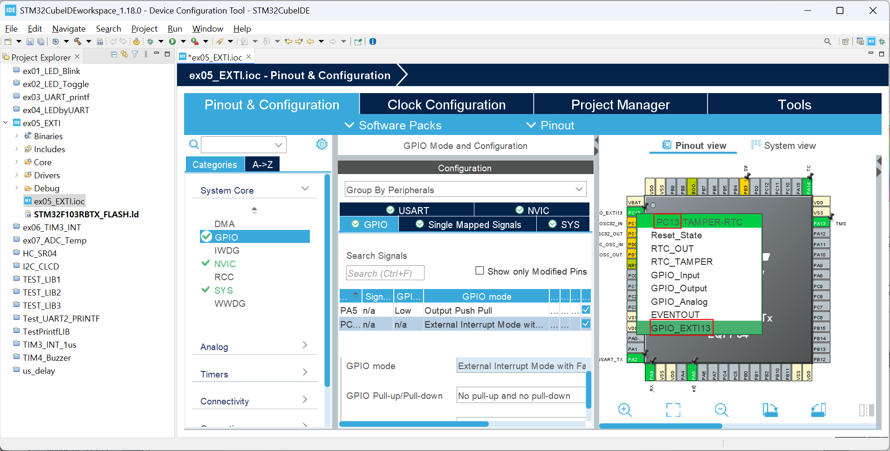
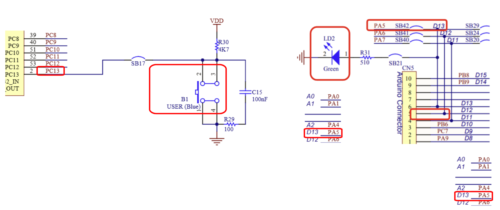
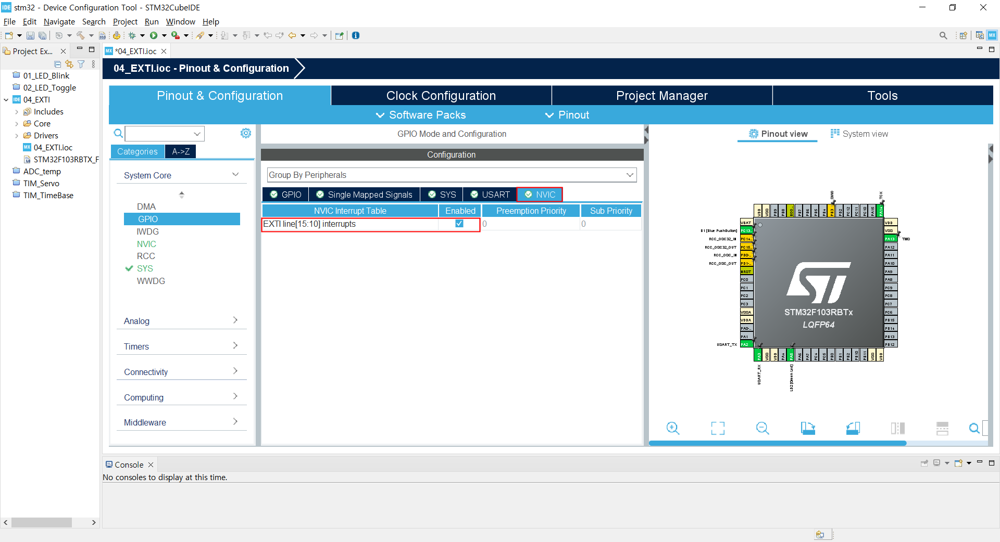
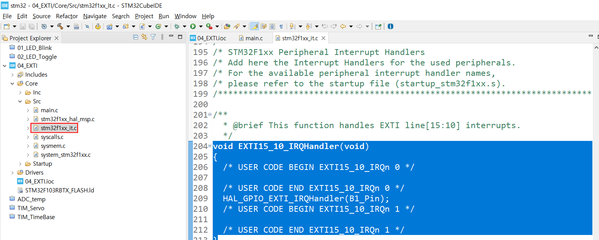
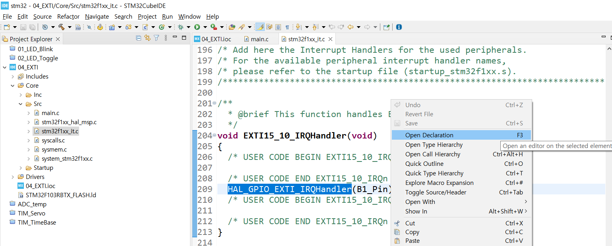

### External Interrupt

#### 개발환경

**OS** MS-Windows 10(64bit)

**Target** STM32 NUCLEO F103RB

**IDE** STM32 Cube IDE

**참고문헌** STM32CubeIDE를 이용한 STM32 따라하기(주)북랩 김남수 ∙ 이진형 지음 

**구현할 기능** B1 SW(Blue Button)가 눌릴 때 마다 외부입력 인터럽트를 발생시키고, LD2 LED(Green LED)의 상태를 토글(Toggle) 시키는 기능 구현.

#### 프로젝트 생성

**STM32CubeIDE** 실행 후, 아래와 같이 File - New - STM32 Project 선택 


#### Target 선택

Tafget Selection 윈도우가 나타나면 **Board Selector** 탭을 클릭한다.


Board selector 탭의 Type에서 NUCLEO64를 체크, MCU/MPU Series에서 STM32F1을 체크 하면 Board List에 **NUCLEO-F103RB**가 표시된다. 이를 선택 후, 하단의 Next > 버튼을 클릭한다.


STM32 Project 창이 나타나면 Project Name: 에 적당한 프로젝트 이름을 입력 후(예: 04_EXTI) `Finish` 버튼을 클릭한다. 


Board Project Options 대화창에서 `Yes` 버튼을 클릭한다.




Open Associated Perspective 대화창에서 `Yes` 버튼을 클릭하면 Device Configration Tool 창이 열린다.





#### Device Configuration Tool


- **RCC 설정**

RCC 설정을 위해 다음 그림과 같이 Device Configuration 창에서 Pinout & Configuration 탭의 System Core 항목 중 RCC를 선택 후 우측의 RCC Mode snd Configuration 의 Mode를 High Speed Clock(HSE), Low Speed Clock(LSE) 모두 Disable로 변경한다.


- **Pinout View에서의 PA5 설정** 

LD2 LED가 연결된 PA5는 출력으로설정 한다.




- **Pinout View에서의 PC13 설정** 

B1 SW가 연결된 PC13은 외부 인터럽트 입력 (EXTI)으로 설정한다.




- 적절한 인터럽트 트리거 방식으로 설정한다. 다음은 LD2 LED와 B1 SW의 회로도이다.
- 

회로도에 의하면 B1 스위치는 풀업 스위치이므로 스위치가 눌리지 않았을 때 HIGH가 입력되다가 스위치가 눌리면 LOW로 떨어지고, 스위치에서 손을 떼면 HIGH로 올라간다. 


즉 누르는 순간에는 Falling Edge가 발생하고, 스위치에서 손을 떼는 순간에는 Rising Edge가 발생하므로 이 SW 를 누를 때 인터럽트를 발생시키기 위해 System Core-GPIO-GPIO Mode and Configuration의 GPIO탭의 PC13 설정을 Interrupt Mode with Falling Edge triger Detection으로 변경한다. 


이제 GPIO Configuration의 NVIC 탭에서 NVIC Interrupt Table항목의 EXTI line[15:10] interrupts Enabled 체크



NVIC Mode and Configuration의 Code Generation 탭의 EXTI line[15:10]항목의 Generate IRQ Handler 및 Call HAL handler에 체크.


지금까지 설정을 반영한 코드 생성을 위해 **Project** 메뉴의 **Generate Code**를 선택한다.

Open_Associated_Perspective? 대화창에서 Yes를 클릭한다.


STM32CubeIDE 화면 우측 상단의 프로젝트 탐색기에서 04_EXTI - Core - Src - `stm32f1xx_it.c`파일을 열면 204~213행에 걸쳐 `EXTI15_10_IRQHandler(void)`가 생성된 것을 확인한다. 




209행의 `HAL_GPIO_EXTI_IRQHandler`함수명 위에 마우스 오른쪽 버튼을 클릭하여 팝업 메뉴에서 Open Declaration 메뉴를 선택하면 `stm32f1xx_hal_gpio.c`파일이 열리면서 HAL_GPIO_EXTI_IRQHandler() 함수를 확인할 수 있다. 



```c
/**
  * @brief  This function handles EXTI interrupt request.
  * @param  GPIO_Pin: Specifies the pins connected EXTI line
  * @retval None
  */
void HAL_GPIO_EXTI_IRQHandler(uint16_t GPIO_Pin)
{
  /* EXTI line interrupt detected */
  if (__HAL_GPIO_EXTI_GET_IT(GPIO_Pin) != 0x00u)
  {
    __HAL_GPIO_EXTI_CLEAR_IT(GPIO_Pin);
    HAL_GPIO_EXTI_Callback(GPIO_Pin);
  }
}

/**
  * @brief  EXTI line detection callbacks.
  * @param  GPIO_Pin: Specifies the pins connected EXTI line
  * @retval None
```

`main.c`의 다음 코드를

```c
/* USER CODE BEGIN PV */

/* USER CODE END PV */
```

아래와 같이 수정, 편집 한다.

```c
/* USER CODE BEGIN PV */
volatile int led_state = 0;
/* USER CODE END PV */
```


인터럽트관련 사용자코드는 `HAL_GPIO_EXTI_Callback()` 함수에 구현하면 된다. 예를 들자면   `main.c`의 213~215 행의 다음 코드를

```c
/* USER CODE BEGIN 4 */

/* USER CODE END 4 */
```

아래와 같이 수정 편집한다. 

```c
 /* USER CODE BEGIN 4 */
HAL_GPIO_EXTI_Callback(uint16_t GPIO_Pin)
{
	led_state = led_state ^1;
	HAL_GPIO_WritePin(GPIOA, GPIO_PIN_5, led_state);
}
/* USER CODE END 4 */
```


Project메뉴의 Build Project메뉴를 선택하여 빌드한 후에, Run 메뉴의 Run항목을 선택하여 타겟보드에 빌드결과를 업로드한 후 타겟보드의 파란색 푸시버튼 스위치를 누를 때 마다 초록색 LED가 ON / OFF 상태가 토글되는 가를 확인한다. 다음은 편집이 완료된 `main.c` 전체 코드이다.

```c
/* USER CODE BEGIN Header */
/**
  ******************************************************************************
  * @file           : main.c
  * @brief          : Main program body
  ******************************************************************************
  * @attention
  *
  * Copyright (c) 2025 STMicroelectronics.
  * All rights reserved.
  *
  * This software is licensed under terms that can be found in the LICENSE file
  * in the root directory of this software component.
  * If no LICENSE file comes with this software, it is provided AS-IS.
  *
  ******************************************************************************
  */
/* USER CODE END Header */
/* Includes ------------------------------------------------------------------*/
#include "main.h"

/* Private includes ----------------------------------------------------------*/
/* USER CODE BEGIN Includes */

/* USER CODE END Includes */

/* Private typedef -----------------------------------------------------------*/
/* USER CODE BEGIN PTD */

/* USER CODE END PTD */

/* Private define ------------------------------------------------------------*/
/* USER CODE BEGIN PD */

/* USER CODE END PD */

/* Private macro -------------------------------------------------------------*/
/* USER CODE BEGIN PM */

/* USER CODE END PM */

/* Private variables ---------------------------------------------------------*/
UART_HandleTypeDef huart2;

/* USER CODE BEGIN PV */
volatile int led_state = 0;
/* USER CODE END PV */

/* Private function prototypes -----------------------------------------------*/
void SystemClock_Config(void);
static void MX_GPIO_Init(void);
static void MX_USART2_UART_Init(void);
/* USER CODE BEGIN PFP */

/* USER CODE END PFP */

/* Private user code ---------------------------------------------------------*/
/* USER CODE BEGIN 0 */

/* USER CODE END 0 */

/**
  * @brief  The application entry point.
  * @retval int
  */
int main(void)
{

  /* USER CODE BEGIN 1 */

  /* USER CODE END 1 */

  /* MCU Configuration--------------------------------------------------------*/

  /* Reset of all peripherals, Initializes the Flash interface and the Systick. */
  HAL_Init();

  /* USER CODE BEGIN Init */

  /* USER CODE END Init */

  /* Configure the system clock */
  SystemClock_Config();

  /* USER CODE BEGIN SysInit */

  /* USER CODE END SysInit */

  /* Initialize all configured peripherals */
  MX_GPIO_Init();
  MX_USART2_UART_Init();
  /* USER CODE BEGIN 2 */

  /* USER CODE END 2 */

  /* Infinite loop */
  /* USER CODE BEGIN WHILE */
  while (1)
  {
    /* USER CODE END WHILE */

    /* USER CODE BEGIN 3 */
  }
  /* USER CODE END 3 */
}

/**
  * @brief System Clock Configuration
  * @retval None
  */
void SystemClock_Config(void)
{
  RCC_OscInitTypeDef RCC_OscInitStruct = {0};
  RCC_ClkInitTypeDef RCC_ClkInitStruct = {0};

  /** Initializes the RCC Oscillators according to the specified parameters
  * in the RCC_OscInitTypeDef structure.
  */
  RCC_OscInitStruct.OscillatorType = RCC_OSCILLATORTYPE_HSI;
  RCC_OscInitStruct.HSIState = RCC_HSI_ON;
  RCC_OscInitStruct.HSICalibrationValue = RCC_HSICALIBRATION_DEFAULT;
  RCC_OscInitStruct.PLL.PLLState = RCC_PLL_ON;
  RCC_OscInitStruct.PLL.PLLSource = RCC_PLLSOURCE_HSI_DIV2;
  RCC_OscInitStruct.PLL.PLLMUL = RCC_PLL_MUL16;
  if (HAL_RCC_OscConfig(&RCC_OscInitStruct) != HAL_OK)
  {
    Error_Handler();
  }

  /** Initializes the CPU, AHB and APB buses clocks
  */
  RCC_ClkInitStruct.ClockType = RCC_CLOCKTYPE_HCLK|RCC_CLOCKTYPE_SYSCLK
                              |RCC_CLOCKTYPE_PCLK1|RCC_CLOCKTYPE_PCLK2;
  RCC_ClkInitStruct.SYSCLKSource = RCC_SYSCLKSOURCE_PLLCLK;
  RCC_ClkInitStruct.AHBCLKDivider = RCC_SYSCLK_DIV1;
  RCC_ClkInitStruct.APB1CLKDivider = RCC_HCLK_DIV2;
  RCC_ClkInitStruct.APB2CLKDivider = RCC_HCLK_DIV1;

  if (HAL_RCC_ClockConfig(&RCC_ClkInitStruct, FLASH_LATENCY_2) != HAL_OK)
  {
    Error_Handler();
  }
}

/**
  * @brief USART2 Initialization Function
  * @param None
  * @retval None
  */
static void MX_USART2_UART_Init(void)
{

  /* USER CODE BEGIN USART2_Init 0 */

  /* USER CODE END USART2_Init 0 */

  /* USER CODE BEGIN USART2_Init 1 */

  /* USER CODE END USART2_Init 1 */
  huart2.Instance = USART2;
  huart2.Init.BaudRate = 115200;
  huart2.Init.WordLength = UART_WORDLENGTH_8B;
  huart2.Init.StopBits = UART_STOPBITS_1;
  huart2.Init.Parity = UART_PARITY_NONE;
  huart2.Init.Mode = UART_MODE_TX_RX;
  huart2.Init.HwFlowCtl = UART_HWCONTROL_NONE;
  huart2.Init.OverSampling = UART_OVERSAMPLING_16;
  if (HAL_UART_Init(&huart2) != HAL_OK)
  {
    Error_Handler();
  }
  /* USER CODE BEGIN USART2_Init 2 */

  /* USER CODE END USART2_Init 2 */

}

/**
  * @brief GPIO Initialization Function
  * @param None
  * @retval None
  */
static void MX_GPIO_Init(void)
{
  GPIO_InitTypeDef GPIO_InitStruct = {0};
  /* USER CODE BEGIN MX_GPIO_Init_1 */

  /* USER CODE END MX_GPIO_Init_1 */

  /* GPIO Ports Clock Enable */
  __HAL_RCC_GPIOC_CLK_ENABLE();
  __HAL_RCC_GPIOD_CLK_ENABLE();
  __HAL_RCC_GPIOA_CLK_ENABLE();
  __HAL_RCC_GPIOB_CLK_ENABLE();

  /*Configure GPIO pin Output Level */
  HAL_GPIO_WritePin(GPIOA, GPIO_PIN_5, GPIO_PIN_RESET);

  /*Configure GPIO pin : PC13 */
  GPIO_InitStruct.Pin = GPIO_PIN_13;
  GPIO_InitStruct.Mode = GPIO_MODE_IT_FALLING;
  GPIO_InitStruct.Pull = GPIO_NOPULL;
  HAL_GPIO_Init(GPIOC, &GPIO_InitStruct);

  /*Configure GPIO pin : PA5 */
  GPIO_InitStruct.Pin = GPIO_PIN_5;
  GPIO_InitStruct.Mode = GPIO_MODE_OUTPUT_PP;
  GPIO_InitStruct.Pull = GPIO_NOPULL;
  GPIO_InitStruct.Speed = GPIO_SPEED_FREQ_LOW;
  HAL_GPIO_Init(GPIOA, &GPIO_InitStruct);

  /* EXTI interrupt init*/
  HAL_NVIC_SetPriority(EXTI15_10_IRQn, 0, 0);
  HAL_NVIC_EnableIRQ(EXTI15_10_IRQn);

  /* USER CODE BEGIN MX_GPIO_Init_2 */

  /* USER CODE END MX_GPIO_Init_2 */
}

/* USER CODE BEGIN 4 */
HAL_GPIO_EXTI_Callback(uint16_t GPIO_Pin)
{
	led_state = led_state ^1;
	HAL_GPIO_WritePin(GPIOA, GPIO_PIN_5, led_state);
}
/* USER CODE END 4 */

/**
  * @brief  This function is executed in case of error occurrence.
  * @retval None
  */
void Error_Handler(void)
{
  /* USER CODE BEGIN Error_Handler_Debug */
  /* User can add his own implementation to report the HAL error return state */
  __disable_irq();
  while (1)
  {
  }
  /* USER CODE END Error_Handler_Debug */
}

#ifdef  USE_FULL_ASSERT
/**
  * @brief  Reports the name of the source file and the source line number
  *         where the assert_param error has occurred.
  * @param  file: pointer to the source file name
  * @param  line: assert_param error line source number
  * @retval None
  */
void assert_failed(uint8_t *file, uint32_t line)
{
  /* USER CODE BEGIN 6 */
  /* User can add his own implementation to report the file name and line number,
     ex: printf("Wrong parameters value: file %s on line %d\r\n", file, line) */
  /* USER CODE END 6 */
}
#endif /* USE_FULL_ASSERT */

```


[**목차**](../README.md) 