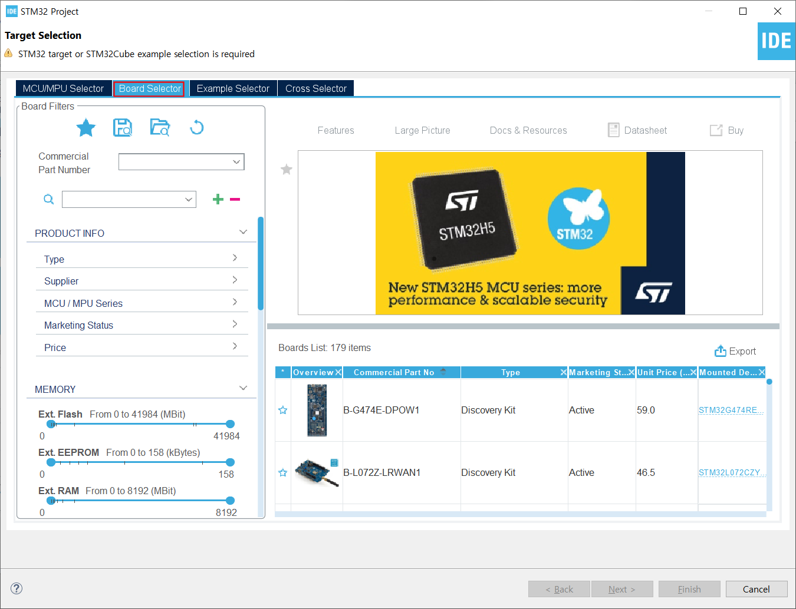
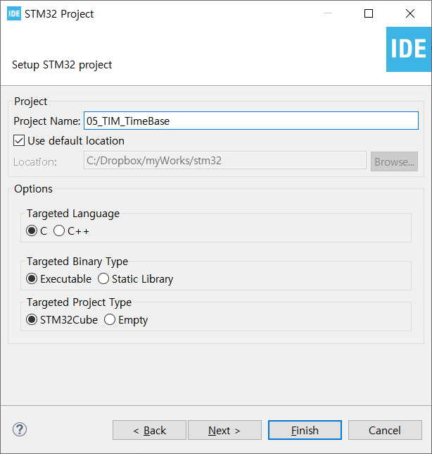
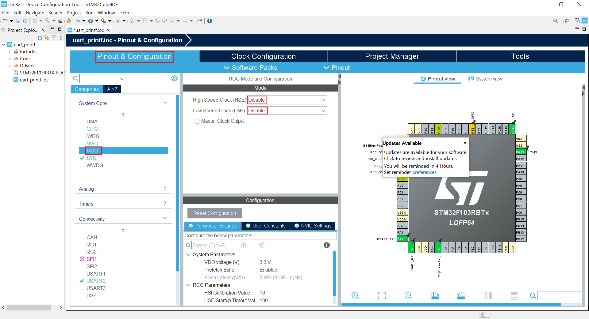
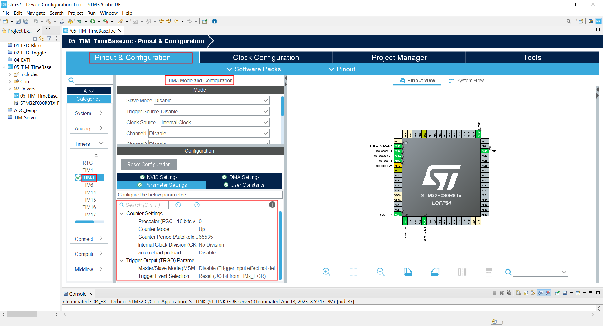
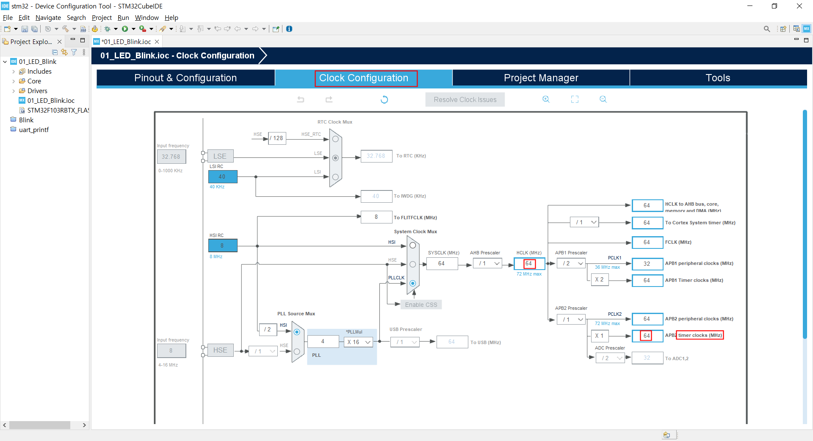
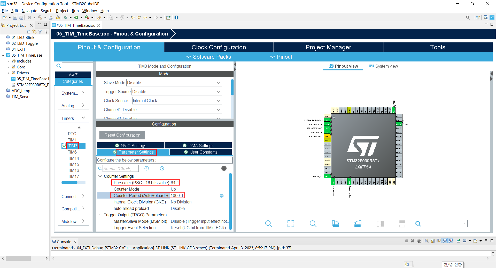
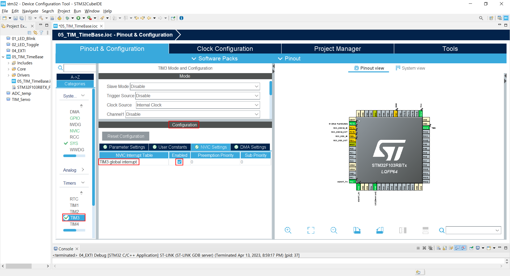
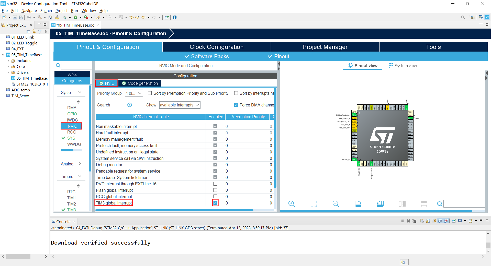
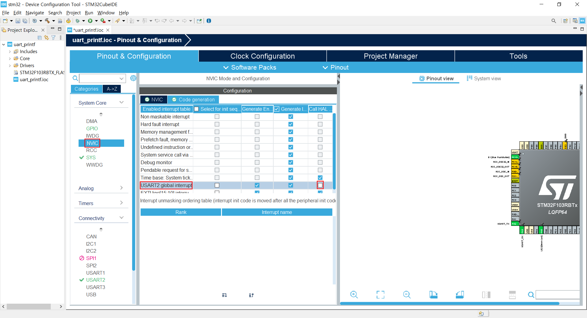

### TIM3 를 이용한 Timer Interrupt

#### 개발환경

**OS** MS-Windows 10(64bit)

**Target** STM32 NUCLEO F103RB

**IDE** STM32 Cube IDE

**참고문헌** STM32CubeIDE를 이용한 STM32 따라하기(주)북랩 김남수 ∙ 이진형 지음 

#### 프로젝트 생성

**STM32CubeIDE** 실행 후, 아래와 같이 File - New - STM32 Project 선택 


#### Target 선택

Tafget Selection 윈도우가 나타나면 **Board Selector** 탭을 클릭한다.



Board selector 탭의 Type에서 NUCLEO64를 체크, MCU/MPU Series에서 STM32F1을 체크 하면 Board List에 **NUCLEO-F103RB**가 표시된다. 이를 선택 후, 하단의 Next > 버튼을 클릭한다.


STM32 Project 창이 나타나면 Project Name: 에 적당한 프로젝트명을 입력 후, Finish 버튼을 클릭한다. 



Board Project Options 대화창에서 Yes 버튼을 클릭한다.


Open Associated Perspective 대화창에서 Yes 버튼을 클릭하면 Device Configration Tool 창이 열린다.


#### Device Configuration Tool


- **RCC 설정**

RCC 설정을 위해 다음 그림과 같이 Device Configuration 창에서 Pinout & Configuration 탭의 System Core 항목 중 RCC를 선택 후 우측의 RCC Mode snd Configuration 의 Mode를 High Speed Clock(HSE), Low Speed Clock(LSE) 모두 Disable로 변경한다.




TIM3 타이머 설정

Pinout & Configuration 탭의 Timers 에서 TIM3를 선택 후, xtim3 Mode and Configuration의 Mode 항목 중 Clock Source를 Internal Clock으로 변경하면 하단 Configuration이 활성화 된다.



TIM3의 Parameters를 설정하기 전 Clock and Configuration 탭에서 타이머에 공급되는 클럭을 확인해 두자. 64(MHz)임을 확인 할 수 있다. 



Configuration 항목의 Parameter Settings 탭을 선택 후, Parameter를 Setting한다. 이 때 Prescaler와 Counter Period 설정값에 의해 타이머 인터럽트의 발생 주기가 결정되므로 주의가 필요하다. Clock Configuration 탭에서 타이머에 공급되는 클럭이 64MHz임을 확인할 수 있다. 이 클럭은 Prescaler에 의해 분주되어 타이머에 공급된다. 64MHz는 64,000,000Hz 인데 Prescaler Parameter를 64로 설정한다면, 타이머에는 64,000,000 / 64 = 1,000,000 Hz의 클럭이 공급된다. 이 때 타이머는 카운터로 동작하며, 입력되는 클럭을 카운트한다. 1초에 1,000,000개의 클럭이 입력되므로, 클럭 1개를 카운트 하는 데에 1/1,000,000초가 소요된다. 이 때 Counter Periode Parameter로 1,000을 설정한다면 클럭을 1,000번 카운트 할 때 마다 타이머 인터럽트를 발생시키게 된다. 따라서 이 때의 인터럽트 주기는 1/1,000,000초 × 1,000 = 1/1,000 초, 즉 1(ms)가된다. 1초가 필요하다면, 인터럽트가 1,000회 발생할 때마다 처리하면된다.

이제 TIM3 타이머의 Parameter들을 설정해보자.

Prescaler값이 64 라는 것은 64개의 클럭이 입력될 때마다 1개의 클럭을 출력한다는 의미이다. 카운트를 1부터 시작한다면 64개의 클럭이 입력됬을 때의 카운트 값은 64 이겠지만, 컴퓨터는 0부터 카운트를 시작하므로 64개의 클럭이 입력됬을 때의 카운트 값은 63이된다. 따라서 Prescaler는 `64-1`로 설정하고, 같은 이유로 Counter Period는 `1000-1`로 설정한다.



TIM3 Configuration의 NVIC Setting 탭에서 TIM3 global interrupt Enabled에 체크.




System Core 항목에서 NVIC을 선택하고, Configuration 의 NVIC탭에 NVIC Interrupt Table에 TIM3global interript가 등록되었는 지 확인한다.







지금까지의 설정을 반영한 코드 생성하기 위해 Project 메뉴의 Generate Code 메뉴를 선택한다. 


`main.c`의 다음코드를 (46~48행)

```c
/* USER CODE BEGIN PV */

/* USER CODE END PV */
```

아래와 같이 변경한다.

```c
/* USER CODE BEGIN PV */
volatile int count = 0;
volatile int led_state = 0;
/* USER CODE END PV */
```

`main.c`의 다음코드를 (94~96행)

```c
/* USER CODE BEGIN 2 */

/* USER CODE END 2 */
```

아래와 같이 변경한다. 

```c
/* USER CODE BEGIN 2 */
  if(HAL_TIM_Base_Start_IT(&htim3) != HAL_OK) {
	  Error_Handler();
  }
  /* USER CODE END 2 */
```

`main.c`의 다음코드를 (262~264행)

```c
/* USER CODE BEGIN 4 */

/* USER CODE END 4 */
```


```c
/* USER CODE BEGIN 4 */
void
HAL_TIM_PeriodElapsedCallback (TIM_HandleTypeDef *htim)
{
  count++;
  if (count == 1000)
    {
      count = 0;
      led_state = led_state^1;
      HAL_GPIO_WritePin(LD2_GPIO_Port, LD2_Pin, led_state);
    }
}
/* USER CODE END 4 */
```

다음은 편집이 완료된 `main.c`의 전체 코드이다.

```c
/* USER CODE BEGIN Header */
/**
  ******************************************************************************
  * @file           : main.c
  * @brief          : Main program body
  ******************************************************************************
  * @attention
  *
  * Copyright (c) 2023 STMicroelectronics.
  * All rights reserved.
  *
  * This software is licensed under terms that can be found in the LICENSE file
  * in the root directory of this software component.
  * If no LICENSE file comes with this software, it is provided AS-IS.
  *
  ******************************************************************************
  */
/* USER CODE END Header */
/* Includes ------------------------------------------------------------------*/
#include "main.h"

/* Private includes ----------------------------------------------------------*/
/* USER CODE BEGIN Includes */

/* USER CODE END Includes */

/* Private typedef -----------------------------------------------------------*/
/* USER CODE BEGIN PTD */

/* USER CODE END PTD */

/* Private define ------------------------------------------------------------*/
/* USER CODE BEGIN PD */
/* USER CODE END PD */

/* Private macro -------------------------------------------------------------*/
/* USER CODE BEGIN PM */

/* USER CODE END PM */

/* Private variables ---------------------------------------------------------*/
TIM_HandleTypeDef htim3;

UART_HandleTypeDef huart2;

/* USER CODE BEGIN PV */
volatile int count = 0;
volatile int led_state = 0;
/* USER CODE END PV */

/* Private function prototypes -----------------------------------------------*/
void SystemClock_Config(void);
static void MX_GPIO_Init(void);
static void MX_USART2_UART_Init(void);
static void MX_TIM3_Init(void);
/* USER CODE BEGIN PFP */

/* USER CODE END PFP */

/* Private user code ---------------------------------------------------------*/
/* USER CODE BEGIN 0 */

/* USER CODE END 0 */

/**
  * @brief  The application entry point.
  * @retval int
  */
int main(void)
{
  /* USER CODE BEGIN 1 */

  /* USER CODE END 1 */

  /* MCU Configuration--------------------------------------------------------*/

  /* Reset of all peripherals, Initializes the Flash interface and the Systick. */
  HAL_Init();

  /* USER CODE BEGIN Init */

  /* USER CODE END Init */

  /* Configure the system clock */
  SystemClock_Config();

  /* USER CODE BEGIN SysInit */

  /* USER CODE END SysInit */

  /* Initialize all configured peripherals */
  MX_GPIO_Init();
  MX_USART2_UART_Init();
  MX_TIM3_Init();
  /* USER CODE BEGIN 2 */
  if(HAL_TIM_Base_Start_IT(&htim3) != HAL_OK) {
	  Error_Handler();
  }
  /* USER CODE END 2 */
  /* Infinite loop */
  /* USER CODE BEGIN WHILE */
  while (1)
  {
    /* USER CODE END WHILE */

    /* USER CODE BEGIN 3 */
  }
  /* USER CODE END 3 */
}

/**
  * @brief System Clock Configuration
  * @retval None
  */
void SystemClock_Config(void)
{
  RCC_OscInitTypeDef RCC_OscInitStruct = {0};
  RCC_ClkInitTypeDef RCC_ClkInitStruct = {0};

  /** Initializes the RCC Oscillators according to the specified parameters
  * in the RCC_OscInitTypeDef structure.
  */
  RCC_OscInitStruct.OscillatorType = RCC_OSCILLATORTYPE_HSI;
  RCC_OscInitStruct.HSIState = RCC_HSI_ON;
  RCC_OscInitStruct.HSICalibrationValue = RCC_HSICALIBRATION_DEFAULT;
  RCC_OscInitStruct.PLL.PLLState = RCC_PLL_ON;
  RCC_OscInitStruct.PLL.PLLSource = RCC_PLLSOURCE_HSI_DIV2;
  RCC_OscInitStruct.PLL.PLLMUL = RCC_PLL_MUL16;
  if (HAL_RCC_OscConfig(&RCC_OscInitStruct) != HAL_OK)
  {
    Error_Handler();
  }

  /** Initializes the CPU, AHB and APB buses clocks
  */
  RCC_ClkInitStruct.ClockType = RCC_CLOCKTYPE_HCLK|RCC_CLOCKTYPE_SYSCLK
                              |RCC_CLOCKTYPE_PCLK1|RCC_CLOCKTYPE_PCLK2;
  RCC_ClkInitStruct.SYSCLKSource = RCC_SYSCLKSOURCE_PLLCLK;
  RCC_ClkInitStruct.AHBCLKDivider = RCC_SYSCLK_DIV1;
  RCC_ClkInitStruct.APB1CLKDivider = RCC_HCLK_DIV2;
  RCC_ClkInitStruct.APB2CLKDivider = RCC_HCLK_DIV1;

  if (HAL_RCC_ClockConfig(&RCC_ClkInitStruct, FLASH_LATENCY_2) != HAL_OK)
  {
    Error_Handler();
  }
}

/**
  * @brief TIM3 Initialization Function
  * @param None
  * @retval None
  */
static void MX_TIM3_Init(void)
{

  /* USER CODE BEGIN TIM3_Init 0 */

  /* USER CODE END TIM3_Init 0 */

  TIM_ClockConfigTypeDef sClockSourceConfig = {0};
  TIM_MasterConfigTypeDef sMasterConfig = {0};

  /* USER CODE BEGIN TIM3_Init 1 */

  /* USER CODE END TIM3_Init 1 */
  htim3.Instance = TIM3;
  htim3.Init.Prescaler = 63;
  htim3.Init.CounterMode = TIM_COUNTERMODE_UP;
  htim3.Init.Period = 999;
  htim3.Init.ClockDivision = TIM_CLOCKDIVISION_DIV1;
  htim3.Init.AutoReloadPreload = TIM_AUTORELOAD_PRELOAD_ENABLE;
  if (HAL_TIM_Base_Init(&htim3) != HAL_OK)
  {
    Error_Handler();
  }
  sClockSourceConfig.ClockSource = TIM_CLOCKSOURCE_INTERNAL;
  if (HAL_TIM_ConfigClockSource(&htim3, &sClockSourceConfig) != HAL_OK)
  {
    Error_Handler();
  }
  sMasterConfig.MasterOutputTrigger = TIM_TRGO_RESET;
  sMasterConfig.MasterSlaveMode = TIM_MASTERSLAVEMODE_DISABLE;
  if (HAL_TIMEx_MasterConfigSynchronization(&htim3, &sMasterConfig) != HAL_OK)
  {
    Error_Handler();
  }
  /* USER CODE BEGIN TIM3_Init 2 */

  /* USER CODE END TIM3_Init 2 */

}

/**
  * @brief USART2 Initialization Function
  * @param None
  * @retval None
  */
static void MX_USART2_UART_Init(void)
{

  /* USER CODE BEGIN USART2_Init 0 */

  /* USER CODE END USART2_Init 0 */

  /* USER CODE BEGIN USART2_Init 1 */

  /* USER CODE END USART2_Init 1 */
  huart2.Instance = USART2;
  huart2.Init.BaudRate = 115200;
  huart2.Init.WordLength = UART_WORDLENGTH_8B;
  huart2.Init.StopBits = UART_STOPBITS_1;
  huart2.Init.Parity = UART_PARITY_NONE;
  huart2.Init.Mode = UART_MODE_TX_RX;
  huart2.Init.HwFlowCtl = UART_HWCONTROL_NONE;
  huart2.Init.OverSampling = UART_OVERSAMPLING_16;
  if (HAL_UART_Init(&huart2) != HAL_OK)
  {
    Error_Handler();
  }
  /* USER CODE BEGIN USART2_Init 2 */

  /* USER CODE END USART2_Init 2 */

}

/**
  * @brief GPIO Initialization Function
  * @param None
  * @retval None
  */
static void MX_GPIO_Init(void)
{
  GPIO_InitTypeDef GPIO_InitStruct = {0};

  /* GPIO Ports Clock Enable */
  __HAL_RCC_GPIOC_CLK_ENABLE();
  __HAL_RCC_GPIOD_CLK_ENABLE();
  __HAL_RCC_GPIOA_CLK_ENABLE();
  __HAL_RCC_GPIOB_CLK_ENABLE();

  /*Configure GPIO pin Output Level */
  HAL_GPIO_WritePin(LD2_GPIO_Port, LD2_Pin, GPIO_PIN_RESET);

  /*Configure GPIO pin : B1_Pin */
  GPIO_InitStruct.Pin = B1_Pin;
  GPIO_InitStruct.Mode = GPIO_MODE_IT_RISING;
  GPIO_InitStruct.Pull = GPIO_NOPULL;
  HAL_GPIO_Init(B1_GPIO_Port, &GPIO_InitStruct);

  /*Configure GPIO pin : LD2_Pin */
  GPIO_InitStruct.Pin = LD2_Pin;
  GPIO_InitStruct.Mode = GPIO_MODE_OUTPUT_PP;
  GPIO_InitStruct.Pull = GPIO_NOPULL;
  GPIO_InitStruct.Speed = GPIO_SPEED_FREQ_LOW;
  HAL_GPIO_Init(LD2_GPIO_Port, &GPIO_InitStruct);

  /* EXTI interrupt init*/
  HAL_NVIC_SetPriority(EXTI15_10_IRQn, 0, 0);
  HAL_NVIC_EnableIRQ(EXTI15_10_IRQn);

}

/* USER CODE BEGIN 4 */
void
HAL_TIM_PeriodElapsedCallback (TIM_HandleTypeDef *htim)
{
  count++;
  if (count == 1000)
    {
      count = 0;
      led_state = led_state^1;
      HAL_GPIO_WritePin(LD2_GPIO_Port, LD2_Pin, led_state);
    }
}
/* USER CODE END 4 */

/**
  * @brief  This function is executed in case of error occurrence.
  * @retval None
  */
void Error_Handler(void)
{
  /* USER CODE BEGIN Error_Handler_Debug */
  /* User can add his own implementation to report the HAL error return state */
  __disable_irq();
  while (1)
  {
  }
  /* USER CODE END Error_Handler_Debug */
}

#ifdef  USE_FULL_ASSERT
/**
  * @brief  Reports the name of the source file and the source line number
  *         where the assert_param error has occurred.
  * @param  file: pointer to the source file name
  * @param  line: assert_param error line source number
  * @retval None
  */
void assert_failed(uint8_t *file, uint32_t line)
{
  /* USER CODE BEGIN 6 */
  /* User can add his own implementation to report the file name and line number,
     ex: printf("Wrong parameters value: file %s on line %d\r\n", file, line) */
  /* USER CODE END 6 */
}
#endif /* USE_FULL_ASSERT */

```

**Project** 메뉴의 **Build**를 선택하여 빌드한다.


에러없이 빌드되었으면, RUN 메뉴에서 RUN 항목을 선택하여 실행한다. 

타겟 보드의 Green LED가 1초 점등, 1초 소등을 반복하는 것을 확인한다.

[**목차**](../README.md) 