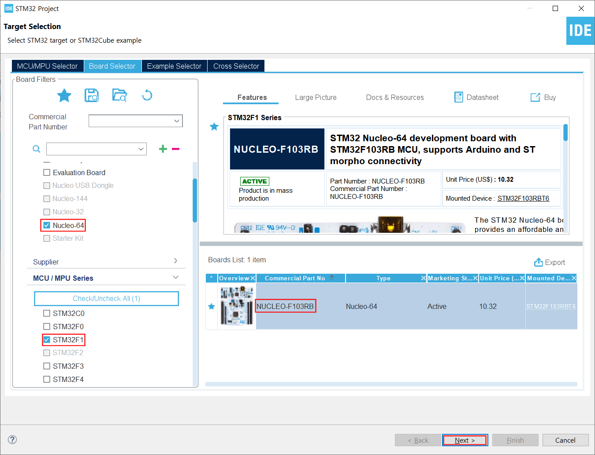
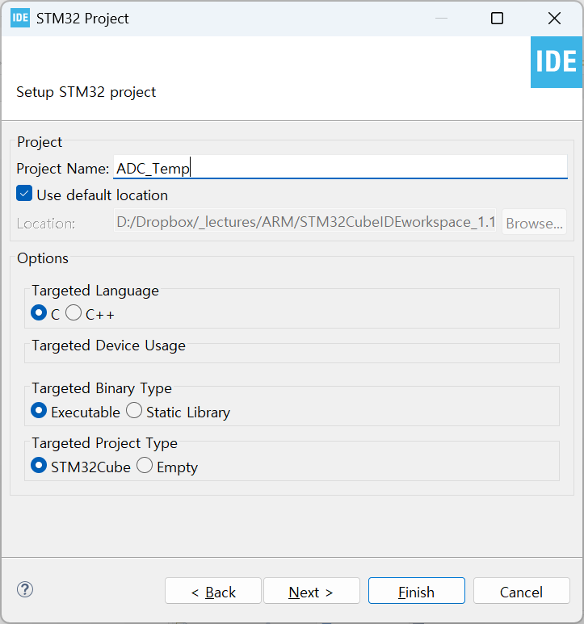
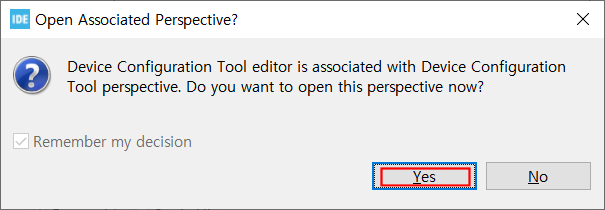
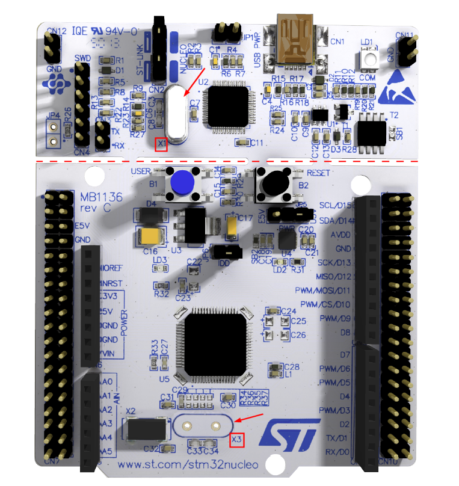
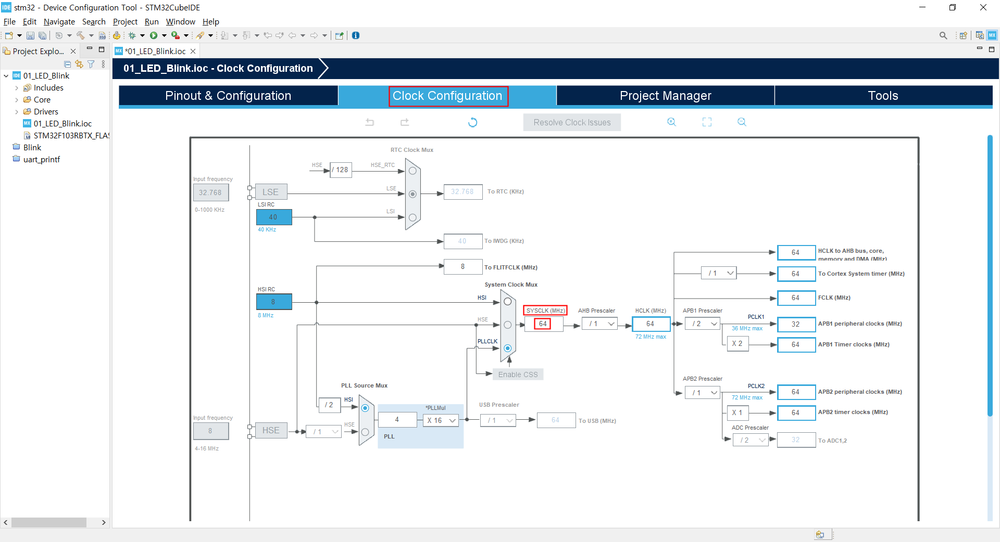
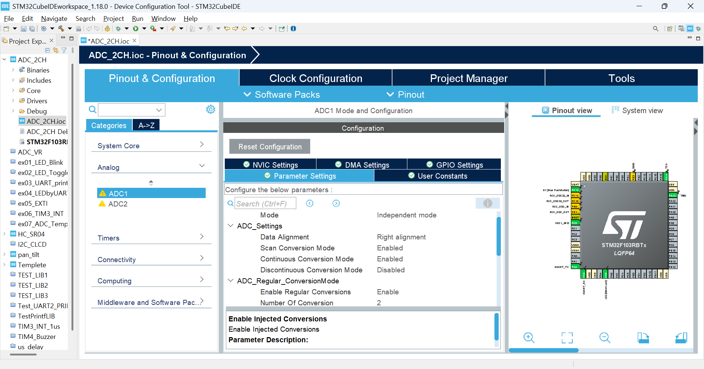
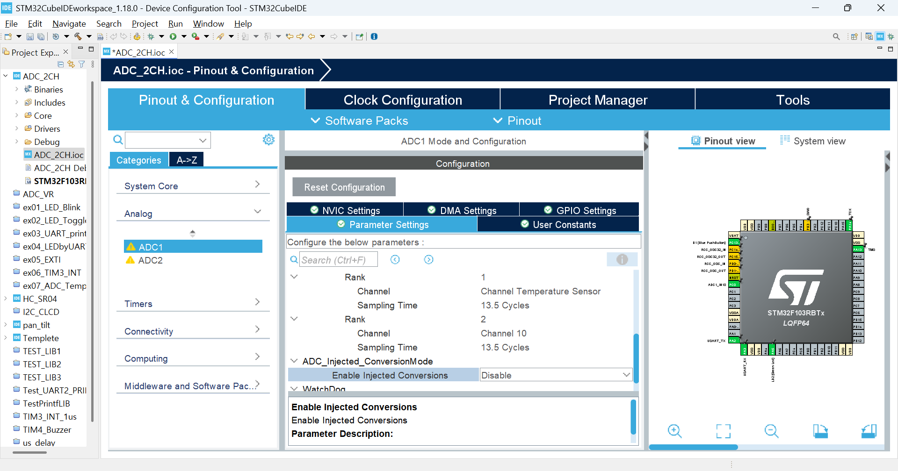
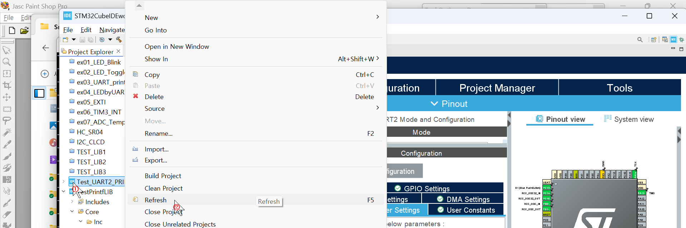
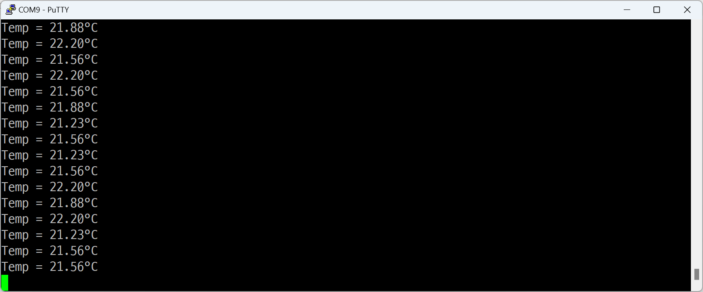

### ADC 2Channel 입력처리

ADC1의 IN_10 채널과 Temperature Sensor 채널에서 2개의 아날로그 신호를 입력받아 Polling 방식으로 변환해 보자.

#### 개발환경

**OS** MS-Windows 10(64bit)

**Target** STM32 NUCLEO F103RB

**IDE** STM32 Cube IDE

**참고문헌** STM32CubeIDE를 이용한 STM32 따라하기(주)북랩 김남수 ∙ 이진형 지음 

#### 프로젝트 생성

**STM32CubeIDE** 실행 후, 아래와 같이 File - New - STM32 Project 선택 


#### Target 선택

Tafget Selection 윈도우가 나타나면 **Board Selector** 탭을 클릭한다.


Board selector 탭의 Type에서 NUCLEO64를 체크, MCU/MPU Series에서 STM32F1을 체크 하면 Board List에 **NUCLEO-F103RB**가 표시된다. 이를 선택 후, 하단의 Next > 버튼을 클릭한다.



STM32 Project 창이 나타나면 Project Name: 에 적당한 프로젝트명을 입력 후, Finish 버튼을 클릭한다. 



Board Project Options 대화창에서 Yes 버튼을 클릭한다.


Open Associated Perspective 대화창에서 Yes 버튼을 클릭하면 Device Configration Tool 창이 열린다.





#### Device Configuration Tool 설정

가장 먼저 설정할 **`peripheral`**은 **RCC**(Reset & Clock Control)이다.

**NUCLEO-F103RB** 에서 사용가능한 클럭소스는 크게 내부클럭, 외부클럭이 있고, 외부클럭은 ST-Link의 8MHz 크리스탈 출력을 bypass시켜 사용하는 방법과 아래 그림에 표시된 X3 위치에 8MHz 크리스털을 납땜하여 그 출력을 클럭으로 사용하는 방법이 있다. 

NUCLEO F103RB 보드는 위 그림의 적색 점선으로 표시한 Cutting Edge를 경계로 잘라서 2개의 보드로 사용할 수 있는데, 위쪽 보드는 ST-Link ISP( In-Circuit Programmer)로 독립적으로사용할 수 있다.

##### RCC 설정

앞으로 모든 실습은 내부내부 클럭(STM32F103RB MCU 내부의 RC클럭 발진회로)사용을 기준으로 진행한다.

클럭 소스로 내부RC 클럭 발진회로를 선택하기위한 RCC 설정을 위해 다음 그림과 같이 Device Configuration 창에서 Pinout & Configuration 탭의 System Core 항목 중 RCC를 선택 후 우측의 RCC Mode and Configuration 의 Mode의 High Speed Clock(HSE), Low Speed Clock(LSE) 모두 Disable로 변경한다.


Clock Configuration 탭에서 SYSCLK이 64(MHz)로 설정되었는 지 확인한다.



##### USART2 설정

RCC 다음에 설정할  **`peripheral`**은 **USART2**(Universal Synchronous ASynchronous RecieverReceiver/Transmitter)이다. **`USART2`**를 이용한 **`printf()`**함수를 사용할 수 있도록 하기위해 USART2 장치를 설정해보자. 

NUCLEO-F103RB 타겟보드는 3개의 USART(USART1, USART2, USART3)가 지원된다. 그 중 USB 포트에 바로 연결된 장치가 USART2이므로 USART2 장치를 표준 출력장치로 설정하여 printf() 함수로 출력한 내용이 시리얼로 출력되도록 USART2를 설정한다. 먼저 Device Configuration 창에서 Pinout & Configuration 탭의 Conectivity 항목 중 USART2를 선택 후 우측의 USART Mode snd Configuration 의 Mode를 Asynchronous로, Hardware Flow Control(RS232)을 Disable로 변경한다. 


USART2  Parameter Settings

앞서 설정한 USART2 Mode 항목 아래에 Configuration 항목의 Parameter Settings 탭을 선택하고 

**Baud Rate** - 115200, **World Length** : 8bit, **Parity** : None, **Stop Bits** : 1, **Data Direction** : Recieve and Transmit 등의 설정값을 확인

한다.


USART2 NVIC Settings

NVIC Settings 탭을 선택하고, USART2 Global Interrupt항목의 Enabled를 체크한다.


##### NVIC 설정

USART 다음에 설정할  **`peripheral`**은 **NVIC**(Nested Vector Interrupt Controller)이다.  peripheral 설정 중 해당 peripheral의 NVIC Settings 탭을 설정했다면 반드시 System Core의 NVIC에 반영 여부를 확인하자. 

System Core 항목에서 NVIC을 선택하고, USART2 Global Interrupt 항목의 체크를 해제한다.


##### GPIO 설정

Pinout view에서 PC0 Pin을 ADC1_IN10으로 설정한다.(가변저항의 출력을 여기에 입력)


- **ADC1 설정**

  Pinout & Configuration탭의 Analog의 하위항목 중 ADC1을 선택한다.  ADC1 Mode and Configuration의 Mode에서IN10채널과 Temperature Sensor 채널을 체크하고, Configuration의 Parameter Settings 탭에서 Mode 는 Independent mode, Data Alignment는 Right Alignment, Scan Conversion Mode는 단일 채널 컨버전에서는 Disabled로 설정했지만,  여러채널의 입력을 변환 할 때에는 Enabled시켜야 하는데, 선택할 수가 없다. 원인은 scan mode를 사용하려면 Conversion 대상이 둘 이상이어야 하는데, Number of Conversion 설정이 기본값 1로 설정되어 있어서 발생하는 문제이므로 먼저 Number of Coversion을 2로 설정한다. 이제 Scan Conversion Mode를 Enabled시키고, Continuous Conversion Mode는 Enabled, Discontinuous 

  Coversion Mode는 Disabled, Enable Regular Coversions는 Enable, Number of Conversion은 2, External Trigger Conversion Source는 Regular Conversion Launched by SW,  Rank 1의 채널은Temperature Sensor, Sampling Time은 13.5 Cycles,  Rank 2의 채널은IN_10, Sampling Time은 13.5 Cycles로 설정하고, Injected Conversions는 Disable로 설정한다.
  
  
  
  
  
  

`>`RANK 앞의 `<` 를 클릭하면 나타나는 Sampling Time은 13.5 Cycle 로 설정한다.  그리고 나서 클럭 설정 확인을 위해 Clock Configuration 탭을 클릭하면클럭 설정 문제와 자동 설정으로 해결하려면 원하는 버튼을 클릭하라는 


ADC Clock에 문제가 있을 경우 Clock Configuration 탭에 표시 이상이 있음이 표시(적색 화살표  참조)되고, 동시에 우측 하단에 ADC1, 2 클럭에 문제가 있음이 표시된다. 


이 때 상단의 Resolve Clock Issue 버튼을 클릭하면 클럭 설정이 적당한 값으로변경되어 Clock Issue가 해결된다. 


지금까지 진행한 의 설정을 반영한 코드 생성하기 위해 Project 메뉴의 Generate Code 메뉴를 선택한다. 


##### `printf()`라이브러리 작성 및 프로젝트에 반영

USART2를 이용한 `printf()` 사용을 위한 사용자 라이브러리 `uart2_printf.h`파일과 `uart2_printf.c`파일을 각각 STM32 Cube IDE의 워크스페이스의 작성 중인 프로젝트 폴더의 `Core/Inc` 및 `Core/Src`폴더에 다음과같이 작성하여 저장한다. 

**`uart2_printf.h`**

```c
/*
 * uart2_printf.h
 *
 * STM32 HAL library for using printf with USART2
 */
  
#ifndef UART2_PRINTF_H
#define UART2_PRINTF_H

#include "stm32f1xx_hal.h"
#include<stdio.h>

#endif /* UART2_PRINTF_H */
```

**`uart2_printf.c`**

```c
/*
 * uart2_printf.c
 *
 * STM32 HAL library for using printf with USART2
 */

#include "uart2_printf.h"

extern UART_HandleTypeDef huart2;

#ifdef __GNUC__
/* With GCC, small printf (option LD Linker->Libraries->Small printf
   set to 'Yes') calls __io_putchar() */
#define PUTCHAR_PROTOTYPE int __io_putchar(int ch)
#else
#define PUTCHAR_PROTOTYPE int fputc(int ch, FILE *f)
#endif /* __GNUC__ */

/**
  * @brief  Retargets the C library printf function to the USART.
  * @param  None
  * @retval None
  */
PUTCHAR_PROTOTYPE
{
  /* Place your implementation of fputc here */
  /* e.g. write a character to the USART1 and Loop until the end of transmission */
  if (ch == '\n')
    HAL_UART_Transmit (&huart2, (uint8_t*) "\r", 1, 0xFFFF);
  HAL_UART_Transmit (&huart2, (uint8_t*) &ch, 1, 0xFFFF);

  return ch;
}
```


##### Refresh Project

추가된 라이브러리를 작성 중인 프로젝트에 반영하기 위해다음 그림과 같이 프로젝트 탐색기에서 프로젝트 명에 우클릭하여 나타난 컨텍스트 메뉴에서`Refresh`를 클릭한다.



 


역시 `printf()`의 사용을 위해 `main.c`의 다음 코드를 찾아

```c
/* Private includes ----------------------------------------------------------*/
/* USER CODE BEGIN Includes */

/* USER CODE END Includes */
```

아래와 같이 변경한다.

```c
/* Private includes ----------------------------------------------------------*/
/* USER CODE BEGIN Includes */
#include "uart2_printf.h"
/* USER CODE END Includes */
```


`main.c`의 다음코드를 

```c
/* USER CODE BEGIN WHILE */
  {
    /* USER CODE END WHILE */
```


```c
/* Start calibration */
    if (HAL_ADCEx_Calibration_Start (&hadc1) != HAL_OK)
      {
        Error_Handler ();
      }
```


```c
/* USER CODE BEGIN WHILE */

    /* Start calibration */
    if (HAL_ADCEx_Calibration_Start (&hadc1) != HAL_OK)
      {
        Error_Handler ();
      }

    /* Start the conversion process */
    if (HAL_ADC_Start (&hadc1) != HAL_OK)
      {
        Error_Handler ();
      }

    int adc[2];
    while (1)
    {HAL_ADC_PollForConversion (&hadc1, 100);
    adc[0] = HAL_ADC_GetValue (&hadc1);
    //printf ("ADC Result = %d \n", adc);
    float Vsense = ((float)adc / 4095) * 3300; // change adc_value to voltage(mV)
    //float Tsense = ((Vsense - 760.0) / 2.5) + 25.0; // change voltage to temperature
    float Tsense = ((Vsense - 1410.0) / 2.5) + 25.0; // change voltage to temperature
    printf("Temp = %.2f°C\n", Tsense);
    delay(500);
      /* USER CODE END WHILE */
```


```c
/* USER CODE BEGIN 4 */
}
/* USER CODE END 4 */
```


```c
/* USER CODE BEGIN 4 */
void Error_Handler(void)
{
  /* USER CODE BEGIN Error_Handler_Debug */
  /* User can add his own implementation to report the HAL error return state */
  __disable_irq();
  while (1)
  {
  }
  /* USER CODE END Error_Handler_Debug */
}
/* USER CODE END 4 */
```


다음은 편집이 완료된 `main.c`의 전체 코드이다.

```c
/* USER CODE BEGIN Header */
/**
  ******************************************************************************
  * @file           : main.c
  * @brief          : Main program body
  ******************************************************************************
  * @attention
  *
  * Copyright (c) 2025 STMicroelectronics.
  * All rights reserved.
  *
  * This software is licensed under terms that can be found in the LICENSE file
  * in the root directory of this software component.
  * If no LICENSE file comes with this software, it is provided AS-IS.
  *
  ******************************************************************************
  */
/* USER CODE END Header */
/* Includes ------------------------------------------------------------------*/
#include "main.h"

/* Private includes ----------------------------------------------------------*/
/* USER CODE BEGIN Includes */
#include "uart2_printf.h"
/* USER CODE END Includes */

/* Private typedef -----------------------------------------------------------*/
/* USER CODE BEGIN PTD */

/* USER CODE END PTD */

/* Private define ------------------------------------------------------------*/
/* USER CODE BEGIN PD */
#define delay HAL_Delay
/* USER CODE END PD */

/* Private macro -------------------------------------------------------------*/
/* USER CODE BEGIN PM */

/* USER CODE END PM */

/* Private variables ---------------------------------------------------------*/
ADC_HandleTypeDef hadc1;

UART_HandleTypeDef huart2;

/* USER CODE BEGIN PV */

/* USER CODE END PV */

/* Private function prototypes -----------------------------------------------*/
void SystemClock_Config(void);
static void MX_GPIO_Init(void);
static void MX_USART2_UART_Init(void);
static void MX_ADC1_Init(void);
/* USER CODE BEGIN PFP */

/* USER CODE END PFP */

/* Private user code ---------------------------------------------------------*/
/* USER CODE BEGIN 0 */

/* USER CODE END 0 */

/**
  * @brief  The application entry point.
  * @retval int
  */
int main(void)
{

  /* USER CODE BEGIN 1 */

  /* USER CODE END 1 */

  /* MCU Configuration--------------------------------------------------------*/

  /* Reset of all peripherals, Initializes the Flash interface and the Systick. */
  HAL_Init();

  /* USER CODE BEGIN Init */

  /* USER CODE END Init */

  /* Configure the system clock */
  SystemClock_Config();

  /* USER CODE BEGIN SysInit */

  /* USER CODE END SysInit */

  /* Initialize all configured peripherals */
  MX_GPIO_Init();
  MX_USART2_UART_Init();
  MX_ADC1_Init();
  /* USER CODE BEGIN 2 */

  /* USER CODE END 2 */

  /* Infinite loop */
  /* USER CODE BEGIN WHILE */

    /* Start calibration */
    if (HAL_ADCEx_Calibration_Start (&hadc1) != HAL_OK)
      {
        Error_Handler ();
      }

    /* Start the conversion process */
    if (HAL_ADC_Start (&hadc1) != HAL_OK)
      {
        Error_Handler ();
      }

    int adc;
    while (1)
    {HAL_ADC_PollForConversion (&hadc1, 100);
    adc = HAL_ADC_GetValue (&hadc1);
    //printf ("ADC Result = %d \n", adc);
    float Vsense = ((float)adc / 4095) * 3300; // change adc_value to voltage(mV)
    //float Tsense = ((Vsense - 760.0) / 2.5) + 25.0; // change voltage to temperature
    float Tsense = ((Vsense - 1410.0) / 2.5) + 25.0; // change voltage to temperature
    printf("Temp = %.2f°C\n", Tsense);
    delay(500);
      /* USER CODE END WHILE */

    /* USER CODE BEGIN 3 */
  }
  /* USER CODE END 3 */
}

/**
  * @brief System Clock Configuration
  * @retval None
  */
void SystemClock_Config(void)
{
  RCC_OscInitTypeDef RCC_OscInitStruct = {0};
  RCC_ClkInitTypeDef RCC_ClkInitStruct = {0};
  RCC_PeriphCLKInitTypeDef PeriphClkInit = {0};

  /** Initializes the RCC Oscillators according to the specified parameters
  * in the RCC_OscInitTypeDef structure.
  */
  RCC_OscInitStruct.OscillatorType = RCC_OSCILLATORTYPE_HSI;
  RCC_OscInitStruct.HSIState = RCC_HSI_ON;
  RCC_OscInitStruct.HSICalibrationValue = RCC_HSICALIBRATION_DEFAULT;
  RCC_OscInitStruct.PLL.PLLState = RCC_PLL_ON;
  RCC_OscInitStruct.PLL.PLLSource = RCC_PLLSOURCE_HSI_DIV2;
  RCC_OscInitStruct.PLL.PLLMUL = RCC_PLL_MUL2;
  if (HAL_RCC_OscConfig(&RCC_OscInitStruct) != HAL_OK)
  {
    Error_Handler();
  }

  /** Initializes the CPU, AHB and APB buses clocks
  */
  RCC_ClkInitStruct.ClockType = RCC_CLOCKTYPE_HCLK|RCC_CLOCKTYPE_SYSCLK
                              |RCC_CLOCKTYPE_PCLK1|RCC_CLOCKTYPE_PCLK2;
  RCC_ClkInitStruct.SYSCLKSource = RCC_SYSCLKSOURCE_PLLCLK;
  RCC_ClkInitStruct.AHBCLKDivider = RCC_SYSCLK_DIV1;
  RCC_ClkInitStruct.APB1CLKDivider = RCC_HCLK_DIV2;
  RCC_ClkInitStruct.APB2CLKDivider = RCC_HCLK_DIV1;

  if (HAL_RCC_ClockConfig(&RCC_ClkInitStruct, FLASH_LATENCY_0) != HAL_OK)
  {
    Error_Handler();
  }
  PeriphClkInit.PeriphClockSelection = RCC_PERIPHCLK_ADC;
  PeriphClkInit.AdcClockSelection = RCC_ADCPCLK2_DIV2;
  if (HAL_RCCEx_PeriphCLKConfig(&PeriphClkInit) != HAL_OK)
  {
    Error_Handler();
  }
}

/**
  * @brief ADC1 Initialization Function
  * @param None
  * @retval None
  */
static void MX_ADC1_Init(void)
{

  /* USER CODE BEGIN ADC1_Init 0 */

  /* USER CODE END ADC1_Init 0 */

  ADC_ChannelConfTypeDef sConfig = {0};

  /* USER CODE BEGIN ADC1_Init 1 */

  /* USER CODE END ADC1_Init 1 */

  /** Common config
  */
  hadc1.Instance = ADC1;
  hadc1.Init.ScanConvMode = ADC_SCAN_DISABLE;
  hadc1.Init.ContinuousConvMode = ENABLE;
  hadc1.Init.DiscontinuousConvMode = DISABLE;
  hadc1.Init.ExternalTrigConv = ADC_SOFTWARE_START;
  hadc1.Init.DataAlign = ADC_DATAALIGN_RIGHT;
  hadc1.Init.NbrOfConversion = 1;
  if (HAL_ADC_Init(&hadc1) != HAL_OK)
  {
    Error_Handler();
  }

  /** Configure Regular Channel
  */
  sConfig.Channel = ADC_CHANNEL_TEMPSENSOR;
  sConfig.Rank = ADC_REGULAR_RANK_1;
  sConfig.SamplingTime = ADC_SAMPLETIME_13CYCLES_5;
  if (HAL_ADC_ConfigChannel(&hadc1, &sConfig) != HAL_OK)
  {
    Error_Handler();
  }
  /* USER CODE BEGIN ADC1_Init 2 */

  /* USER CODE END ADC1_Init 2 */

}

/**
  * @brief USART2 Initialization Function
  * @param None
  * @retval None
  */
static void MX_USART2_UART_Init(void)
{

  /* USER CODE BEGIN USART2_Init 0 */

  /* USER CODE END USART2_Init 0 */

  /* USER CODE BEGIN USART2_Init 1 */

  /* USER CODE END USART2_Init 1 */
  huart2.Instance = USART2;
  huart2.Init.BaudRate = 115200;
  huart2.Init.WordLength = UART_WORDLENGTH_8B;
  huart2.Init.StopBits = UART_STOPBITS_1;
  huart2.Init.Parity = UART_PARITY_NONE;
  huart2.Init.Mode = UART_MODE_TX_RX;
  huart2.Init.HwFlowCtl = UART_HWCONTROL_NONE;
  huart2.Init.OverSampling = UART_OVERSAMPLING_16;
  if (HAL_UART_Init(&huart2) != HAL_OK)
  {
    Error_Handler();
  }
  /* USER CODE BEGIN USART2_Init 2 */

  /* USER CODE END USART2_Init 2 */

}

/**
  * @brief GPIO Initialization Function
  * @param None
  * @retval None
  */
static void MX_GPIO_Init(void)
{
  GPIO_InitTypeDef GPIO_InitStruct = {0};
  /* USER CODE BEGIN MX_GPIO_Init_1 */

  /* USER CODE END MX_GPIO_Init_1 */

  /* GPIO Ports Clock Enable */
  __HAL_RCC_GPIOC_CLK_ENABLE();
  __HAL_RCC_GPIOD_CLK_ENABLE();
  __HAL_RCC_GPIOA_CLK_ENABLE();
  __HAL_RCC_GPIOB_CLK_ENABLE();

  /*Configure GPIO pin Output Level */
  HAL_GPIO_WritePin(LD2_GPIO_Port, LD2_Pin, GPIO_PIN_RESET);

  /*Configure GPIO pin : B1_Pin */
  GPIO_InitStruct.Pin = B1_Pin;
  GPIO_InitStruct.Mode = GPIO_MODE_IT_RISING;
  GPIO_InitStruct.Pull = GPIO_NOPULL;
  HAL_GPIO_Init(B1_GPIO_Port, &GPIO_InitStruct);

  /*Configure GPIO pin : LD2_Pin */
  GPIO_InitStruct.Pin = LD2_Pin;
  GPIO_InitStruct.Mode = GPIO_MODE_OUTPUT_PP;
  GPIO_InitStruct.Pull = GPIO_NOPULL;
  GPIO_InitStruct.Speed = GPIO_SPEED_FREQ_LOW;
  HAL_GPIO_Init(LD2_GPIO_Port, &GPIO_InitStruct);

  /* EXTI interrupt init*/
  HAL_NVIC_SetPriority(EXTI15_10_IRQn, 0, 0);
  HAL_NVIC_EnableIRQ(EXTI15_10_IRQn);

  /* USER CODE BEGIN MX_GPIO_Init_2 */

  /* USER CODE END MX_GPIO_Init_2 */
}

/* USER CODE BEGIN 4 */

/* USER CODE END 4 */

/**
  * @brief  This function is executed in case of error occurrence.
  * @retval None
  */
void Error_Handler(void)
{
  /* USER CODE BEGIN Error_Handler_Debug */
  /* User can add his own implementation to report the HAL error return state */
  __disable_irq();
  while (1)
  {
  }
  /* USER CODE END Error_Handler_Debug */
}

#ifdef  USE_FULL_ASSERT
/**
  * @brief  Reports the name of the source file and the source line number
  *         where the assert_param error has occurred.
  * @param  file: pointer to the source file name
  * @param  line: assert_param error line source number
  * @retval None
  */
void assert_failed(uint8_t *file, uint32_t line)
{
  /* USER CODE BEGIN 6 */
  /* User can add his own implementation to report the file name and line number,
     ex: printf("Wrong parameters value: file %s on line %d\r\n", file, line) */
  /* USER CODE END 6 */
}
#endif /* USE_FULL_ASSERT */

```

**Project** 메뉴의 **Build**를 선택하여 빌드한다.


에러없이 빌드되었으면, RUN 메뉴에서 RUN 항목을 선택하여 실행한다. 

Putty와 같은 시리얼 통신 에뮬레이터 프로그램으로 데이터를 수신해보면, 다음과같이 온도가 출력되는 것을 확인할 수 있다.



[**목차**](../README.md) 