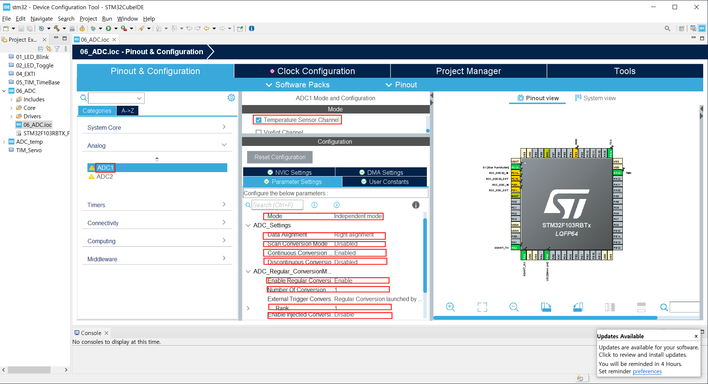
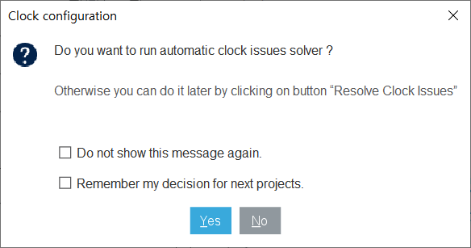

### 가변저항에 걸린 전압Analog toDigital Converting

#### 개발환경

**OS** MS-Windows 10(64bit)

**Target** STM32 NUCLEO F103RB

**IDE** STM32 Cube IDE

**참고문헌** STM32CubeIDE를 이용한 STM32 따라하기(주)북랩 김남수 ∙ 이진형 지음 

#### 프로젝트 생성

**STM32CubeIDE** 실행 후, 아래와 같이 File - New - STM32 Project 선택 


#### Target 선택

Tafget Selection 윈도우가 나타나면 **Board Selector** 탭을 클릭한다.


Board selector 탭의 Type에서 NUCLEO64를 체크, MCU/MPU Series에서 STM32F1을 체크 하면 Board List에 **NUCLEO-F103RB**가 표시된다. 이를 선택 후, 하단의 Next > 버튼을 클릭한다.


STM32 Project 창이 나타나면 Project Name: 에 적당한 프로젝트명을 입력 후, Finish 버튼을 클릭한다. 


Board Project Options 대화창에서 Yes 버튼을 클릭한다.


Open Associated Perspective 대화창에서 Yes 버튼을 클릭하면 Device Configration Tool 창이 열린다.


#### Device Configuration Tool


- **RCC 설정**

RCC 설정을 위해 다음 그림과 같이 Device Configuration 창에서 Pinout & Configuration 탭의 System Core 항목 중 RCC를 선택 후 우측의 RCC Mode snd Configuration 의 Mode를 High Speed Clock(HSE), Low Speed Clock(LSE) 모두 Disable로 변경한다.


- **ADC1 설정**

  Pinout & Configuration탭의 Analog의 하위항목 중 ADC1을 선택한다.  ADC1 Mode and Configuration의 Mode에서 Temperature Sensor Channel을 체크, Configuration의 Parameter Settings 탭에서 Mode 는 Independent mode, Data Alignment는 Right Alignment, Scan Conversion Mode는 Disabled, Continuous Conversion Mode는 Enabled, Discontinuous Coversion Mode는 Disabled, Enable Regular Coversions는 Enable, Number of Conversion은 1, Rank는 1, Enable Injected Conversions는 Disable로 설정하고. 

  
  
  

`>`RANK 앞의 `<` 를 클릭하면 나타나는 Sampling Time은 13.5 Cycle 로 설정한다.  그리고 나서 클럭 설정 확인을 위해 Clock Configuration 탭을 클릭하면클럭 설정 문제와 자동 설정으로 해결하려면 원하는 버튼을 클릭하라는 대화창이 나타나는데, 여기서 YES 버튼을 클릭한다. 



지금까지 진행한 의 설정을 반영한 코드 생성하기 위해 Project 메뉴의 Generate Code 메뉴를 선택한다. 


`printf()` 사용을 위해`main.c`의 다음코드를 

```c
/* USER CODE BEGIN Includes */

/* USER CODE END Includes */
```

아래와 같이 변경한다.

```c
/* USER CODE BEGIN Includes */
#include <stdio.h>
/* USER CODE END Includes */
```

온도센서의 ADC 결과로부터 온도를 산출하기위해 다음 코드를

```c
/* USER CODE BEGIN PV */
/* USER CODE END PV */
```

아래와 같이 변경한다. 

```c
/* USER CODE BEGIN PV */
const float AVG_SLOPE = 4.3E-03;      // slope (gradient) of temperature line function
const float V25 = 1.43;               // sensor's voltage at 25°C [V]
const float ADC_TO_VOLT = 3.3 / 4096; // conversion coefficient of digital value to volt
                                      // when using 3.3V ref. voltage at 12-bit resolution
/* USER CODE END PV */
```


`printf()` 사용을 위해`main.c`의 다음코드 를 

```c
/* USER CODE BEGIN 0 */

/* USER CODE END 0 */
```

아래와 같이 변경한다. 

```c
/* USER CODE BEGIN 0 */
#ifdef __GNUC__
/* With GCC, small printf (option LD Linker->Libraries->Small printf
   set to 'Yes') calls __io_putchar() */
#define PUTCHAR_PROTOTYPE int __io_putchar(int ch)
#else
#define PUTCHAR_PROTOTYPE int fputc(int ch, FILE *f)
#endif /* __GNUC__ */

/**
  * @brief  Retargets the C library printf function to the USART.
  * @param  None
  * @retval None
  */
PUTCHAR_PROTOTYPE
{
  /* Place your implementation of fputc here */
  /* e.g. write a character to the USART1 and Loop until the end of transmission */
  if (ch == '\n')
    HAL_UART_Transmit (&huart2, (uint8_t*) "\r", 1, 0xFFFF);
  HAL_UART_Transmit (&huart2, (uint8_t*) &ch, 1, 0xFFFF);

  return ch;
}
/* USER CODE END 0 */
```

`main.c`의 다음코드를 

```c
/* USER CODE BEGIN WHILE */
  {
    /* USER CODE END WHILE */
```


```c
/* USER CODE BEGIN WHILE */

  /* Start calibration */
  if (HAL_ADCEx_Calibration_Start (&hadc1) != HAL_OK)
    {
      Error_Handler ();
    }

  /* Start the conversion process */
  if (HAL_ADC_Start (&hadc1) != HAL_OK)
    {
      Error_Handler ();
    }

  uint16_t adc1;
  while (1)
  {HAL_ADC_PollForConversion (&hadc1, 100);
  adc1 = HAL_ADC_GetValue (&hadc1);
  printf ("ADC Result = %d \n", adc1);
    /* USER CODE END WHILE */
```

다음은 편집이 완료된 `main.c`의 전체 코드이다.

```c
/* USER CODE BEGIN Header */
/**
  ******************************************************************************
  * @file           : main.c
  * @brief          : Main program body
  ******************************************************************************
  * @attention
  *
  * Copyright (c) 2023 STMicroelectronics.
  * All rights reserved.
  *
  * This software is licensed under terms that can be found in the LICENSE file
  * in the root directory of this software component.
  * If no LICENSE file comes with this software, it is provided AS-IS.
  *
  ******************************************************************************
  */
/* USER CODE END Header */
/* Includes ------------------------------------------------------------------*/
#include "main.h"

/* Private includes ----------------------------------------------------------*/
/* USER CODE BEGIN 0 */

/* USER CODE END 0 */

/* Private typedef -----------------------------------------------------------*/
/* USER CODE BEGIN PTD */

/* USER CODE END PTD */

/* Private define ------------------------------------------------------------*/
/* USER CODE BEGIN PD */

/* USER CODE END PD */

/* Private macro -------------------------------------------------------------*/
/* USER CODE BEGIN PM */

/* USER CODE END PM */

/* Private variables ---------------------------------------------------------*/
ADC_HandleTypeDef hadc1;

UART_HandleTypeDef huart2;

/* USER CODE BEGIN PV */

/* USER CODE END PV */

/* Private function prototypes -----------------------------------------------*/
void SystemClock_Config(void);
static void MX_GPIO_Init(void);
static void MX_USART2_UART_Init(void);
static void MX_ADC1_Init(void);
/* USER CODE BEGIN PFP */

/* USER CODE END PFP */

/* Private user code ---------------------------------------------------------*/
/* USER CODE BEGIN 0 */
#ifdef __GNUC__
/* With GCC, small printf (option LD Linker->Libraries->Small printf
   set to 'Yes') calls __io_putchar() */
#define PUTCHAR_PROTOTYPE int __io_putchar(int ch)
#else
#define PUTCHAR_PROTOTYPE int fputc(int ch, FILE *f)
#endif /* __GNUC__ */

/**
  * @brief  Retargets the C library printf function to the USART.
  * @param  None
  * @retval None
  */
PUTCHAR_PROTOTYPE
{
  /* Place your implementation of fputc here */
  /* e.g. write a character to the USART1 and Loop until the end of transmission */
  if (ch == '\n')
    HAL_UART_Transmit (&huart2, (uint8_t*) "\r", 1, 0xFFFF);
  HAL_UART_Transmit (&huart2, (uint8_t*) &ch, 1, 0xFFFF);

  return ch;
}
/* USER CODE END 0 */

/**
  * @brief  The application entry point.
  * @retval int
  */
int main(void)
{
  /* USER CODE BEGIN 1 */

  /* USER CODE END 1 */

  /* MCU Configuration--------------------------------------------------------*/

  /* Reset of all peripherals, Initializes the Flash interface and the Systick. */
  HAL_Init();

  /* USER CODE BEGIN Init */

  /* USER CODE END Init */

  /* Configure the system clock */
  SystemClock_Config();

  /* USER CODE BEGIN SysInit */

  /* USER CODE END SysInit */

  /* Initialize all configured peripherals */
  MX_GPIO_Init();
  MX_USART2_UART_Init();
  MX_ADC1_Init();
  /* USER CODE BEGIN 2 */

  /* USER CODE END 2 */


  /* USER CODE BEGIN WHILE */

  /* Start calibration */
  if (HAL_ADCEx_Calibration_Start (&hadc1) != HAL_OK)
    {
      Error_Handler ();
    }

  /* Start the conversion process */
  if (HAL_ADC_Start (&hadc1) != HAL_OK)
    {
      Error_Handler ();
    }

  uint16_t adc1;
  while (1)
  {HAL_ADC_PollForConversion (&hadc1, 100);
  adc1 = HAL_ADC_GetValue (&hadc1);
  printf ("ADC Result = %d \n", adc1);
    /* USER CODE END WHILE */

    /* USER CODE BEGIN 3 */
  }
  /* USER CODE END 3 */
}

/**
  * @brief System Clock Configuration
  * @retval None
  */
void SystemClock_Config(void)
{
  RCC_OscInitTypeDef RCC_OscInitStruct = {0};
  RCC_ClkInitTypeDef RCC_ClkInitStruct = {0};
  RCC_PeriphCLKInitTypeDef PeriphClkInit = {0};

  /** Initializes the RCC Oscillators according to the specified parameters
  * in the RCC_OscInitTypeDef structure.
  */
  RCC_OscInitStruct.OscillatorType = RCC_OSCILLATORTYPE_HSI;
  RCC_OscInitStruct.HSIState = RCC_HSI_ON;
  RCC_OscInitStruct.HSICalibrationValue = RCC_HSICALIBRATION_DEFAULT;
  RCC_OscInitStruct.PLL.PLLState = RCC_PLL_ON;
  RCC_OscInitStruct.PLL.PLLSource = RCC_PLLSOURCE_HSI_DIV2;
  RCC_OscInitStruct.PLL.PLLMUL = RCC_PLL_MUL2;
  if (HAL_RCC_OscConfig(&RCC_OscInitStruct) != HAL_OK)
  {
    Error_Handler();
  }

  /** Initializes the CPU, AHB and APB buses clocks
  */
  RCC_ClkInitStruct.ClockType = RCC_CLOCKTYPE_HCLK|RCC_CLOCKTYPE_SYSCLK
                              |RCC_CLOCKTYPE_PCLK1|RCC_CLOCKTYPE_PCLK2;
  RCC_ClkInitStruct.SYSCLKSource = RCC_SYSCLKSOURCE_PLLCLK;
  RCC_ClkInitStruct.AHBCLKDivider = RCC_SYSCLK_DIV1;
  RCC_ClkInitStruct.APB1CLKDivider = RCC_HCLK_DIV2;
  RCC_ClkInitStruct.APB2CLKDivider = RCC_HCLK_DIV1;

  if (HAL_RCC_ClockConfig(&RCC_ClkInitStruct, FLASH_LATENCY_0) != HAL_OK)
  {
    Error_Handler();
  }
  PeriphClkInit.PeriphClockSelection = RCC_PERIPHCLK_ADC;
  PeriphClkInit.AdcClockSelection = RCC_ADCPCLK2_DIV2;
  if (HAL_RCCEx_PeriphCLKConfig(&PeriphClkInit) != HAL_OK)
  {
    Error_Handler();
  }
}

/**
  * @brief ADC1 Initialization Function
  * @param None
  * @retval None
  */
static void MX_ADC1_Init(void)
{

  /* USER CODE BEGIN ADC1_Init 0 */

  /* USER CODE END ADC1_Init 0 */

  ADC_ChannelConfTypeDef sConfig = {0};

  /* USER CODE BEGIN ADC1_Init 1 */

  /* USER CODE END ADC1_Init 1 */

  /** Common config
  */
  hadc1.Instance = ADC1;
  hadc1.Init.ScanConvMode = ADC_SCAN_DISABLE;
  hadc1.Init.ContinuousConvMode = ENABLE;
  hadc1.Init.DiscontinuousConvMode = DISABLE;
  hadc1.Init.ExternalTrigConv = ADC_SOFTWARE_START;
  hadc1.Init.DataAlign = ADC_DATAALIGN_RIGHT;
  hadc1.Init.NbrOfConversion = 1;
  if (HAL_ADC_Init(&hadc1) != HAL_OK)
  {
    Error_Handler();
  }

  /** Configure Regular Channel
  */
  sConfig.Channel = ADC_CHANNEL_TEMPSENSOR;
  sConfig.Rank = ADC_REGULAR_RANK_1;
  sConfig.SamplingTime = ADC_SAMPLETIME_13CYCLES_5;
  if (HAL_ADC_ConfigChannel(&hadc1, &sConfig) != HAL_OK)
  {
    Error_Handler();
  }
  /* USER CODE BEGIN ADC1_Init 2 */

  /* USER CODE END ADC1_Init 2 */

}

/**
  * @brief USART2 Initialization Function
  * @param None
  * @retval None
  */
static void MX_USART2_UART_Init(void)
{

  /* USER CODE BEGIN USART2_Init 0 */

  /* USER CODE END USART2_Init 0 */

  /* USER CODE BEGIN USART2_Init 1 */

  /* USER CODE END USART2_Init 1 */
  huart2.Instance = USART2;
  huart2.Init.BaudRate = 115200;
  huart2.Init.WordLength = UART_WORDLENGTH_8B;
  huart2.Init.StopBits = UART_STOPBITS_1;
  huart2.Init.Parity = UART_PARITY_NONE;
  huart2.Init.Mode = UART_MODE_TX_RX;
  huart2.Init.HwFlowCtl = UART_HWCONTROL_NONE;
  huart2.Init.OverSampling = UART_OVERSAMPLING_16;
  if (HAL_UART_Init(&huart2) != HAL_OK)
  {
    Error_Handler();
  }
  /* USER CODE BEGIN USART2_Init 2 */

  /* USER CODE END USART2_Init 2 */

}

/**
  * @brief GPIO Initialization Function
  * @param None
  * @retval None
  */
static void MX_GPIO_Init(void)
{
  GPIO_InitTypeDef GPIO_InitStruct = {0};
/* USER CODE BEGIN MX_GPIO_Init_1 */
/* USER CODE END MX_GPIO_Init_1 */

  /* GPIO Ports Clock Enable */
  __HAL_RCC_GPIOC_CLK_ENABLE();
  __HAL_RCC_GPIOD_CLK_ENABLE();
  __HAL_RCC_GPIOA_CLK_ENABLE();
  __HAL_RCC_GPIOB_CLK_ENABLE();

  /*Configure GPIO pin Output Level */
  HAL_GPIO_WritePin(LD2_GPIO_Port, LD2_Pin, GPIO_PIN_RESET);

  /*Configure GPIO pin : B1_Pin */
  GPIO_InitStruct.Pin = B1_Pin;
  GPIO_InitStruct.Mode = GPIO_MODE_IT_RISING;
  GPIO_InitStruct.Pull = GPIO_NOPULL;
  HAL_GPIO_Init(B1_GPIO_Port, &GPIO_InitStruct);

  /*Configure GPIO pin : LD2_Pin */
  GPIO_InitStruct.Pin = LD2_Pin;
  GPIO_InitStruct.Mode = GPIO_MODE_OUTPUT_PP;
  GPIO_InitStruct.Pull = GPIO_NOPULL;
  GPIO_InitStruct.Speed = GPIO_SPEED_FREQ_LOW;
  HAL_GPIO_Init(LD2_GPIO_Port, &GPIO_InitStruct);

  /* EXTI interrupt init*/
  HAL_NVIC_SetPriority(EXTI15_10_IRQn, 0, 0);
  HAL_NVIC_EnableIRQ(EXTI15_10_IRQn);

/* USER CODE BEGIN MX_GPIO_Init_2 */
/* USER CODE END MX_GPIO_Init_2 */
}

/* USER CODE BEGIN 4 */

/* USER CODE END 4 */

/**
  * @brief  This function is executed in case of error occurrence.
  * @retval None
  */
void Error_Handler(void)
{
  /* USER CODE BEGIN Error_Handler_Debug */
  /* User can add his own implementation to report the HAL error return state */
  __disable_irq();
  while (1)
  {
  }
  /* USER CODE END Error_Handler_Debug */
}

#ifdef  USE_FULL_ASSERT
/**
  * @brief  Reports the name of the source file and the source line number
  *         where the assert_param error has occurred.
  * @param  file: pointer to the source file name
  * @param  line: assert_param error line source number
  * @retval None
  */
void assert_failed(uint8_t *file, uint32_t line)
{
  /* USER CODE BEGIN 6 */
  /* User can add his own implementation to report the file name and line number,
     ex: printf("Wrong parameters value: file %s on line %d\r\n", file, line) */
  /* USER CODE END 6 */
}
#endif /* USE_FULL_ASSERT */


```

**Project** 메뉴의 **Build**를 선택하여 빌드한다.


에러없이 빌드되었으면, RUN 메뉴에서 RUN 항목을 선택하여 실행한다. 

타겟 보드의 Green LED가 1초 점등, 1초 소등을 반복하는 것을 확인한다.

[**목차**](../README.md) 