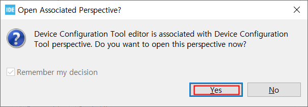

### USART2 수신 인터럽트를 이용한 USART 수신

#### 개발환경

**OS** MS-Windows 10(64bit)

**Target** STM32 NUCLEO F103RB

**IDE** STM32 Cube IDE

**참고문헌** STM32CubeIDE를 이용한 STM32 따라하기(주)북랩 김남수 ∙ 이진형 지음 

#### 프로젝트 생성

**STM32CubeIDE** 실행 후, 아래와 같이 File - New - STM32 Project 선택 


#### Target 선택

Tafget Selection 윈도우가 나타나면 **Board Selector** 탭을 클릭한다.


Board selector 탭의 Type에서 NUCLEO64를 체크, MCU/MPU Series에서 STM32F1을 체크 하면 Board List에 **NUCLEO-F103RB**가 표시된다. 이를 선택 후, 하단의 Next > 버튼을 클릭한다.


STM32 Project 창이 나타나면 Project Name: 에 적당한 프로젝트 이름을 입력 후(예: uart_printf) Finish 버튼을 클릭한다. 


Board Project Options 대화창에서 Yes 버튼을 클릭한다.


Open Associated Perspective 대화창에서 Yes 버튼을 클릭하면 Device Configration Tool 창이 열린다.





#### Device Configuration Tool


- **RCC 설정**

RCC 설정을 위해 다음 그림과 같이 Device Configuration 창에서 Pinout & Configuration 탭의 System Core 항목 중 RCC를 선택 후 우측의 RCC Mode snd Configuration 의 Mode를 High Speed Clock(HSE), Low Speed Clock(LSE) 모두 Disable로 변경한다.


- **USART2 설정**

  NUCLEO-F103RB 타겟보드는 3개의 USART(USART1, USART2, USART3)가 지원된다. 그 중 USB 포트에 바로 연결된 장치가 USART2이므로 USART2 장치를 표준 출력장치로 설정하여 printf() 함수로 출력한 내용이 시리얼로 출력되도록 하기위해 Device Configuration 창에서 Pinout & Configuration 탭의 Conectivity 항목 중 USART2를 선택 후 우측의 USART Mode snd Configuration 의 Mode를 Asynchronous로, Hardware Flow Control(RS232)을 Disable로 변경한다. 

  

USART2 Parameter Setting

앞서 설정한 USART2 Mode 항목 아래에 Configuration 항목의 Parameter Settings 탭을 선택하고 

**Baud Rate** - 115200, **World Length** : 8bit, **Parity** : None, **Stop Bits** : 1, **Data Direction** : Recieve and Transmit 등의 설정값을 확인

한다.


NVIC Settings 탭을 선택하고, USART2 Global Interrupt항목의 Enabled를 체크한다.


System Core 항목에서 NVIC을 선택하고, NVIC Mode and Configuration의 NVIC 탭을 선택 후, NVIC Interrupt Table에 USART global interrupt가 Eabled되어 있는 지 확인한다.


System Core 항목에서 NVIC을 선택하고,NVIC Mode and Configuration의 Code generation 탭을 선택 후,


지금까지의 설정을 반영한 코드 생성


**Project**메뉴의 **Generate Code** 메뉴를 선택한다.


프로젝트 탐색기에서 07_USART_rb-`Core-Src-stm32f1xx_it.c`파일을 열어 `USART2_IRQHandler()`함수가 생성됬는 지 확인한다.


**STM32CubeIDE를 이용한 STM32 따라하기** 실습코드  <https://github.com/dauera80/STM32AtoZ>

위 깃허브에서 `rb.c`와 `rb.h` 파일을 내려받아 `rb.c` 는 Core-Src에, `rb.h` 는 Core-Inc 에 복사 후, 프로젝트 탐색기에서 

`rb.c` 

```c
/*
 * rb.c
 *
 * Created: 2018-04-14 PM 3:12:06
 *  Author: dauera
 */

#include "rb.h"

#include <assert.h>
#include <string.h>
#include <stdlib.h>
   
/**
  * @brief  ring buffer init.
  * @param  ptRB		
  					size 		
  * @retval unsigned int 0 success
  */
unsigned char 
RB_init(RingFifo_t * ptRB, unsigned short size)
{
  
    if(size & (size-1))
      return 1;
    
		ptRB->size = size;
		ptRB->wrIdx= 0;
		ptRB->rdIdx= 0;
		ptRB->data = malloc(size);
    
    assert(ptRB->data);
    
		return 0;		
}

void
RB_clear(RingFifo_t * ptRB)
{
		ptRB->wrIdx= 0;
		ptRB->rdIdx= 0;
		memset(ptRB->data, 0, ptRB->size);
}

void
RB_write(RingFifo_t * ptRB, unsigned char data)
{
  if(RB_isfull(ptRB))
    return;
    
	ptRB->data[ptRB->wrIdx] = data;
	ptRB->wrIdx = (ptRB->size-1) & (ptRB->wrIdx+1);	
}

unsigned char
RB_read(RingFifo_t * ptRB)
{

	unsigned char val = ptRB->data[ptRB->rdIdx];
	ptRB->rdIdx = (ptRB->size-1) & (ptRB->rdIdx+1);	
	
	return val;
}

unsigned char
RB_isempty(RingFifo_t * ptRB)
{
	return (ptRB->rdIdx == ptRB->wrIdx);
}

unsigned char
RB_isfull(RingFifo_t * ptRB)
{
	return ((ptRB->size-1) & ptRB->rdIdx) == ((ptRB->size-1) & (ptRB->wrIdx+1));
}

unsigned short
RB_count(RingFifo_t * ptRB)
{
	return ((ptRB->size-1) & (ptRB->wrIdx - ptRB->rdIdx));
}
```

`rb.h`

```c
/*
 * rb.c
 *
 * Created: 2018-04-14 PM 3:12:06
 *  Author: dauera
 */
 
#ifndef _RB_H_
#define _RB_H_

#ifdef __cplusplus
extern "C"
{
#endif

// buffer type 
typedef struct{
    unsigned short size; // serial buffer in bytes (power 2)
    unsigned short wrIdx;
    unsigned short rdIdx;
    unsigned char *data;
} RingFifo_t;

extern unsigned char RB_init(RingFifo_t * ptRB, unsigned short size);
extern void RB_clear(RingFifo_t * ptRB);
extern void RB_write(RingFifo_t * ptRB, unsigned char data);
extern unsigned char RB_read(RingFifo_t * ptRB);
extern unsigned char RB_isempty(RingFifo_t * ptRB);
extern unsigned char RB_isfull(RingFifo_t * ptRB);
extern unsigned short RB_count(RingFifo_t * ptRB);

#ifdef __cplusplus
}
#endif

#endif                          /* _RB_H_ */

```


`stm32f1xx_it.c`의 `USART2_IRQHandler()` 함수의 다음 코드를

```c
/* USER CODE BEGIN USART2_IRQn 0 */
/* USER CODE END USART2_IRQn 0 */
```

다음과 같이 수정 편집 후 저장한다. 

```c
/* USER CODE BEGIN USART2_IRQn 0 */
  if ((__HAL_UART_GET_FLAG(&huart2, UART_FLAG_RXNE) != RESET) && (__HAL_UART_GET_IT_SOURCE(&huart2, UART_IT_RXNE) != RESET))
    {
      HAL_UART_RxCpltCallback (&huart2);
      __HAL_UART_CLEAR_PEFLAG(&huart2);
    }
  /* USER CODE END USART2_IRQn 0 */
```


`main.c` 의 다음 코드를 


```c
/* USER CODE BEGIN Includes */

/* USER CODE END Includes */
```

다음과 같이 수정 편집한다. 

```c
/* USER CODE BEGIN Includes */
#include "rb.h"
/* USER CODE END Includes */
```


`main.c` 의 다음 코드를 


```c
/* USER CODE BEGIN PV */

/* USER CODE END PV */
```

다음과 같이 수정 편집한다. 

```c
/* USER CODE BEGIN PV */
RingFifo_t gtUart2Fifo;
/* USER CODE END PV */
```


`main.c` 의 다음 코드를 


```c
/* USER CODE BEGIN 2 */
    }
  /* USER CODE END 2 */
```

다음과 같이 수정 편집한다. 

```c
/* USER CODE BEGIN 2 */
  __HAL_UART_ENABLE_IT(&huart2, UART_IT_RXNE);
  if (RB_init (&gtUart2Fifo, 16)) // buffer size is power of 2
    {
      //assert(0);
    }
  /* USER CODE END 2 */
```


`main.c` 의 다음 코드를 

```c

  /* USER CODE BEGIN WHILE */
  while (1)
  {
    /* USER CODE END WHILE */
```


다음과 같이 수정 편집한다. 

```c
 /* USER CODE BEGIN WHILE */
      uint8_t ch;

      while (1)
      {
          if (!RB_isempty (&gtUart2Fifo))
            {
              ch = RB_read (&gtUart2Fifo);
              HAL_UART_Transmit (&huart2, &ch, 1, 0xFF);
            }
        /* USER CODE END WHILE */
```

`main.c` 의 다음 코드를 

```c
/* USER CODE BEGIN 4 */
/* USER CODE END 4 */
```

다음과 같이 수정 편집한다.

```c
/* USER CODE BEGIN 4 */
void
HAL_UART_RxCpltCallback (UART_HandleTypeDef *UartHandle)
{
  uint8_t rx;

  if (UartHandle->Instance == USART2)
    {
      rx = (uint8_t) (UartHandle->Instance->DR & (uint8_t) 0x00FF);
      RB_write (&gtUart2Fifo, rx);
    }
}
/* USER CODE END 4 */
```


ekdmadms 모든 편집이 완료된 `main.c`의 내용이다. 

```c
/* USER CODE BEGIN Header */
/**
  ******************************************************************************
  * @file           : main.c
  * @brief          : Main program body
  ******************************************************************************
  * @attention
  *
  * Copyright (c) 2023 STMicroelectronics.
  * All rights reserved.
  *
  * This software is licensed under terms that can be found in the LICENSE file
  * in the root directory of this software component.
  * If no LICENSE file comes with this software, it is provided AS-IS.
  *
  ******************************************************************************
  */
/* USER CODE END Header */
/* Includes ------------------------------------------------------------------*/
#include "main.h"

/* Private includes ----------------------------------------------------------*/
/* USER CODE BEGIN Includes */

/* USER CODE END Includes */

/* Private typedef -----------------------------------------------------------*/
/* USER CODE BEGIN PTD */

/* USER CODE END PTD */

/* Private define ------------------------------------------------------------*/
/* USER CODE BEGIN PD */
/* USER CODE END PD */

/* Private macro -------------------------------------------------------------*/
/* USER CODE BEGIN PM */

/* USER CODE END PM */

/* Private variables ---------------------------------------------------------*/
UART_HandleTypeDef huart2;

/* USER CODE BEGIN PV */

/* USER CODE END PV */

/* Private function prototypes -----------------------------------------------*/
void SystemClock_Config(void);
static void MX_GPIO_Init(void);
static void MX_USART2_UART_Init(void);
/* USER CODE BEGIN PFP */

/* USER CODE END PFP */

/* Private user code ---------------------------------------------------------*/
/* USER CODE BEGIN 0 */

/* USER CODE END 0 */

/**
  * @brief  The application entry point.
  * @retval int
  */
int main(void)
{
  /* USER CODE BEGIN 1 */

  /* USER CODE END 1 */

  /* MCU Configuration--------------------------------------------------------*/

  /* Reset of all peripherals, Initializes the Flash interface and the Systick. */
  HAL_Init();

  /* USER CODE BEGIN Init */

  /* USER CODE END Init */

  /* Configure the system clock */
  SystemClock_Config();

  /* USER CODE BEGIN SysInit */

  /* USER CODE END SysInit */

  /* Initialize all configured peripherals */
  MX_GPIO_Init();
  MX_USART2_UART_Init();
  /* USER CODE BEGIN 2 */

  /* USER CODE END 2 */

  /* Infinite loop */
  /* USER CODE BEGIN WHILE */
  while (1)
  {
    /* USER CODE END WHILE */

    /* USER CODE BEGIN 3 */
  }
  /* USER CODE END 3 */
}

/**
  * @brief System Clock Configuration
  * @retval None
  */
void SystemClock_Config(void)
{
  RCC_OscInitTypeDef RCC_OscInitStruct = {0};
  RCC_ClkInitTypeDef RCC_ClkInitStruct = {0};

  /** Initializes the RCC Oscillators according to the specified parameters
  * in the RCC_OscInitTypeDef structure.
  */
  RCC_OscInitStruct.OscillatorType = RCC_OSCILLATORTYPE_HSI;
  RCC_OscInitStruct.HSIState = RCC_HSI_ON;
  RCC_OscInitStruct.HSICalibrationValue = RCC_HSICALIBRATION_DEFAULT;
  RCC_OscInitStruct.PLL.PLLState = RCC_PLL_ON;
  RCC_OscInitStruct.PLL.PLLSource = RCC_PLLSOURCE_HSI_DIV2;
  RCC_OscInitStruct.PLL.PLLMUL = RCC_PLL_MUL16;
  if (HAL_RCC_OscConfig(&RCC_OscInitStruct) != HAL_OK)
  {
    Error_Handler();
  }

  /** Initializes the CPU, AHB and APB buses clocks
  */
  RCC_ClkInitStruct.ClockType = RCC_CLOCKTYPE_HCLK|RCC_CLOCKTYPE_SYSCLK
                              |RCC_CLOCKTYPE_PCLK1|RCC_CLOCKTYPE_PCLK2;
  RCC_ClkInitStruct.SYSCLKSource = RCC_SYSCLKSOURCE_PLLCLK;
  RCC_ClkInitStruct.AHBCLKDivider = RCC_SYSCLK_DIV1;
  RCC_ClkInitStruct.APB1CLKDivider = RCC_HCLK_DIV2;
  RCC_ClkInitStruct.APB2CLKDivider = RCC_HCLK_DIV1;

  if (HAL_RCC_ClockConfig(&RCC_ClkInitStruct, FLASH_LATENCY_2) != HAL_OK)
  {
    Error_Handler();
  }
}

/**
  * @brief USART2 Initialization Function
  * @param None
  * @retval None
  */
static void MX_USART2_UART_Init(void)
{

  /* USER CODE BEGIN USART2_Init 0 */

  /* USER CODE END USART2_Init 0 */

  /* USER CODE BEGIN USART2_Init 1 */

  /* USER CODE END USART2_Init 1 */
  huart2.Instance = USART2;
  huart2.Init.BaudRate = 115200;
  huart2.Init.WordLength = UART_WORDLENGTH_8B;
  huart2.Init.StopBits = UART_STOPBITS_1;
  huart2.Init.Parity = UART_PARITY_NONE;
  huart2.Init.Mode = UART_MODE_TX_RX;
  huart2.Init.HwFlowCtl = UART_HWCONTROL_NONE;
  huart2.Init.OverSampling = UART_OVERSAMPLING_16;
  if (HAL_UART_Init(&huart2) != HAL_OK)
  {
    Error_Handler();
  }
  /* USER CODE BEGIN USART2_Init 2 */

  /* USER CODE END USART2_Init 2 */

}

/**
  * @brief GPIO Initialization Function
  * @param None
  * @retval None
  */
static void MX_GPIO_Init(void)
{
  GPIO_InitTypeDef GPIO_InitStruct = {0};

  /* GPIO Ports Clock Enable */
  __HAL_RCC_GPIOC_CLK_ENABLE();
  __HAL_RCC_GPIOD_CLK_ENABLE();
  __HAL_RCC_GPIOA_CLK_ENABLE();
  __HAL_RCC_GPIOB_CLK_ENABLE();

  /*Configure GPIO pin Output Level */
  HAL_GPIO_WritePin(LD2_GPIO_Port, LD2_Pin, GPIO_PIN_RESET);

  /*Configure GPIO pin : B1_Pin */
  GPIO_InitStruct.Pin = B1_Pin;
  GPIO_InitStruct.Mode = GPIO_MODE_IT_RISING;
  GPIO_InitStruct.Pull = GPIO_NOPULL;
  HAL_GPIO_Init(B1_GPIO_Port, &GPIO_InitStruct);

  /*Configure GPIO pin : LD2_Pin */
  GPIO_InitStruct.Pin = LD2_Pin;
  GPIO_InitStruct.Mode = GPIO_MODE_OUTPUT_PP;
  GPIO_InitStruct.Pull = GPIO_NOPULL;
  GPIO_InitStruct.Speed = GPIO_SPEED_FREQ_LOW;
  HAL_GPIO_Init(LD2_GPIO_Port, &GPIO_InitStruct);

  /* EXTI interrupt init*/
  HAL_NVIC_SetPriority(EXTI15_10_IRQn, 0, 0);
  HAL_NVIC_EnableIRQ(EXTI15_10_IRQn);

}

/* USER CODE BEGIN 4 */

/* USER CODE END 4 */

/**
  * @brief  This function is executed in case of error occurrence.
  * @retval None
  */
void Error_Handler(void)
{
  /* USER CODE BEGIN Error_Handler_Debug */
  /* User can add his own implementation to report the HAL error return state */
  __disable_irq();
  while (1)
  {
  }
  /* USER CODE END Error_Handler_Debug */
}

#ifdef  USE_FULL_ASSERT
/**
  * @brief  Reports the name of the source file and the source line number
  *         where the assert_param error has occurred.
  * @param  file: pointer to the source file name
  * @param  line: assert_param error line source number
  * @retval None
  */
void assert_failed(uint8_t *file, uint32_t line)
{
  /* USER CODE BEGIN 6 */
  /* User can add his own implementation to report the file name and line number,
     ex: printf("Wrong parameters value: file %s on line %d\r\n", file, line) */
  /* USER CODE END 6 */
}
#endif /* USE_FULL_ASSERT */

```


22 ~ 25행의 다음 코드를

```c
/* Private includes ----------------------------------------------------------*/
/* USER CODE BEGIN Includes */

/* USER CODE END Includes */
```

아래와 같이 수정한다.

```c

/* Private includes ----------------------------------------------------------*/
/* USER CODE BEGIN Includes */
#include <stdio.h>
/* USER CODE END Includes */
```

56 ~ 59행의 다음 코드를

```c
/* Private user code ---------------------------------------------------------*/
/* USER CODE BEGIN 0 */

/* USER CODE END 0 */
```

아래와 같이 수정한다.

```c
/* USER CODE BEGIN Header */
/**
  ******************************************************************************
  * @file           : main.c
  * @brief          : Main program body
  ******************************************************************************
  * @attention
  *
  * <h2><center>&copy; Copyright (c) 2020 STMicroelectronics.
  * All rights reserved.</center></h2>
  *
  * This software component is licensed by ST under BSD 3-Clause license,
  * the "License"; You may not use this file except in compliance with the
  * License. You may obtain a copy of the License at:
  *                        opensource.org/licenses/BSD-3-Clause
  *
  ******************************************************************************
  */
/* USER CODE END Header */

/* Includes ------------------------------------------------------------------*/
#include "main.h"

/* Private includes ----------------------------------------------------------*/
/* USER CODE BEGIN Includes */
#include "rb.h"
/* USER CODE END Includes */

/* Private typedef -----------------------------------------------------------*/
/* USER CODE BEGIN PTD */

/* USER CODE END PTD */

/* Private define ------------------------------------------------------------*/
/* USER CODE BEGIN PD */
/* USER CODE END PD */

/* Private macro -------------------------------------------------------------*/
/* USER CODE BEGIN PM */

/* USER CODE END PM */

/* Private variables ---------------------------------------------------------*/
UART_HandleTypeDef huart2;

/* USER CODE BEGIN PV */
RingFifo_t gtUart2Fifo;
/* USER CODE END PV */

/* Private function prototypes -----------------------------------------------*/
void SystemClock_Config(void);
static void MX_GPIO_Init(void);
static void MX_USART2_UART_Init(void);
/* USER CODE BEGIN PFP */

/* USER CODE END PFP */

/* Private user code ---------------------------------------------------------*/
/* USER CODE BEGIN 0 */

/* USER CODE END 0 */

/**
  * @brief  The application entry point.
  * @retval int
  */
int main(void)
{
  /* USER CODE BEGIN 1 */

  /* USER CODE END 1 */

  /* MCU Configuration--------------------------------------------------------*/

  /* Reset of all peripherals, Initializes the Flash interface and the Systick. */
  HAL_Init();

  /* USER CODE BEGIN Init */

  /* USER CODE END Init */

  /* Configure the system clock */
  SystemClock_Config();

  /* USER CODE BEGIN SysInit */

  /* USER CODE END SysInit */

  /* Initialize all configured peripherals */
  MX_GPIO_Init();
  MX_USART2_UART_Init();
  /* USER CODE BEGIN 2 */
  __HAL_UART_ENABLE_IT(&huart2, UART_IT_RXNE);
  if (RB_init (&gtUart2Fifo, 16)) // buffer size is power of 2
    {
      //assert(0);
    }
  /* USER CODE END 2 */

  /* Infinite loop */
  /* USER CODE BEGIN WHILE */
  uint8_t ch;

  while (1)
  {
      if (!RB_isempty (&gtUart2Fifo))
        {
          ch = RB_read (&gtUart2Fifo);
          HAL_UART_Transmit (&huart2, &ch, 1, 0xFF);
        }
    /* USER CODE END WHILE */

    /* USER CODE BEGIN 3 */
  }
  /* USER CODE END 3 */
}

/**
  * @brief System Clock Configuration
  * @retval None
  */
void SystemClock_Config(void)
{
  RCC_OscInitTypeDef RCC_OscInitStruct = {0};
  RCC_ClkInitTypeDef RCC_ClkInitStruct = {0};

  /** Initializes the CPU, AHB and APB busses clocks 
  */
  RCC_OscInitStruct.OscillatorType = RCC_OSCILLATORTYPE_HSI;
  RCC_OscInitStruct.HSIState = RCC_HSI_ON;
  RCC_OscInitStruct.HSICalibrationValue = RCC_HSICALIBRATION_DEFAULT;
  RCC_OscInitStruct.PLL.PLLState = RCC_PLL_ON;
  RCC_OscInitStruct.PLL.PLLSource = RCC_PLLSOURCE_HSI_DIV2;
  RCC_OscInitStruct.PLL.PLLMUL = RCC_PLL_MUL16;
  if (HAL_RCC_OscConfig(&RCC_OscInitStruct) != HAL_OK)
  {
    Error_Handler();
  }
  /** Initializes the CPU, AHB and APB busses clocks 
  */
  RCC_ClkInitStruct.ClockType = RCC_CLOCKTYPE_HCLK|RCC_CLOCKTYPE_SYSCLK
                              |RCC_CLOCKTYPE_PCLK1|RCC_CLOCKTYPE_PCLK2;
  RCC_ClkInitStruct.SYSCLKSource = RCC_SYSCLKSOURCE_PLLCLK;
  RCC_ClkInitStruct.AHBCLKDivider = RCC_SYSCLK_DIV1;
  RCC_ClkInitStruct.APB1CLKDivider = RCC_HCLK_DIV2;
  RCC_ClkInitStruct.APB2CLKDivider = RCC_HCLK_DIV1;

  if (HAL_RCC_ClockConfig(&RCC_ClkInitStruct, FLASH_LATENCY_2) != HAL_OK)
  {
    Error_Handler();
  }
}

/**
  * @brief USART2 Initialization Function
  * @param None
  * @retval None
  */
static void MX_USART2_UART_Init(void)
{

  /* USER CODE BEGIN USART2_Init 0 */

  /* USER CODE END USART2_Init 0 */

  /* USER CODE BEGIN USART2_Init 1 */

  /* USER CODE END USART2_Init 1 */
  huart2.Instance = USART2;
  huart2.Init.BaudRate = 115200;
  huart2.Init.WordLength = UART_WORDLENGTH_8B;
  huart2.Init.StopBits = UART_STOPBITS_1;
  huart2.Init.Parity = UART_PARITY_NONE;
  huart2.Init.Mode = UART_MODE_TX_RX;
  huart2.Init.HwFlowCtl = UART_HWCONTROL_NONE;
  huart2.Init.OverSampling = UART_OVERSAMPLING_16;
  if (HAL_UART_Init(&huart2) != HAL_OK)
  {
    Error_Handler();
  }
  /* USER CODE BEGIN USART2_Init 2 */

  /* USER CODE END USART2_Init 2 */

}

/**
  * @brief GPIO Initialization Function
  * @param None
  * @retval None
  */
static void MX_GPIO_Init(void)
{
  GPIO_InitTypeDef GPIO_InitStruct = {0};

  /* GPIO Ports Clock Enable */
  __HAL_RCC_GPIOC_CLK_ENABLE();
  __HAL_RCC_GPIOD_CLK_ENABLE();
  __HAL_RCC_GPIOA_CLK_ENABLE();
  __HAL_RCC_GPIOB_CLK_ENABLE();

  /*Configure GPIO pin Output Level */
  HAL_GPIO_WritePin(LD2_GPIO_Port, LD2_Pin, GPIO_PIN_RESET);

  /*Configure GPIO pin : B1_Pin */
  GPIO_InitStruct.Pin = B1_Pin;
  GPIO_InitStruct.Mode = GPIO_MODE_IT_RISING;
  GPIO_InitStruct.Pull = GPIO_NOPULL;
  HAL_GPIO_Init(B1_GPIO_Port, &GPIO_InitStruct);

  /*Configure GPIO pin : LD2_Pin */
  GPIO_InitStruct.Pin = LD2_Pin;
  GPIO_InitStruct.Mode = GPIO_MODE_OUTPUT_PP;
  GPIO_InitStruct.Pull = GPIO_NOPULL;
  GPIO_InitStruct.Speed = GPIO_SPEED_FREQ_LOW;
  HAL_GPIO_Init(LD2_GPIO_Port, &GPIO_InitStruct);

  /* EXTI interrupt init*/
  HAL_NVIC_SetPriority(EXTI15_10_IRQn, 0, 0);
  HAL_NVIC_EnableIRQ(EXTI15_10_IRQn);

}

/* USER CODE BEGIN 4 */
void
HAL_UART_RxCpltCallback (UART_HandleTypeDef *UartHandle)
{
  uint8_t rx;

  if (UartHandle->Instance == USART2)
    {
      rx = (uint8_t) (UartHandle->Instance->DR & (uint8_t) 0x00FF);
      RB_write (&gtUart2Fifo, rx);
    }
}
/* USER CODE END 4 */

/**
  * @brief  This function is executed in case of error occurrence.
  * @retval None
  */
void Error_Handler(void)
{
  /* USER CODE BEGIN Error_Handler_Debug */
  /* User can add his own implementation to report the HAL error return state */

  /* USER CODE END Error_Handler_Debug */
}

#ifdef  USE_FULL_ASSERT
/**
  * @brief  Reports the name of the source file and the source line number
  *         where the assert_param error has occurred.
  * @param  file: pointer to the source file name
  * @param  line: assert_param error line source number
  * @retval None
  */
void assert_failed(uint8_t *file, uint32_t line)
{ 
  /* USER CODE BEGIN 6 */
  /* User can add his own implementation to report the file name and line number,
     tex: printf("Wrong parameters value: file %s on line %d\r\n", file, line) */
  /* USER CODE END 6 */
}
#endif /* USE_FULL_ASSERT */

/************************ (C) COPYRIGHT STMicroelectronics *****END OF FILE****/
```

**Project** 메뉴의 **Build Project**를 선택하여 빌드한다.


에러없이 빌드되었으면, RUN 메뉴에서 RUN 항목을 선택하여 실행한다. 

적당한 시리얼 통신 터미널 에뮬레이터(putty, TERATERM, Arduino IDE 등)를 실행하여 결과를 확인한다.  


[**목차**](../README.md) 