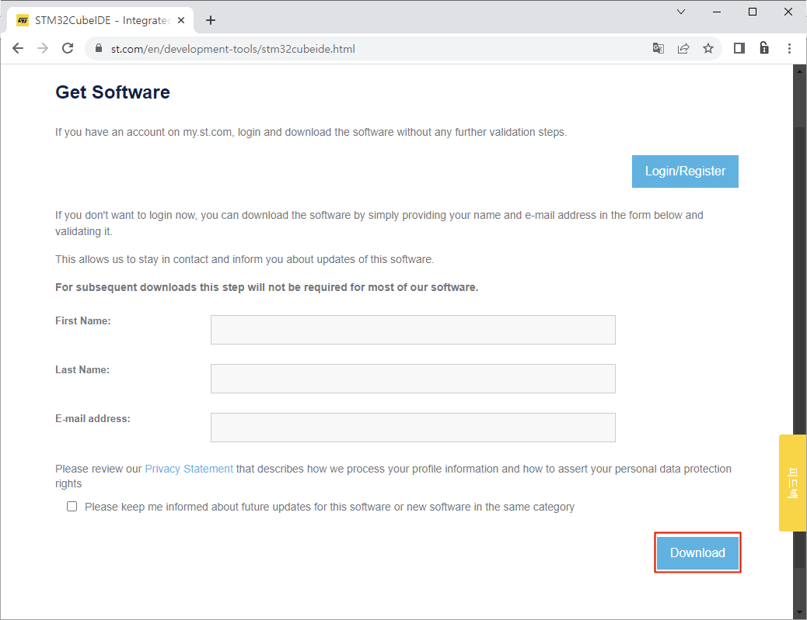
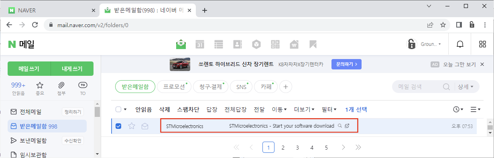
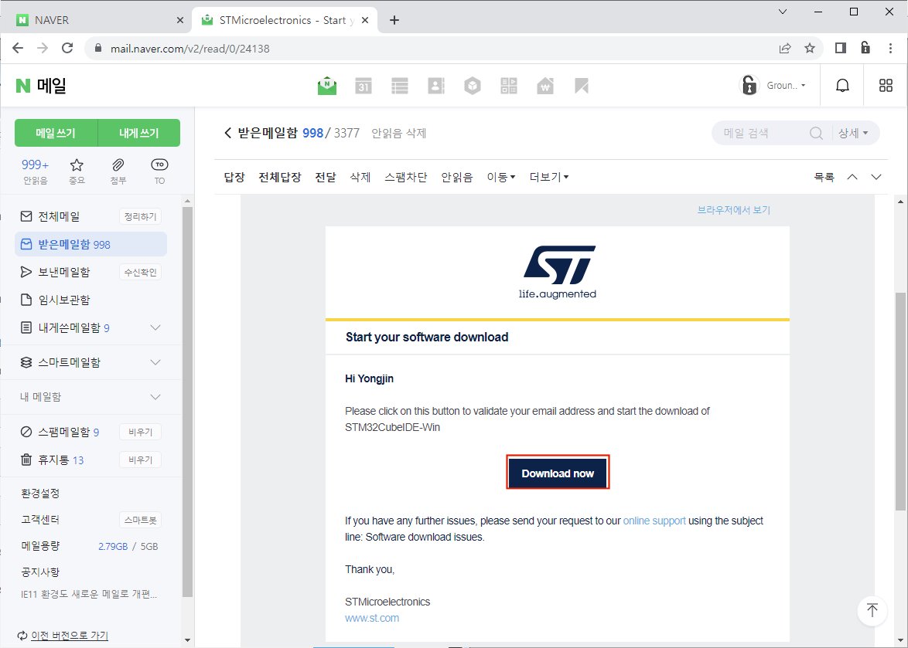

### Install STM32 Cube IDE

수행할 작업내용

#### 개발환경

**OS** MS-Windows 10(64bit)

**Target** STM32 NUCLEO F103RB

**IDE** STM32 Cube IDE

**참고문헌** STM32CubeIDE를 이용한 STM32 따라하기(주)북랩 김남수 ∙ 이진형 지음 

#### 설치파일 다운로드를 위해 아래 링크를 연다.

[STMicroelectronics](https://www.st.com/en/development-tools/stm32cubeide.html)

**Get Software** 항목이 나타날 때 까지 화면을 스크롤 다운 시킨 후, 사용 중인 운영체제에 해당하는 설치 파일의 다운로드 버튼을 클릭한다.

First Name, Last Name, E-Mail address 항목 기입후, Download 버튼을 클릭한다.

 E-Mail address 항목에 기입한 메일 계정에 로그인하여 STMicroelectronics 로부터 새로 수신된 메일을 확인한다. 

**Download now** 버튼을 클릭하면 설치파일 다운로드가 시작된다. 

[**목차**](../README.md) 

