### Install STM32 Cube IDE

수행할 작업내용

#### 개발환경

**OS** MS-Windows 10(64bit)

**Target** STM32 NUCLEO F103RB

**IDE** STM32 Cube IDE

**참고문헌** STM32CubeIDE를 이용한 STM32 따라하기(주)북랩 김남수 ∙ 이진형 지음 

#### 설치파일 다운로드를 위해 아래 링크를 연다.

[STMicroelectronics](https://www.st.com/en/development-tools/stm32cubeide.html)

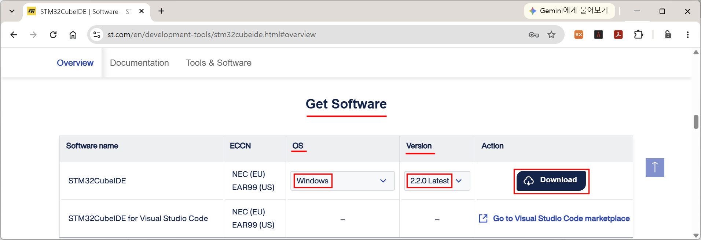

**Get Software** 항목이 나타날 때 까지 화면을 스크롤 다운 시킨 후, 사용 중인 운영체제에 해당하는 설치 파일의 다운로드 버튼을 클릭한다.

First Name, Last Name, E-Mail address 항목 기입후, Download 버튼을 클릭한다.

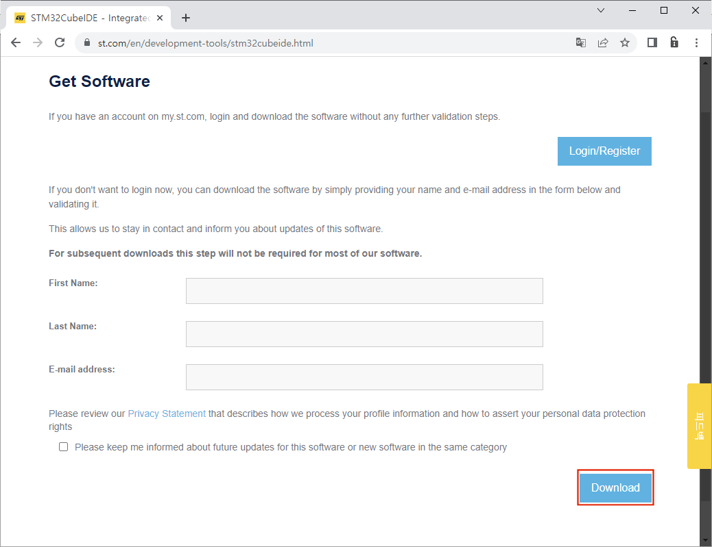

 E-Mail address 항목에 기입한 메일 계정에 로그인하여 STMicroelectronics 로부터 새로 수신된 메일을 확인한다. 

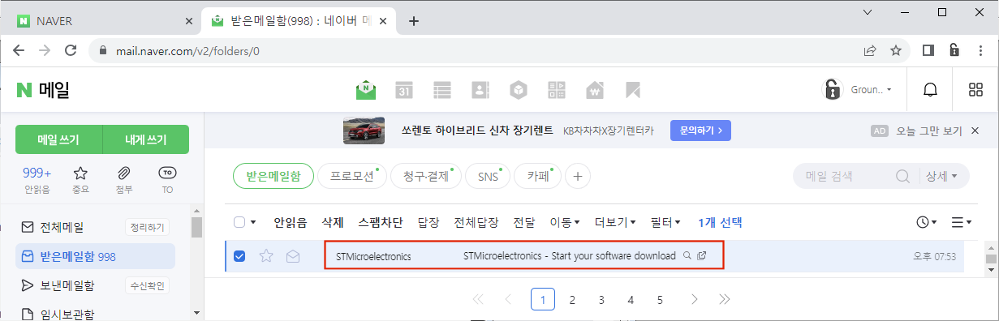

**Download now** 버튼을 클릭하면 설치파일 다운로드가 시작된다. 

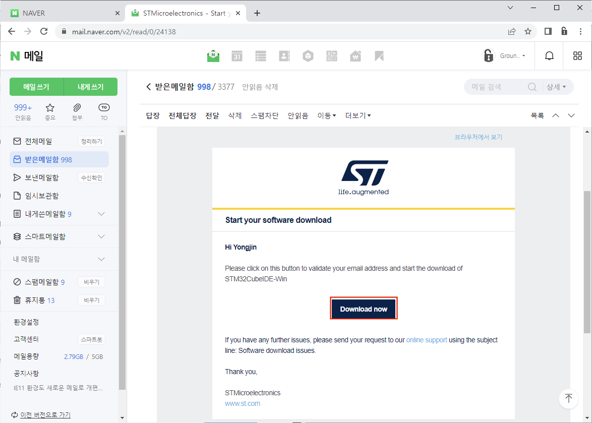

다운로드가 완료되고 나면, `stm32cubeide_2.2.0-Win-x86_64.exe.zip`파일의 압축을 해제한다.

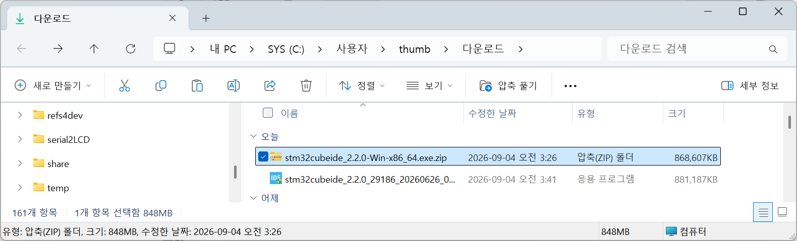

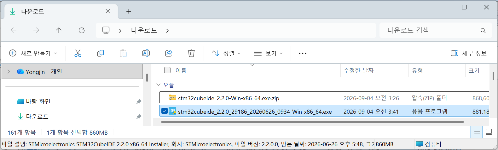

 `stm32cubeide_2.2.0-Win-x86_64.exe.zip`파일의 압축 해제 결과로 얻어진`stm32cubeide_2.2.0_29186_20260626_0934-Win-x86_64.exe`파일을 실행하여 STM32CubeIDE의 설치를 진행한다.

이 앱이 디바이스를 변경할 수 있도록 허용하시겠어요? STMicroelectronics STM32CubeIDE 2.2.0 x86_64 Installer

팝업 메세지에서 [ 예 ]를 클릭한다.

아래  웰컴 팝업에서는  [ <u>N</u>ext > ]를 클릭한다.

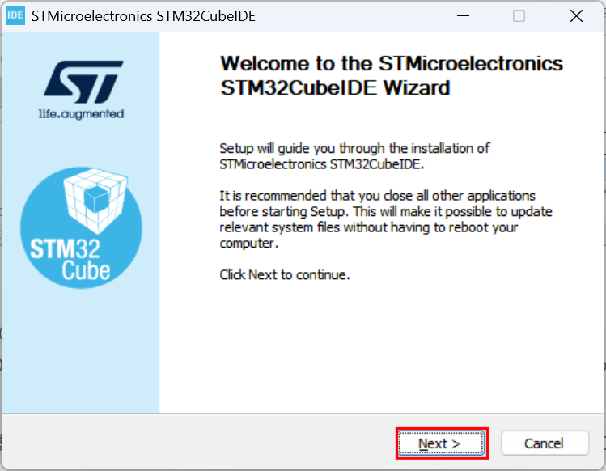

다음 아래 소프트웨어 사용 계약 팝업에서는  [ I <u>A</u>gree ]를 클릭한다.

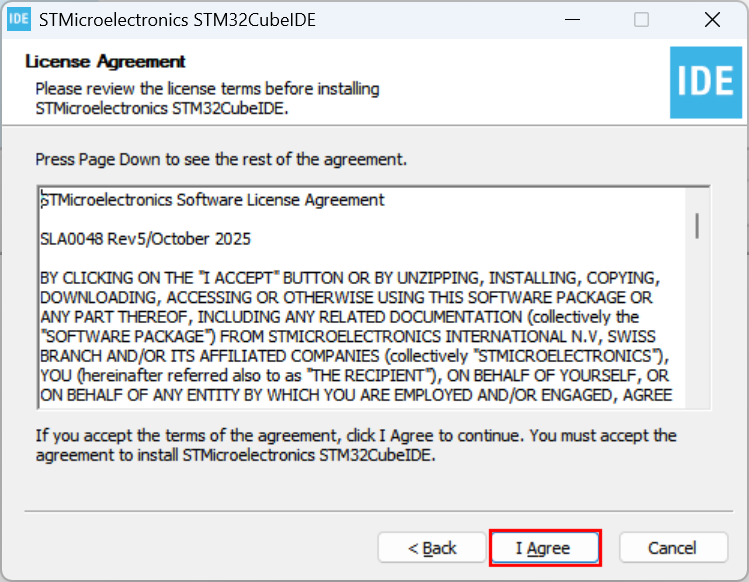

설치 위치 팝업에서는 기본 위치에 설치하려면  바로 [ <u>N</u>ext > ]를 클릭한다.

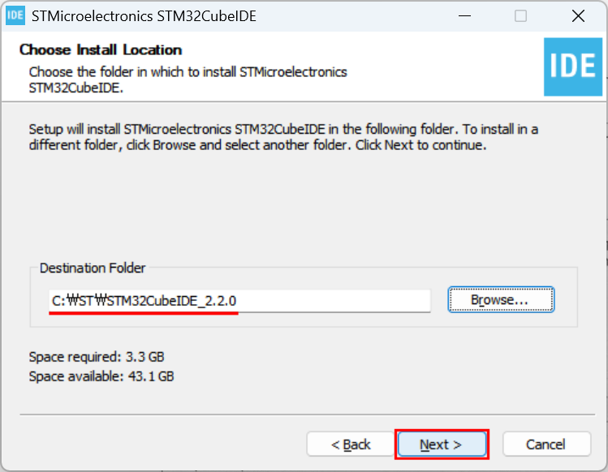

프로그램 다운로더 선택 팝업에서는 기본값 대로 J-Link와 ST-Link 모두 선택한 채로 [ <u>I</u>nstall ] 버튼을 클릭한다.

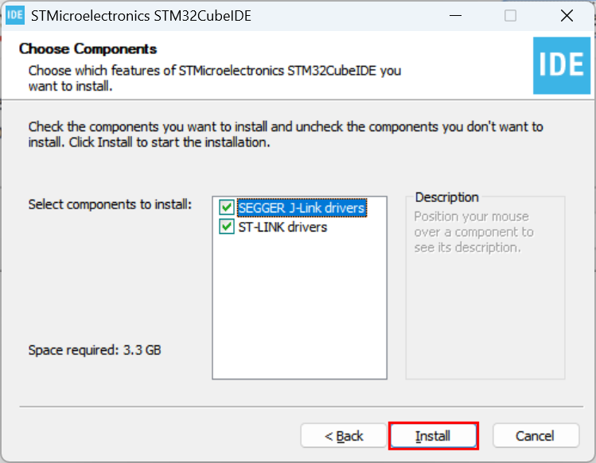

[ <u>I</u>nstall ] 버튼을 클릭 후 설치 진행상태 표시 막대가 꽉 차기를 기다린다.

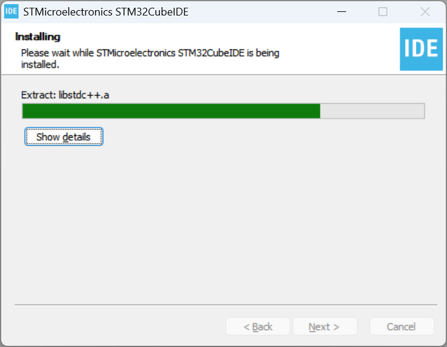

설치 완료 메세지가 뜨면 [ <u>N</u>ext > ] 버튼을 클릭한다.

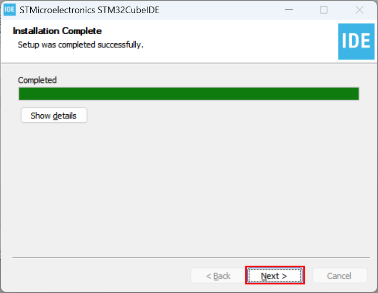

모든 설치가 완료되었다. 바탕화면 바로가기가 필요하면 [v] Create desktop shortcut 에 체크 후 [ <u>F</u>inish ]버튼을 클릭하여 설치프로그램을 종료한다.

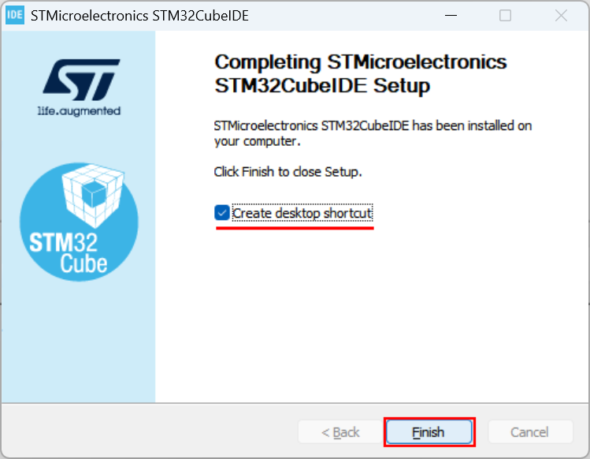

[**목차**](../README.md) 

