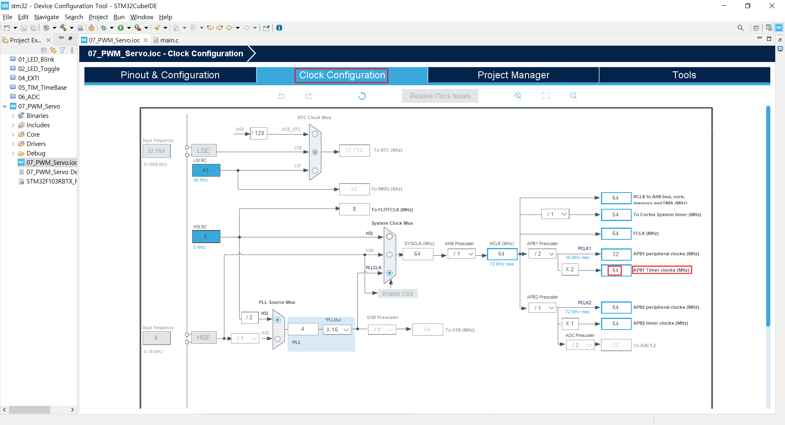

### OpenCV를 이용한 객체 추적

#### 1. STM32 Firmware

USART 시리얼 통신으로 전송받은 문자열에 따라 카메라 팬/틸트 제어 기능 구현


**1.1 RCC 설정**

RCC 설정을 위해 다음 그림과 같이 Device Configuration 창에서 Pinout & Configuration 탭의 System Core 항목 중 RCC를 선택 후 우측의 RCC Mode and Configuration 의 Mode의 High Speed Clock(HSE) 및 Low Speed Clock(LSE) 모두를 Disable로 변경한다.


 **1.2 TIM4 설정**

  Pinout & Configuration탭의 Timers의 하위항목 중 Tim4를 선택한다.  ATim4 Mode and Configuration의 Mode에서 Internal Clock을 체크, Channel2를 PWM Generation CH2로 변경 후, 화면 우측의 PINout 탭에서 PB7 핀을 클릭하여 TIM4_CH2가 나타나는 지 확인한다. 

  

  Tim4의 Congiguration의 arameter Settings 탭의 Prescaler,  Counter Period 설정에 앞서 Clock을 확인해야 한다. 

  STM32-F1xx 시리즈 MCU는 CPU와  다수의 peripheral 장치들로 이루어져 있으며, 이들은 ARMBA( Advanced Microcontroller Bus Architecture ) 버스로 연결되어 있다. 

  ARMBA( Advanced Microcontroller Bus Architecture ) 버스는 AHB(Advanced High Performance Bus), APB1(Advanced Peripheral Bus1 ), APB2( Advanced Peripheral Bus2 ) 의 3가지 BUS로 이루어지며, 다음은 각 Peripheral Device들이 어떤 버스에 연결되어 있는가를 보여주는  구성도이다. 

  

  

  서보모터를 제어하기위한 PWM 파형을 TIM4 타이머의 PWM 출력 채널2를 통해 발생시키기 위해 TIM4가 연결된 APB1 버스에 공급되는 클럭 주파수를 확인해야한다.  Clock Configuration 탭을 선택한다.

  APB1 Timer Clock이 64(MHz)라는 것을 확인할 수 있다. 

  

  서보모터를 제어하기위해서는 주기가 20(ms) 즉 50(Hz)인 PWM 파형이 필요하다. Tim4 Mode and Configuration에서 Parameter Settings의 Prescaler와 Counter Period에 적절한 값을 설정하여 이를 맞춰줘야 한다. 

  Tim4에는 64(MHz) 클럭이 공급되는 것은 이미 확인 했다. 이 클럭은은 Prescaler에 의해 분주되어 타이머에 공급된다. 64(MHz)는 64,000,000Hz 인데 Prescaler Parameter를 1280으로 설정한다면, 타이머에는 64,000,000 / 1280 = 50,000(Hz)의 클럭이 공급된다. 이 때 타이머는 카운터로 동작하며, 입력되는 클럭을 카운트한다. 1초에 50,000개의 클럭이 입력되므로, 클럭 1개를 카운트 하는 데에 1/50,000초가 소요된다. 이 때 Counter Periode Parameter로 1,000을 설정한다면 클럭을 1,000번 카운트 할 때 마다 타이머 인터럽트를 발생시키게 된다. 따라서 이 때의 인터럽트 주기는 1/50,000초 × 1,000 = 1,000/50,000=1/50=2/100 초, 즉 20(ms)가 되어 서보모터를 제어하기위한 주기 20(ms)인 PWM 파형을 발생시킬 준비가 되었다. 

  이제 TIM3 타이머의 Parameter들을 설정해보자.

  Prescaler값이 1280 이라는 것은 1280개의 클럭이 입력될 때마다 1개의 클럭을 출력한다는 의미이다. 카운트를 1부터 시작한다면 1280개의 클럭이 입력됬을 때의 카운트 값은 1280 이겠지만, 컴퓨터는 0부터 카운트를 시작하므로 1280개의 클럭이 입력됬을 때의 카운트 값은 1281이된다. 따라서 Prescaler는 `1280-1`로 설정하고, 같은 이유로 Counter Period는 `1000-1`로 설정한다.

  

  

  

  

  **1.3 TIM2 설정**

  Pinout & Configuration탭의 Timers의 하위항목 중 Tim2를 선택한다.  Tim2 Mode and Configuration의 Mode에서 Clock Source를 Internal Clock으로, Channel1를 PWM Generation CH1로 변경 후, 화면 우측의 PINout 탭에서 PA0 핀을 클릭하여 TIM2_CH1이 나타나는 지 확인한다. 

  

  

  

  


Tim2의 Congiguration의 arameter Settings 탭의 Prescaler,  Counter Period 설정은 앞서 TIM4에서 계산한 설정값을 참조하여 Tim2 Mode and Configuration의 Mode에서 Parameter Settings 탭의 Prescaler 값을 `1280-1`로, Counter Mode를 `Up`으로, Counter Period 값을 `1000-1`로 설정한다.


**1.4 `main.c` 편집**

`main.c`의 다음코드를

```c
/* USER CODE BEGIN Includes */

/* USER CODE END Includes */
```

아래와 같이 수정한다. 

```c
/* USER CODE BEGIN Includes */
#include<stdio.h>
#include<string.h>
/* USER CODE END Includes */
```


`main.c`의 다음코드를

```c
/* USER CODE BEGIN PV */

/* USER CODE END PV */
```

아래와 같이 수정한다. 

```c
/* USER CODE BEGIN PV */
uint8_t str[10];
uint8_t pos_pan;
uint8_t pos_tilt;
uint8_t digits;
/* USER CODE END PV */
```


`main.c`의 다음코드를

```c
/* USER CODE BEGIN PFP */

/* USER CODE END PFP */
```

아래와 같이 수정한다. 

```c
/* USER CODE BEGIN PFP */
int check_digit(void);
void reset_str(void);
/* USER CODE END PFP */
```


`printf()`함수 사용을 위해 `main.c`의 다음코드를

```c
/* USER CODE BEGIN 0 */

}
/* USER CODE END 0 */
```

아래와 같이 수정한다. 

```c
/* USER CODE BEGIN 0 */
#ifdef __GNUC__
/* With GCC, small printf (option LD Linker->Libraries->Small printf
   set to 'Yes') calls __io_putchar() */
#define PUTCHAR_PROTOTYPE int __io_putchar(int ch)
#else
#define PUTCHAR_PROTOTYPE int fputc(int ch, FILE *f)
#endif /* __GNUC__ */

/**
  * @brief  Retargets the C library printf function to the USART.
  * @param  None
  * @retval None
  */
PUTCHAR_PROTOTYPE
{
  /* Place your implementation of fputc here */
  /* e.g. write a character to the USART1 and Loop until the end of transmission */
  if (ch == '\n')
    HAL_UART_Transmit (&huart2, (uint8_t*) "\r", 1, 0xFFFF);
  HAL_UART_Transmit (&huart2, (uint8_t*) &ch, 1, 0xFFFF);

  return ch;
}
/* USER CODE END 0 */
```


위에서 수정한 코드 마지막 줄 `/* USER CODE END 0 */` 바로 다음 줄에 다음코드를 삽입한다. 

```c
/* USER CODE BEGIN 1 */
	int check_digit() {
		int i, cnt;
		cnt = 0;
		for(i=0; i<=sizeof(str); i++) {
			if(str[i]>='0' && str[i]<='9') {
				cnt++;
			}
		}
		return cnt;
		}
void reset_str(void) {
	for(int i=0; i<=sizeof(str); i++)
	{
		str[i] = '\0';
	}
}

/* USER CODE END 1 */
```

`main.c`의 다음코드를 `main.c`의 다음코드를 

```c
/* USER CODE BEGIN WHILE */
  {
    /* USER CODE END WHILE */
```

아래와 같이 수정한다. 

```c
/* USER CODE BEGIN WHILE */
 
  HAL_TIM_PWM_Start(&htim2,TIM_CHANNEL_1);
  HAL_TIM_PWM_Start(&htim4,TIM_CHANNEL_2);
  while (1)
  {
    /* USER CODE END WHILE */
```


```c
/* USER CODE BEGIN 3 */

  }
  /* USER CODE END 3 */
```


```c

	 /* USER CODE BEGIN 3 */

	  HAL_UART_Receive(&huart2,str,10,100);
	  char *ptr1_str = strstr(str, "pan");
	  char *ptr2_str = strstr(str, "tilt");

	  if(ptr1_str !=NULL )
	  {
		  digits = check_digit();
		  if     (digits==3) {
		  pos_pan = (str[3]-'0')*100 + (str[4]-'0')*10 +(str[5]-'0');
		  }
		  else if(digits==2) {
			  pos_pan = (str[3]-'0')*10 + (str[4]-'0');
		  }
		  else if(digits==1) {
			  pos_pan = str[3]-'0';
		  }
		  printf("pos_pan = %d\n",pos_pan);
		  __HAL_TIM_SetCompare(&htim4, TIM_CHANNEL_2, pos_pan);
		  reset_str();
	  }

	  else if(ptr2_str !=NULL )
	  {
		  digits = check_digit();
		  if     (digits==3){
		  pos_tilt = (str[4]-'0')*100 + (str[5]-'0')*10 +(str[6]-'0');
		  }
		  else if(digits==2) {
			  pos_tilt = (str[4]-'0')*10 + (str[5]-'0');
		  }
		  else if(digits==1) {
			  pos_tilt = str[4]-'0';
		  }
		  printf("pos_tilt = %d\n",pos_tilt);
		  __HAL_TIM_SetCompare(&htim2, TIM_CHANNEL_1, pos_tilt);
		  reset_str();
	  }
  }
  /* USER CODE END 3 */
```


다음은 편집이 완료된 `main.c`의 전체 코드이다.

```c
/* USER CODE BEGIN Header */
/**
  ******************************************************************************
  * @file           : main.c
  * @brief          : Main program body
  ******************************************************************************
  * @attention
  *
  * Copyright (c) 2023 STMicroelectronics.
  * All rights reserved.
  *
  * This software is licensed under terms that can be found in the LICENSE file
  * in the root directory of this software component.
  * If no LICENSE file comes with this software, it is provided AS-IS.
  *
  ******************************************************************************
  */
/* USER CODE END Header */
/* Includes ------------------------------------------------------------------*/
#include "main.h"

/* Private includes ----------------------------------------------------------*/
/* USER CODE BEGIN Includes */
#include<stdio.h>
#include<string.h>
/* USER CODE END Includes */

/* Private typedef -----------------------------------------------------------*/
/* USER CODE BEGIN PTD */

/* USER CODE END PTD */

/* Private define ------------------------------------------------------------*/
/* USER CODE BEGIN PD */
/* USER CODE END PD */

/* Private macro -------------------------------------------------------------*/
/* USER CODE BEGIN PM */

/* USER CODE END PM */

/* Private variables ---------------------------------------------------------*/
TIM_HandleTypeDef htim2;
TIM_HandleTypeDef htim4;

UART_HandleTypeDef huart2;

/* USER CODE BEGIN PV */
uint8_t str[12];	//ptval125 125
uint8_t pan[3];
uint8_t pos_pan = 75;
uint8_t pos_tilt = 75;
uint8_t digits;
/* USER CODE END PV */

/* Private function prototypes -----------------------------------------------*/
void SystemClock_Config(void);
static void MX_GPIO_Init(void);
static void MX_USART2_UART_Init(void);
static void MX_TIM4_Init(void);
static void MX_TIM2_Init(void);
/* USER CODE BEGIN PFP */
int check_digit(void);
void reset_str(void);
void get_pan_value(void);
/* USER CODE END PFP */

/* Private user code ---------------------------------------------------------*/
/* USER CODE BEGIN 0 */
#ifdef __GNUC__
/* With GCC, small printf (option LD Linker->Libraries->Small printf
   set to 'Yes') calls __io_putchar() */
#define PUTCHAR_PROTOTYPE int __io_putchar(int ch)
#else
#define PUTCHAR_PROTOTYPE int fputc(int ch, FILE *f)
#endif /* __GNUC__ */

/**
  * @brief  Retargets the C library printf function to the USART.
  * @param  None
  * @retval None
  */
PUTCHAR_PROTOTYPE
{
  /* Place your implementation of fputc here */
  /* e.g. write a character to the USART1 and Loop until the end of transmission */
  if (ch == '\n')
    HAL_UART_Transmit (&huart2, (uint8_t*) "\r", 1, 0xFFFF);
  HAL_UART_Transmit (&huart2, (uint8_t*) &ch, 1, 0xFFFF);

  return ch;
}
/* USER CODE END 0 */

/* USER CODE BEGIN 1 */
	int check_digit() {
		int i, cnt;
		cnt = 0;
		for(i=0; i<=sizeof(str); i++) {
			if(str[i]>='0' && str[i]<='9') {
				cnt++;
			}
		}
		return cnt;
		}
void reset_str(void) {
	for(int i=0; i<=sizeof(str); i++)
	{
		str[i] = '\0';
	}
}


/* USER CODE END 1 */

/**
  * @brief  The application entry point.
  * @retval int
  */
int main(void)
{

  /* MCU Configuration--------------------------------------------------------*/

  /* Reset of all peripherals, Initializes the Flash interface and the Systick. */
  HAL_Init();

  /* USER CODE BEGIN Init */

  /* USER CODE END Init */

  /* Configure the system clock */
  SystemClock_Config();

  /* USER CODE BEGIN SysInit */

  /* USER CODE END SysInit */

  /* Initialize all configured peripherals */
  MX_GPIO_Init();
  MX_USART2_UART_Init();
  MX_TIM4_Init();
  MX_TIM2_Init();
  /* USER CODE BEGIN 2 */

  /* USER CODE END 2 */

  /* Infinite loop */
  /* USER CODE BEGIN WHILE */
  HAL_TIM_PWM_Start(&htim2,TIM_CHANNEL_1);
  HAL_TIM_PWM_Start(&htim4,TIM_CHANNEL_2);
  __HAL_TIM_SetCompare(&htim4, TIM_CHANNEL_2, pos_pan);
  __HAL_TIM_SetCompare(&htim2, TIM_CHANNEL_1, pos_tilt);

  while (1)
  {
    /* USER CODE END WHILE */

    /* USER CODE BEGIN 3 */

	  HAL_UART_Receive(&huart2,str,12,100);

	  printf("%s\r\n",str); // 125 75
	  char *pan = strtok(str, " ");
	  char *tilt = strtok(NULL, " ");
	  pos_pan = atoi(pan);
	  __HAL_TIM_SetCompare(&htim4, TIM_CHANNEL_2, pos_pan);
	  HAL_Delay(10);
	  pos_tilt = atoi(tilt);
	  __HAL_TIM_SetCompare(&htim2, TIM_CHANNEL_1, pos_tilt);
	  HAL_Delay(10);
	  printf("pan = %d, tilt = %d\r\n", pos_pan, pos_tilt);


	  char *ptr1_str = strstr(str, "pan");
	  char *ptr2_str = strstr(str, "tilt");

	  if(ptr1_str !=NULL )
	  {
		  digits = check_digit();
		  if     (digits==3) {
		  pos_pan = (str[3]-'0')*100 + (str[4]-'0')*10 +(str[5]-'0');
		  }
		  else if(digits==2) {
			  pos_pan = (str[3]-'0')*10 + (str[4]-'0');
		  }
		  else if(digits==1) {
			  pos_pan = str[3]-'0';
		  }
		  printf("pos_pan = %d\n",pos_pan);
		  __HAL_TIM_SetCompare(&htim4, TIM_CHANNEL_2, pos_pan);
		  reset_str();
	  }

	  else if(ptr2_str !=NULL )
	  {
		  digits = check_digit();
		  if     (digits==3){
		  pos_tilt = (str[4]-'0')*100 + (str[5]-'0')*10 +(str[6]-'0');
		  }
		  else if(digits==2) {
			  pos_tilt = (str[4]-'0')*10 + (str[5]-'0');
		  }
		  else if(digits==1) {
			  pos_tilt = str[4]-'0';
		  }
		  printf("pos_tilt = %d\n",pos_tilt);
		  __HAL_TIM_SetCompare(&htim2, TIM_CHANNEL_1, pos_tilt);
		  reset_str();
	  }
  }
  /* USER CODE END 3 */
}

/**
  * @brief System Clock Configuration
  * @retval None
  */
void SystemClock_Config(void)
{
  RCC_OscInitTypeDef RCC_OscInitStruct = {0};
  RCC_ClkInitTypeDef RCC_ClkInitStruct = {0};

  /** Initializes the RCC Oscillators according to the specified parameters
  * in the RCC_OscInitTypeDef structure.
  */
  RCC_OscInitStruct.OscillatorType = RCC_OSCILLATORTYPE_HSI;
  RCC_OscInitStruct.HSIState = RCC_HSI_ON;
  RCC_OscInitStruct.HSICalibrationValue = RCC_HSICALIBRATION_DEFAULT;
  RCC_OscInitStruct.PLL.PLLState = RCC_PLL_ON;
  RCC_OscInitStruct.PLL.PLLSource = RCC_PLLSOURCE_HSI_DIV2;
  RCC_OscInitStruct.PLL.PLLMUL = RCC_PLL_MUL16;
  if (HAL_RCC_OscConfig(&RCC_OscInitStruct) != HAL_OK)
  {
    Error_Handler();
  }

  /** Initializes the CPU, AHB and APB buses clocks
  */
  RCC_ClkInitStruct.ClockType = RCC_CLOCKTYPE_HCLK|RCC_CLOCKTYPE_SYSCLK
                              |RCC_CLOCKTYPE_PCLK1|RCC_CLOCKTYPE_PCLK2;
  RCC_ClkInitStruct.SYSCLKSource = RCC_SYSCLKSOURCE_PLLCLK;
  RCC_ClkInitStruct.AHBCLKDivider = RCC_SYSCLK_DIV1;
  RCC_ClkInitStruct.APB1CLKDivider = RCC_HCLK_DIV2;
  RCC_ClkInitStruct.APB2CLKDivider = RCC_HCLK_DIV1;

  if (HAL_RCC_ClockConfig(&RCC_ClkInitStruct, FLASH_LATENCY_2) != HAL_OK)
  {
    Error_Handler();
  }
}

/**
  * @brief TIM2 Initialization Function
  * @param None
  * @retval None
  */
static void MX_TIM2_Init(void)
{

  /* USER CODE BEGIN TIM2_Init 0 */

  /* USER CODE END TIM2_Init 0 */

  TIM_ClockConfigTypeDef sClockSourceConfig = {0};
  TIM_MasterConfigTypeDef sMasterConfig = {0};
  TIM_OC_InitTypeDef sConfigOC = {0};

  /* USER CODE BEGIN TIM2_Init 1 */

  /* USER CODE END TIM2_Init 1 */
  htim2.Instance = TIM2;
  htim2.Init.Prescaler = 1280-1;
  htim2.Init.CounterMode = TIM_COUNTERMODE_UP;
  htim2.Init.Period = 1000-1;
  htim2.Init.ClockDivision = TIM_CLOCKDIVISION_DIV1;
  htim2.Init.AutoReloadPreload = TIM_AUTORELOAD_PRELOAD_DISABLE;
  if (HAL_TIM_Base_Init(&htim2) != HAL_OK)
  {
    Error_Handler();
  }
  sClockSourceConfig.ClockSource = TIM_CLOCKSOURCE_INTERNAL;
  if (HAL_TIM_ConfigClockSource(&htim2, &sClockSourceConfig) != HAL_OK)
  {
    Error_Handler();
  }
  if (HAL_TIM_PWM_Init(&htim2) != HAL_OK)
  {
    Error_Handler();
  }
  sMasterConfig.MasterOutputTrigger = TIM_TRGO_RESET;
  sMasterConfig.MasterSlaveMode = TIM_MASTERSLAVEMODE_DISABLE;
  if (HAL_TIMEx_MasterConfigSynchronization(&htim2, &sMasterConfig) != HAL_OK)
  {
    Error_Handler();
  }
  sConfigOC.OCMode = TIM_OCMODE_PWM1;
  sConfigOC.Pulse = 0;
  sConfigOC.OCPolarity = TIM_OCPOLARITY_HIGH;
  sConfigOC.OCFastMode = TIM_OCFAST_DISABLE;
  if (HAL_TIM_PWM_ConfigChannel(&htim2, &sConfigOC, TIM_CHANNEL_1) != HAL_OK)
  {
    Error_Handler();
  }
  /* USER CODE BEGIN TIM2_Init 2 */

  /* USER CODE END TIM2_Init 2 */
  HAL_TIM_MspPostInit(&htim2);

}

/**
  * @brief TIM4 Initialization Function
  * @param None
  * @retval None
  */
static void MX_TIM4_Init(void)
{

  /* USER CODE BEGIN TIM4_Init 0 */

  /* USER CODE END TIM4_Init 0 */

  TIM_ClockConfigTypeDef sClockSourceConfig = {0};
  TIM_MasterConfigTypeDef sMasterConfig = {0};
  TIM_OC_InitTypeDef sConfigOC = {0};

  /* USER CODE BEGIN TIM4_Init 1 */

  /* USER CODE END TIM4_Init 1 */
  htim4.Instance = TIM4;
  htim4.Init.Prescaler = 1280-1;
  htim4.Init.CounterMode = TIM_COUNTERMODE_UP;
  htim4.Init.Period = 1000-1;
  htim4.Init.ClockDivision = TIM_CLOCKDIVISION_DIV1;
  htim4.Init.AutoReloadPreload = TIM_AUTORELOAD_PRELOAD_DISABLE;
  if (HAL_TIM_Base_Init(&htim4) != HAL_OK)
  {
    Error_Handler();
  }
  sClockSourceConfig.ClockSource = TIM_CLOCKSOURCE_INTERNAL;
  if (HAL_TIM_ConfigClockSource(&htim4, &sClockSourceConfig) != HAL_OK)
  {
    Error_Handler();
  }
  if (HAL_TIM_PWM_Init(&htim4) != HAL_OK)
  {
    Error_Handler();
  }
  sMasterConfig.MasterOutputTrigger = TIM_TRGO_RESET;
  sMasterConfig.MasterSlaveMode = TIM_MASTERSLAVEMODE_DISABLE;
  if (HAL_TIMEx_MasterConfigSynchronization(&htim4, &sMasterConfig) != HAL_OK)
  {
    Error_Handler();
  }
  sConfigOC.OCMode = TIM_OCMODE_PWM1;
  sConfigOC.Pulse = 0;
  sConfigOC.OCPolarity = TIM_OCPOLARITY_HIGH;
  sConfigOC.OCFastMode = TIM_OCFAST_DISABLE;
  if (HAL_TIM_PWM_ConfigChannel(&htim4, &sConfigOC, TIM_CHANNEL_2) != HAL_OK)
  {
    Error_Handler();
  }
  /* USER CODE BEGIN TIM4_Init 2 */

  /* USER CODE END TIM4_Init 2 */
  HAL_TIM_MspPostInit(&htim4);

}

/**
  * @brief USART2 Initialization Function
  * @param None
  * @retval None
  */
static void MX_USART2_UART_Init(void)
{

  /* USER CODE BEGIN USART2_Init 0 */

  /* USER CODE END USART2_Init 0 */

  /* USER CODE BEGIN USART2_Init 1 */

  /* USER CODE END USART2_Init 1 */
  huart2.Instance = USART2;
  huart2.Init.BaudRate = 115200;
  huart2.Init.WordLength = UART_WORDLENGTH_8B;
  huart2.Init.StopBits = UART_STOPBITS_1;
  huart2.Init.Parity = UART_PARITY_NONE;
  huart2.Init.Mode = UART_MODE_TX_RX;
  huart2.Init.HwFlowCtl = UART_HWCONTROL_NONE;
  huart2.Init.OverSampling = UART_OVERSAMPLING_16;
  if (HAL_UART_Init(&huart2) != HAL_OK)
  {
    Error_Handler();
  }
  /* USER CODE BEGIN USART2_Init 2 */

  /* USER CODE END USART2_Init 2 */

}

/**
  * @brief GPIO Initialization Function
  * @param None
  * @retval None
  */
static void MX_GPIO_Init(void)
{
  GPIO_InitTypeDef GPIO_InitStruct = {0};
/* USER CODE BEGIN MX_GPIO_Init_1 */
/* USER CODE END MX_GPIO_Init_1 */

  /* GPIO Ports Clock Enable */
  __HAL_RCC_GPIOC_CLK_ENABLE();
  __HAL_RCC_GPIOD_CLK_ENABLE();
  __HAL_RCC_GPIOA_CLK_ENABLE();
  __HAL_RCC_GPIOB_CLK_ENABLE();

  /*Configure GPIO pin Output Level */
  HAL_GPIO_WritePin(LD2_GPIO_Port, LD2_Pin, GPIO_PIN_RESET);

  /*Configure GPIO pin : B1_Pin */
  GPIO_InitStruct.Pin = B1_Pin;
  GPIO_InitStruct.Mode = GPIO_MODE_IT_RISING;
  GPIO_InitStruct.Pull = GPIO_NOPULL;
  HAL_GPIO_Init(B1_GPIO_Port, &GPIO_InitStruct);

  /*Configure GPIO pin : LD2_Pin */
  GPIO_InitStruct.Pin = LD2_Pin;
  GPIO_InitStruct.Mode = GPIO_MODE_OUTPUT_PP;
  GPIO_InitStruct.Pull = GPIO_NOPULL;
  GPIO_InitStruct.Speed = GPIO_SPEED_FREQ_LOW;
  HAL_GPIO_Init(LD2_GPIO_Port, &GPIO_InitStruct);

  /* EXTI interrupt init*/
  HAL_NVIC_SetPriority(EXTI15_10_IRQn, 0, 0);
  HAL_NVIC_EnableIRQ(EXTI15_10_IRQn);

/* USER CODE BEGIN MX_GPIO_Init_2 */
/* USER CODE END MX_GPIO_Init_2 */
}

/* USER CODE BEGIN 4 */

/* USER CODE END 4 */

/**
  * @brief  This function is executed in case of error occurrence.
  * @retval None
  */
void Error_Handler(void)
{
  /* USER CODE BEGIN Error_Handler_Debug */
  /* User can add his own implementation to report the HAL error return state */
  __disable_irq();
  while (1)
  {
  }
  /* USER CODE END Error_Handler_Debug */
}

#ifdef  USE_FULL_ASSERT
/**
  * @brief  Reports the name of the source file and the source line number
  *         where the assert_param error has occurred.
  * @param  file: pointer to the source file name
  * @param  line: assert_param error line source number
  * @retval None
  */
void assert_failed(uint8_t *file, uint32_t line)
{
  /* USER CODE BEGIN 6 */
  /* User can add his own implementation to report the file name and line number,
     ex: printf("Wrong parameters value: file %s on line %d\r\n", file, line) */
  /* USER CODE END 6 */
}
#endif /* USE_FULL_ASSERT */


```

**Project** 메뉴의 **Build Project**를 선택하여 빌드한다.


에러없이 빌드되었으면, 서보모터의 갈색 선을 GND에, 적색 선을 +5V에, 주황색 선을 NUCLEO 보드의 PB7 핀에 결선한다.


 **RUN** 메뉴에서 **RUN** 항목을 선택하여 실행한다. 

`pan25` ~ `pan125` 를 시리얼로 전송하면 TIM4 Channel2에 연결된 서보모터가 0도 ~ 180도 회전하고, `tilt25` ~ `tilt125` 를 시리얼로 전송하면 TIM2 Channel1에 연결된 서보모터가 0도 ~ 180도 회전하는 것을 확인한다. 


#### 2. 파이썬 코드

**2.1 `getchar.py`** 

표준 입력장치(키보드)로 부터 입력된 1byte를 반환하는 코드

```python
import sys, select, os, msvcrt, time
  
# class for checking keyboard input
class Getchar:
    def __init__(self):
        pass
  
    def getch(self):
        if os.name == 'nt':
            timeout = 0.1
            startTime = time.time()
            while(1):
                if msvcrt.kbhit():
                    if sys.version_info[0] >= 3:
                        return msvcrt.getch().decode()
                    else:
                        return msvcrt.getch()
                elif time.time() - startTime > timeout:
                    return ''

        tty.setraw(sys.stdin.fileno())
        rlist, _, _ = select.select([sys.stdin], [], [], 0.1)
        if rlist:
            key = sys.stdin.read(1)
        else:
            key = ''

        termios.tcsetattr(sys.stdin, termios.TCSADRAIN, settings)
        return key

```


**2.2 `test_getchar.py`**

앞서 작성한 `getchar.py` 코드 사용법 예제

```python
from getchar import Getchar

def main(args=None):
    kb = Getchar()
    key = ''
    
    while key!='Q':
    
        key = kb.getch()
        if key != '':
            print(key)
        else:
            pass
        

if __name__ == '__main__':
    main()


```


**2.2 `pt_ctrl.py`**

```python
from getchar import Getchar
import serial

sp  = serial.Serial('COM5', 115200, timeout=1)

pan = _pan = 75
tlt = _tlt = 75

def send_pan(pan):
    tx_dat = "pan" + str(pan) + "\n"
    sp.write(tx_dat.encode())
    print(tx_dat)

def send_tilt(tlt):
    tx_dat = "tilt" + str(tlt) + "\n"
    sp.write(tx_dat.encode())
    print(tx_dat)

def main(args=None):
    global pan; global _pan; global tlt; global _tlt;
    send_pan(75)
    send_tilt(75)
    kb = Getchar()
    key = ''
    
    while key!='Q':
    
        key = kb.getch()
            ####################################################### tilt control ########################################
        if key == 'w': 
            if tlt - 1 >= 25:
                tlt = tlt - 1
            else:
                tlt = 25
            print("tilt up,   pan = %s, tilt = %s."%(pan, tlt))
            send_tilt(tlt)
        elif key == 's':
            if tlt + 1 <= 125:
                tlt = tlt + 1
            else:
                tlt = 125
                
            print("tilt down, pan = %s, tilt = %s."%(pan, tlt))
            send_tilt(tlt)
            ####################################################### pan control ########################################
        elif key == 'a': # pan left
            if pan + 1 <= 125:
                pan = pan + 1
            else:
                pan = 125
            print("pan left,  pan = %s, tilt = %s."%(pan, tlt))
            send_pan(pan)
        if key == 'd': # pan right
            if pan - 1 >= 25:
                pan = pan - 1
            else:
                pan = 25
            print("panright,  pan = %s, tilt = %s."%(pan, tlt))
            send_pan(pan)
        else:   pass
        
        #send_pan(pan)
        #send_tilt(tlt)
        

if __name__ == '__main__':
    main()


```


**2.2 `get_blue.py`**

```python
import cv2
import numpy as np
import serial
import time
def main(args=None):
    global pan; global _pan; global tilt; global _tilt;
    send_pan(75)
    send_tilt(75)

cap = cv2.VideoCapture(1)


while(1):
    ret, frame = cap.read()     #  read camera frame

    hsv = cv2.cvtColor(frame, cv2.COLOR_BGR2HSV)    # Convert from BGR to HSV

    # define range of blue color in HSV
    lower_blue = np.array([100,100,120])          # range of blue
    upper_blue = np.array([150,255,255])

    lower_green = np.array([50, 150, 50])        # range of green
    upper_green = np.array([80, 255, 255])

    lower_red = np.array([150, 50, 50])        # range of red
    upper_red = np.array([180, 255, 255])

    # Threshold the HSV image to get only blue colors
    mask = cv2.inRange(hsv, lower_blue, upper_blue)     # color range of blue
    mask1 = cv2.inRange(hsv, lower_green, upper_green)  # color range of green
    mask2 = cv2.inRange(hsv, lower_red, upper_red)      # color range of red

    # Bitwise-AND mask and original image
    res1 = cv2.bitwise_and(frame, frame, mask=mask)      # apply blue mask
    res = cv2.bitwise_and(frame, frame, mask=mask1)    # apply green mask
    res2 = cv2.bitwise_and(frame, frame, mask=mask2)    # apply red mask
    
    gray = cv2.cvtColor(res1, cv2.COLOR_BGR2GRAY)    
    _, bin = cv2.threshold(gray, 30, 255, cv2.THRESH_BINARY)
        
    contours, _ = cv2.findContours(bin, cv2.RETR_EXTERNAL, cv2.CHAIN_APPROX_SIMPLE)
    
    largest_contour = None
    largest_area = 0    
    
    COLOR = (0, 255, 0)
    for cnt in contours:                # find largest blue object
        area = cv2.contourArea(cnt)
        if area > largest_area:
            largest_area = area
            largest_contour = cnt
            
     # draw bounding box with green line
    if largest_contour is not None:
        #area = cv2.contourArea(cnt)
        if largest_area > 500:  # draw only larger than 500
            x, y, width, height = cv2.boundingRect(largest_contour)       
            cv2.rectangle(frame, (x, y), (x + width, y + height), COLOR, 2)
            center_x = x + width//2
            center_y = y + height//2
            print("center: ( %s, %s )"%(center_x, center_y)) 
    cv2.imshow("VideoFrame",frame)       # show original frame
    #cv2.imshow('Blue', res)           # show applied blue mask
    #cv2.imshow('Green', res1)          # show appliedgreen mask
    #cv2.imshow('red', res2)          # show applied red mask

    k = cv2.waitKey(5) & 0xFF
        
    if k == 27:
        break
   
        
capture.release()
cv2.destroyAllWindows()

```


**2.2 `tilt_blue.py`**

```python
import cv2
import numpy as np
import serial
import time
'''
    0         pan left(pan++)           300   320         pan right(pan--)               640
  0 +------------------------------------+-----+-----+------------------------------------+
    |                                    |     |     |                                    | 
    |                                    |     |     |                                    | 
    |                                    |     |     |          tilt up(tilt--)           | 
    |                                    |     |     |                                    | 
    |                                    |     |     |                                    | 
220 +------------------------------------+-----+-----+------------------------------------+ 
    |                                    |     |     |                                    | 
    |                                    |     |     |                                    |  
240 +------------------------------------+-----+-----+------------------------------------+ 
    |                                    |     |     |                                    | 
    |                                    |     |     |                                    |  
260 +------------------------------------+-----+-----+------------------------------------+ 
    |                                    |     |     |                                    | 
    |                                    |     |     |                                    | 
    |                                    |     |     |                                    | 
    |                                    |     |     |          tilt down(tilt++)         | 
    |                                    |     |     |                                    | 
    |                                    |     |     |                                    | 
    |                                    |     |     |                                    | 
    |                                    |     |     |                                    |  
480 +------------------------------------+-----+-----+------------------------------------+ 

'''

margin_x = 90
margin_y = 80

_pan = pan = 75
_tilt = tilt = 75

sp  = serial.Serial('COM5', 115200, timeout=1)

pan = _pan = 75
tilt = _tilt = 75

def send_pan(pan):
    tx_dat = "pan" + str(pan) + "\n"
    sp.write(tx_dat.encode())
    print(tx_dat)

def send_tilt(tilt):
    tx_dat = "tilt" + str(tilt) + "\n"
    sp.write(tx_dat.encode())
    print(tx_dat)

def main(args=None):
    global pan; global _pan; global tilt; global _tilt;
    send_pan(75)
    send_tilt(75)

cap = cv2.VideoCapture(1)       # /dev/video4


while(1):
    time.sleep(0.05)
    ret, frame = cap.read()     #  read camera frame

    hsv = cv2.cvtColor(frame, cv2.COLOR_BGR2HSV)    # Convert from BGR to HSV

    # define range of blue color in HSV
    lower_blue = np.array([100,100,120])          # range of blue
    upper_blue = np.array([150,255,255])

    lower_green = np.array([50, 150, 50])        # range of green
    upper_green = np.array([80, 255, 255])

    lower_red = np.array([150, 50, 50])        # range of red
    upper_red = np.array([180, 255, 255])

    # Threshold the HSV image to get only blue colors
    mask = cv2.inRange(hsv, lower_blue, upper_blue)     # color range of blue
    mask1 = cv2.inRange(hsv, lower_green, upper_green)  # color range of green
    mask2 = cv2.inRange(hsv, lower_red, upper_red)      # color range of red

    # Bitwise-AND mask and original image
    res1 = cv2.bitwise_and(frame, frame, mask=mask)      # apply blue mask
    res = cv2.bitwise_and(frame, frame, mask=mask1)    # apply green mask
    res2 = cv2.bitwise_and(frame, frame, mask=mask2)    # apply red mask
    
    gray = cv2.cvtColor(res1, cv2.COLOR_BGR2GRAY)    
    _, bin = cv2.threshold(gray, 30, 255, cv2.THRESH_BINARY)
        
    contours, _ = cv2.findContours(bin, cv2.RETR_EXTERNAL, cv2.CHAIN_APPROX_SIMPLE)
    
    largest_contour = None
    largest_area = 0    
    
    COLOR = (0, 255, 0)
    for cnt in contours:                # find largest blue object
        area = cv2.contourArea(cnt)
        if area > largest_area:
            largest_area = area
            largest_contour = cnt
            
     # draw bounding box with green line
    if largest_contour is not None:
        #area = cv2.contourArea(cnt)
        if largest_area > 500:  # draw only larger than 500
            x, y, width, height = cv2.boundingRect(largest_contour)
            center_x = x + width//2
            center_y = y + height//2
            print("center: ( %s, %s )"%(center_x, center_y))
            if center_y <= 240-margin_y:########################################### need tilt up 
                if tilt - 1 >= 25:
                    tilt = tilt - 1
                    send_tilt(tilt); _tilt = tilt
                else:
                    tilt = 25
                    send_tilt(tilt); _tilt = tilt
            elif center_y < 240+margin_y: ########################################### do not change tilt value
                tilt = _tilt
                send_tilt(tilt); _tilt = tilt
            else: ########################################### need tilt down
                    if tilt + 1 <= 125:
                        tilt = tilt + 1
                        send_tilt(tilt); _tilt = tilt
                    else:
                        tilt = 125
                        send_tilt(tilt); _tilt = tilt
            
           # _pan = pan; _tilt = tilt;
            cv2.rectangle(frame, (x, y), (x + width, y + height), COLOR, 2)
            time.sleep(0.05)   
    cv2.imshow("VideoFrame",frame)       # show original frame
    #cv2.imshow('Blue', res)           # show applied blue mask
    #cv2.imshow('Green', res1)          # show applied green mask
    #cv2.imshow('red', res2)          # show applied red mask

    k = cv2.waitKey(5) & 0xFF
        
    if k == 27:
        break
   
        
cap.release()
cv2.destroyAllWindows()

```


**2.2 `tilt_blue.py`**

```python
import cv2
import numpy as np
import serial
import time
'''
    0 <------ pan left(pan++) ------- > 300   320 <------ pan right(pan--) ------------> 640
  0 +------------------------------------+-----+-----+------------------------------------+
    |                                    |     |     |                ^                   | 
    |                                    |     |     |                |                   | 
    |                                    |     |     |          tilt up(tilt--)           | 
    |                                    |     |     |                |                   | 
    |                                    |     |     |                v                   | 
220 +------------------------------------+-----+-----+------------------------------------+ 
    |                                    |     |     |                                    | 
    |                                    |     |     |                                    |  
240 +------------------------------------+-----+-----+------------------------------------+ 
    |                                    |     |     |                                    | 
    |                                    |     |     |                                    |  
260 +------------------------------------+-----+-----+------------------------------------+ 
    |                                    |     |     |                ^                   | 
    |                                    |     |     |                |                   | 
    |                                    |     |     |                                    | 
    |                                    |     |     |          tilt down(tilt++)         | 
    |                                    |     |     |                |                   | 
    |                                    |     |     |                v                   |  
480 +------------------------------------+-----+-----+------------------------------------+ 

'''

margin_x = 90
margin_y = 80

_pan = pan = 75
_tilt = tilt = 75

sp  = serial.Serial('/COM5', 115200, timeout=1)

pan = _pan = 75
tilt = _tilt = 75

def send_ptval(pan, tilt):
    tx_dat = str(pan) + " " + str(tilt) + "\n"
    sp.write(tx_dat.encode())
    print(tx_dat)

send_ptval(75, 75)

def main(args=None):
    global pan; global _pan; global tilt; global _tilt;

cap = cv2.VideoCapture(0)       # /dev/video4


while(1):
    time.sleep(0.05)
    ret, frame = cap.read()     #  read camera frame

    hsv = cv2.cvtColor(frame, cv2.COLOR_BGR2HSV)    # Convert from BGR to HSV

    # define range of blue color in HSV
    lower_blue = np.array([100,100,120])          # range of blue
    upper_blue = np.array([150,255,255])

    lower_green = np.array([50, 150, 50])        # range of green
    upper_green = np.array([80, 255, 255])

    lower_red = np.array([150, 50, 50])        # range of red
    upper_red = np.array([180, 255, 255])

    # Threshold the HSV image to get only blue colors
    mask = cv2.inRange(hsv, lower_blue, upper_blue)     # color range of blue
    mask1 = cv2.inRange(hsv, lower_green, upper_green)  # color range of green
    mask2 = cv2.inRange(hsv, lower_red, upper_red)      # color range of red

    # Bitwise-AND mask and original image
    res1 = cv2.bitwise_and(frame, frame, mask=mask)      # apply blue mask
    res = cv2.bitwise_and(frame, frame, mask=mask1)    # apply green mask
    res2 = cv2.bitwise_and(frame, frame, mask=mask2)    # apply red mask
    
    gray = cv2.cvtColor(res1, cv2.COLOR_BGR2GRAY)    
    _, bin = cv2.threshold(gray, 30, 255, cv2.THRESH_BINARY)
        
    contours, _ = cv2.findContours(bin, cv2.RETR_EXTERNAL, cv2.CHAIN_APPROX_SIMPLE)
    
    largest_contour = None
    largest_area = 0    
    
    COLOR = (0, 255, 0)
    for cnt in contours:                # find largest blue object
        area = cv2.contourArea(cnt)
        if area > largest_area:
            largest_area = area
            largest_contour = cnt
            
     # draw bounding box with green line
    if largest_contour is not None:
        #area = cv2.contourArea(cnt)
        if largest_area > 500:  # draw only larger than 500
            x, y, width, height = cv2.boundingRect(largest_contour)
            center_x = x + width//2
            center_y = y + height//2
            print("center: ( %s, %s )"%(center_x, center_y))
            if center_x < 320-margin_x: ########################################### need pan left
                if pan + 1 <= 125:
                    pan = pan + 1
                else:
                    pan = 125
                    send_ptval(pan, tilt)
            elif center_x < 320 + margin_x: ########################################### do not change pan value
                pan = _pan
                send_ptval(pan, tilt)
            else: ########################################### need pan right
                if pan - 1 >= 25:
                    pan = pan -1
                else:
                    pan = 25
                    send_ptval(pan, tilt)
            if center_y <= 240-margin_y:########################################### need tilt up
                if tilt - 1 >= 25:
                    tilt = tilt - 1
                else:
                    tilt = 25
                    send_ptval(pan, tilt)
            elif center_y < 240+margin_y: ########################################### do not change tilt value
                tilt = _tilt
                send_ptval(pan, tilt)
            else: ########################################### need tilt down
                    if tilt + 1 <= 125:
                        tilt = tilt + 1
                    else:
                        tilt = 125
            send_ptval(pan, tilt)
            
        _pan = pan; _tilt = tilt;
        send_ptval(pan, tilt)
        cv2.rectangle(frame, (x, y), (x + width, y + height), COLOR, 2)
            #### time.sleep(0.05)   
    cv2.imshow("VideoFrame",frame)       # show original frame
    #cv2.imshow('Blue', res)           # show applied blue mask
    #cv2.imshow('Green', res1)          # show appliedgreen mask
    #cv2.imshow('red', res2)          # show applied red mask

    k = cv2.waitKey(5) & 0xFF
        
    if k == 27:
        break
   
        
cap.release()
cv2.destroyAllWindows()

```


[**목차**](../README.md) 